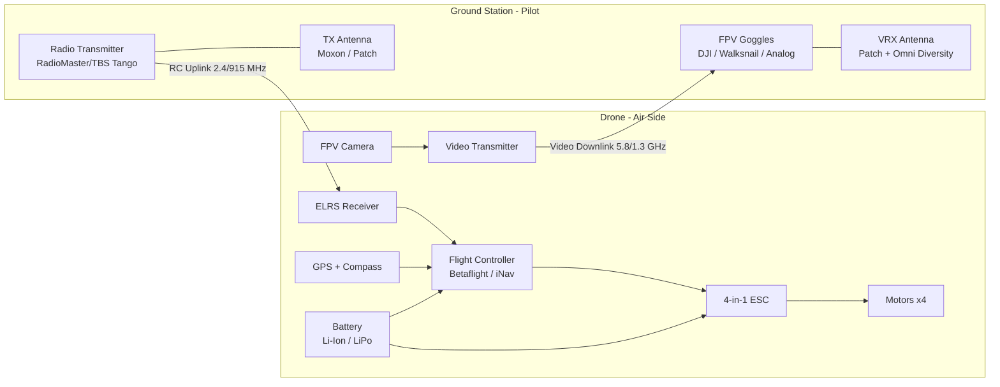
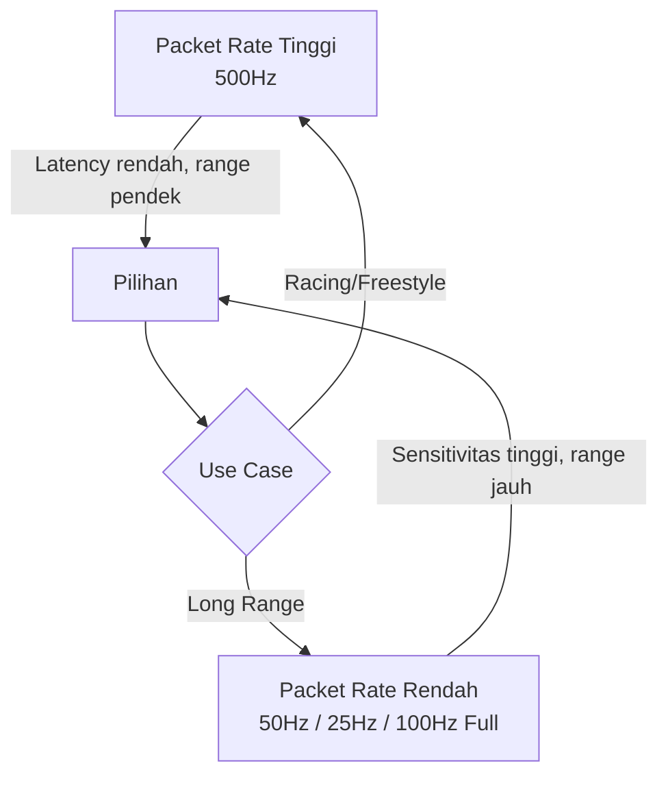
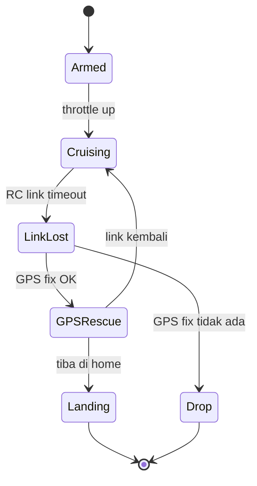
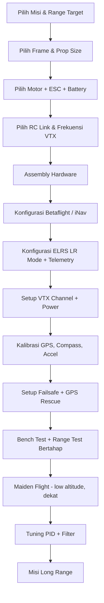

# FPV Long Range — Overview Lengkap

> Dokumen ini merangkum konsep, komponen, regulasi, dan praktik terbaik untuk membangun & menerbangkan **drone FPV Long Range (LR)**. Sumber referensi diambil dari dokumentasi resmi pabrikan, proyek open-source, dan otoritas penerbangan.

---

## Daftar Isi

1. [Apa itu FPV Long Range?](#1-apa-itu-fpv-long-range)
2. [Karakteristik Build LR vs Freestyle/Racing](#2-karakteristik-build-lr-vs-freestyleracing)
3. [Arsitektur Sistem](#3-arsitektur-sistem)
4. [Komponen Utama](#4-komponen-utama)
5. [Sistem Radio Control (RC Link)](#5-sistem-radio-control-rc-link)
6. [Sistem Video (VTX/VRX)](#6-sistem-video-vtxvrx)
7. [Power System & Estimasi Jangkauan](#7-power-system--estimasi-jangkauan)
8. [Failsafe, GPS Rescue, dan Keamanan](#8-failsafe-gps-rescue-dan-keamanan)
9. [Workflow Build & Setup](#9-workflow-build--setup)
10. [Regulasi (Indonesia & Internasional)](#10-regulasi-indonesia--internasional)
11. [Checklist Pra-Terbang](#11-checklist-pra-terbang)
12. [Referensi Terpercaya](#12-referensi-terpercaya)

---

## 1. Apa itu FPV Long Range?

**FPV (First Person View) Long Range** adalah kategori drone FPV yang dirancang untuk terbang **jauh dari pilot** (umumnya 5–40+ km satu arah) dengan prioritas pada:

- **Efisiensi daya** (waktu terbang 20–60 menit).
- **Link radio & video yang sangat andal** pada jarak jauh.
- **Failsafe & GPS Rescue** untuk pulang otomatis bila link putus.
- **Frame ringan** (umumnya 5"–10") dengan AUW rendah.

Berbeda dengan racing/freestyle yang menekankan akselerasi & manuver, LR menekankan **endurance, reliability, dan range**.

---

## 2. Karakteristik Build LR vs Freestyle/Racing

| Aspek | Long Range | Freestyle | Racing |
|---|---|---|---|
| Ukuran propeller | 5"–10" (umum 7") | 5" | 5" |
| Motor KV | 1500–2000 KV (7") | 1700–2400 KV | 2400–2750 KV |
| Battery | Li-Ion 4S–6S (P42A, P45B) atau LiPo capacity tinggi | LiPo 6S 1300–1500 mAh | LiPo 6S 1100–1300 mAh |
| AUW | Ringan untuk efisiensi | Sedang | Seringan mungkin |
| RC Link | ELRS 2.4/915 MHz LR mode, **ELRS Gemini / Dual Band**, Crossfire/Tracer | ELRS/Crossfire | ELRS 2.4 GHz |
| VTX | Analog 1.2/1.3 GHz, **DJI O4 Pro**, Walksnail Moonlight, HDZero LR | Analog/Digital 5.8 GHz | Analog/Digital 5.8 GHz |
| Antenna | Directional (Patch) di ground, omni di drone | Omni | Omni |

---

## 3. Arsitektur Sistem

---

## 4. Komponen Utama

### 4.1 Frame
- **Ukuran umum**: 7" (paling populer LR), 5" (mini-LR), 9"/10" (cinematic LR / heavy lift).
- Material: carbon fiber 3K/12K, geometri **deadcat** atau **stretched-X** untuk memberi ruang baterai besar dan menjauhkan propeller dari kamera.

### 4.2 Motor
- 7" LR umumnya **2806.5 / 2807** dengan KV **1300–1700**.
- Pilih KV berdasarkan voltase battery (lihat Bab 7).

### 4.3 Propeller
- Pitch lebih rendah & 3-blade (mis. **HQ 7x4x3**, **Gemfan 7035**) → efisiensi lebih baik dari pitch tinggi.

### 4.4 Flight Controller (FC) & ESC
- FC populer: **F7/H7** dengan firmware **Betaflight 4.5+** atau **iNav 7.x/8.x** (iNav lebih kaya fitur navigasi/waypoint, mission planner, fixed-wing support).
- ESC 4-in-1 **45–60 A** untuk 6S; protokol modern **BLHeli_32 / AM32 / BLHeli_M (Bluejay 32)** mendukung **DShot300/600** + **bidirectional DShot** untuk RPM filtering.
- **AIO board** (FC+ESC dalam satu PCB) makin populer untuk 5"–7" LR ringan.
- Konektor standar baru: **MR30 / XT30 / XT60** untuk power, **HD VTX** umumnya pakai konektor **6-pin JST-GH 1.0 mm** (DJI O3/O4) atau **MIPI** kamera.

### 4.5 Battery
- **Li-Ion 4S2P/6S2P** (Molicel P42A, P45B, Samsung 40T/50S) — **capacity tinggi, berat lebih efisien per Wh**, cocok untuk LR.
- **LiPo high-capacity** untuk performa lebih agresif.

---

## 5. Sistem Radio Control (RC Link)

Standar industri saat ini untuk LR:

- **ExpressLRS (ELRS) 3.x/4.x** — open-source, latency rendah, sensitivitas tinggi (–108 dBm @ 50 Hz, –112 dBm @ 25 Hz pada 2.4 GHz; lebih jauh lagi pada 915/868 MHz).
- **ELRS Gemini** — *true diversity* memakai **dua transmitter 2.4 GHz** secara simultan (dua antena dengan polarisasi berbeda) untuk mengurangi multipath fading & meningkatkan link reliability tanpa pindah band.
- **ELRS Dual Band** — kombinasi simultan **2.4 GHz + 915/868 MHz** pada satu RX (mis. RadioMaster Bandit Dual Band, BetaFPV SuperD); FC otomatis pakai band terkuat. Solusi paling tangguh untuk LR menembus area padat RF dan obstruksi.
- **TBS Crossfire / Tracer** — proprietary 868/915 MHz (Crossfire) & 2.4 GHz (Tracer), sangat matang, ekosistem luas, dukungan **TBS Agent** & **Fusion** video link.
- **TBS Ghost** — 2.4 GHz latency ultra-rendah (lebih ke racing), kurang umum untuk LR.
- **Frsky R9 (900 MHz)** — opsi lawas yang masih dipakai sebagian builder.

> **Aturan praktis ELRS**: setiap penurunan packet rate setengahnya menambah ±3 dB sensitivitas (≈ jangkauan 1.4×).

### Frekuensi
- **2.4 GHz** — antena kecil, jangkauan baik, padat di area urban.
- **915 MHz (FCC) / 868 MHz (EU) / 433 MHz** — penetrasi & jangkauan jauh lebih baik, antena lebih besar. **Cek regulasi lokal** sebelum dipakai.

---

## 6. Sistem Video (VTX/VRX)

| Sistem | Resolusi | Latency | Range Tipikal* | Catatan |
|---|---|---|---|---|
| **Analog 5.8 GHz** | CVBS | <20 ms | 5–20 km dgn patch | Murah, graceful degradation |
| **DJI O3 Air Unit** | 1080p 100 fps | 30–40 ms | 8–20+ km | HD, sangat populer untuk LR |
| **DJI O4 Air Unit Pro** | 1080p 100 fps, gyroflow built-in | ~22 ms (E2E) | 15–30+ km (FCC), kompatibel **Goggles 3 / N3** | Generasi terbaru (2024), dual antena coax + dipole, output up to 1 W (region) |
| **DJI O4 Air Unit Lite** | 1080p 60 fps | ~28 ms | 8–15 km | Versi ringan & murah, MIPI camera lebih kecil |
| **Walksnail Avatar HD Pro Kit** | 1080p 100 fps | ~18 ms | 10–20+ km | Generasi baru, true diversity 2 RX antena |
| **Walksnail Moonlight** | 1080p 100 fps, **4K 60 fps recording**, low-light Starlight sensor | ~22 ms | 10–20+ km | Sensor low-light, recording lokal kualitas tinggi |
| **HDZero (Race / Freestyle / LR Whoop V2)** | 720p 60/90 fps digital | <20 ms | 5–15 km | Open ecosystem, mendekati feel analog, **HDZero ELRS combo VTX** populer |
| **Caddx Vista / DJI Air Unit V1** | 720p | ~28 ms | 4–8 km | Generasi lama, masih dipakai |
| **Analog 1.2/1.3 GHz** | CVBS | <20 ms | 30–60+ km | Penetrasi terbaik, butuh izin frekuensi |

### Goggles populer (2024–2026)
- **DJI Goggles 3** — pendamping utama O4 Air Unit, head-tracking, kompatibel O3.
- **DJI Goggles N3** — varian terjangkau O4 ecosystem (single panel).
- **DJI Goggles 2 / Integra** — masih kompatibel O3/O4 via firmware.
- **Walksnail Avatar HD Goggles X / V2** — ekosistem Walksnail; varian X mendukung Moonlight 4K playback.
- **HDZero Goggles** — native HDZero, ada bay analog module.
- **Skyzone Cobra X V4 / 04X / 04O** — analog + bay module untuk HDZero/Walksnail.
- **Orqa FPV.One Pilot / Race** — analog premium dengan bay module.
- **Fatshark Dominator HDO3** — analog OLED kelas atas.

\*Range sangat dipengaruhi antena, lingkungan, dan ketinggian terbang.

### Antena
- **Drone (omni)**: linear / RHCP atau LHCP (cloverleaf, lollipop, Pagoda, AXII).
- **Goggles/Ground**: kombinasi **patch directional** (gain tinggi, depan) + **omni** (diversity, belakang).
- **Polarisasi VTX dan VRX harus sama** (RHCP↔RHCP).
- Untuk **DJI O4 / Walksnail Avatar HD Pro**: gunakan **dua antena beda polarisasi/orientasi** (mis. coax + dipole vertikal) supaya true diversity bekerja maksimal.
- Untuk **ELRS Gemini / Dual Band RX**: pasang **dua antena** dengan **polarisasi berbeda** (mis. linear vertikal + linear horizontal, atau T-antenna), jangan disatukan dekat carbon.

---

## 7. Power System & Estimasi Jangkauan

### Estimasi Waktu Terbang (rumus dasar)

$$
T_{\text{terbang (menit)}} \approx \frac{C_{\text{Wh}}}{P_{\text{avg (W)}}} \times 60 \times \eta
$$

- $C_{\text{Wh}} = V_{\text{nom}} \times C_{\text{Ah}}$
- $P_{\text{avg}}$ = daya rata-rata cruise (untuk 7" LR ringan ≈ 100–150 W).
- $\eta$ ≈ 0.85 (margin keamanan agar tidak menguras battery 100%).

**Contoh**: 6S2P P42A → $V_{nom} = 21.6$ V, $C = 8.4$ Ah → 181 Wh. Pada 130 W cruise:
$$
T \approx \frac{181}{130} \times 60 \times 0.85 \approx 71 \text{ menit teoretis} \rightarrow \text{realistis 45–55 menit}.
$$

### Memilih KV Motor

$$
\text{RPM}_{\text{no-load}} \approx KV \times V_{\text{batt}}
$$

Untuk 7" prop disarankan tip speed wajar; 6S × 1500 KV = 13.500 RPM no-load → cocok untuk efisiensi LR.

---

## 8. Failsafe, GPS Rescue, dan Keamanan

### Wajib diaktifkan untuk LR
1. **Failsafe Drop / RTH**: di Betaflight aktifkan **GPS Rescue**, di iNav gunakan **RTH (Return-To-Home)**.
2. **Voltage warning** & **min cell voltage** untuk auto-RTH.
3. **Sanity check arming**: GPS fix ≥ 6–8 satelit, magnetometer terkalibrasi, home position tersimpan.

### Tips Keandalan
- **True diversity** pada video & RX.
- **Antena dipasang lurus** dan jauh dari sumber RF.
- **Update firmware ELRS** TX & RX **harus versi mayor sama**.
- Gunakan **Bluetooth/ESP backpack** + **Bluetooth GPS tracker** (mis. iNav Lua + Telegram bot) sebagai cadangan pencarian.

---

## 9. Workflow Build & Setup

---

## 10. Regulasi (Indonesia & Internasional)

> **PENTING**: Regulasi berubah. Selalu cek sumber resmi sebelum terbang.

### Indonesia
- **PM 37 Tahun 2020** (Kementerian Perhubungan) tentang pengoperasian pesawat udara tanpa awak.
- **Peraturan Menkominfo** untuk perangkat radio (sertifikasi Postel, izin spektrum 1.2/1.3 GHz, dsb.).
- Ketinggian umum dibatasi **120 m AGL**, jauh dari KKOP bandara, dan registrasi via **SIDOPI-Go** untuk drone tertentu.

### Eropa (EASA)
- Kategori **Open / Specific / Certified**, kelas C0–C4. FPV LR umumnya masuk **Specific category** karena BVLOS → butuh otorisasi & SORA.

### USA (FAA)
- Bagian **Part 107** (komersial) atau **Recreational (44809)**, **Remote ID** wajib, FPV harus punya **Visual Observer**, BVLOS butuh waiver.

### Frekuensi Radio (cek sebelum dipakai)
- **2.4 GHz, 5.8 GHz** umumnya bebas dengan batasan daya.
- **915/868 MHz, 1.2/1.3 GHz** sering **butuh izin**.

---

## 11. Checklist Pra-Terbang

- [ ] Battery freshly charged & tegangan seimbang.
- [ ] Propeller terpasang kencang & arah benar.
- [ ] GPS fix ≥ 8 satelit, home position OK.
- [ ] Failsafe & GPS Rescue diuji di lapangan terbuka kecil.
- [ ] VTX channel & power sesuai regulasi & tidak mengganggu pilot lain.
- [ ] Antena RX/VTX tidak rusak/patah.
- [ ] OSD menampilkan: RSSI/LQ, voltase, mAh, GPS sat, distance, home arrow.
- [ ] Cuaca & angin dicek (idealnya angin < 25 km/h untuk 7").
- [ ] Area BVLOS sudah disurvei lewat Google Earth / peta topografi.

---

## 12. Referensi Terpercaya

- **ExpressLRS Documentation** — <https://www.expresslrs.org/>
- **Betaflight Wiki / Documentation** — <https://betaflight.com/docs/wiki> & <https://github.com/betaflight/betaflight/wiki>
- **iNav Wiki** — <https://github.com/iNavFlight/inav/wiki>
- **Team BlackSheep (TBS) Crossfire Manual** — <https://www.team-blacksheep.com/products/prod:crossfire_tx>
- **DJI O3 Air Unit User Manual** — <https://www.dji.com/o3-air-unit/downloads>
- **DJI O4 Air Unit Pro / Lite** — <https://www.dji.com/o4-air-unit-pro> & <https://www.dji.com/o4-air-unit-lite>
- **DJI Goggles 3 / N3** — <https://www.dji.com/goggles-3> & <https://www.dji.com/goggles-n3>
- **Walksnail Avatar HD Pro / Moonlight** — <https://caddxfpv.com/pages/walksnail-avatar-hd-kit>
- **HDZero** — <https://www.hd-zero.com/>
- **ELRS Gemini & Dual Band** — <https://www.expresslrs.org/hardware/transmitters/> (lihat RadioMaster Bandit, BetaFPV SuperD, Happymodel ES24TX Pro)
- **Oscar Liang — FPV Knowledge Base** — <https://oscarliang.com/category/fpv/>
- **Painless360 / Joshua Bardwell (YouTube edukasi)** — channel resmi.
- **Molicel Datasheet (P42A / P45B)** — <https://www.molicel.com/product/>
- **EASA Drone Regulations** — <https://www.easa.europa.eu/en/domains/civil-drones>
- **FAA UAS** — <https://www.faa.gov/uas>
- **Ditjen Hubud Indonesia** — <https://hubud.dephub.go.id/>
- **Ditjen SDPPI Kominfo** (sertifikasi alat radio) — <https://sdppi.kominfo.go.id/>

---

*Dokumen ini bersifat edukatif. Selalu verifikasi regulasi setempat dan datasheet komponen versi terbaru sebelum membangun atau menerbangkan drone FPV Long Range.*
