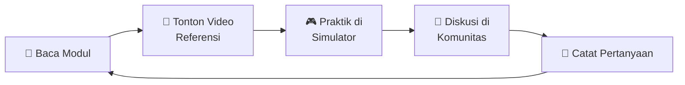
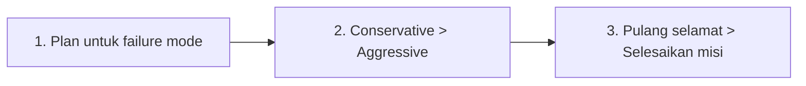

# 🚁 FPV Long Range Mastery

### 

> **Build → Tune → Fly.** 11 modul terstruktur + cheat sheet lapangan, berbasis teknologi FPV terkini (**ExpressLRS 4.x, DJI O4 Air Unit Pro, Walksnail Avatar HD, Li-Ion 6S2P P42A**) dan regulasi penerbangan Indonesia (**SDPPI, PM 37/2020, SIDOPI-Go**).

**Dibuat oleh [@skyfluxfpv](https://www.instagram.com/skyfluxfpv/)** — [Instagram](https://www.instagram.com/skyfluxfpv/) • [TikTok](https://www.tiktok.com/@skyfluxfpv)

[](learning/00-index.md)
[](learning/00-index.md)
[](learning/00-index.md)
[](#-sumber-terpercaya)

---

## 🎯 Untuk Siapa Repo Ini?

- 🆕 **Pilot FPV pemula** yang ingin upgrade ke long range (>2 km).
- 🛠️ **Builder/hobyis** yang ingin pegangan terstruktur sebelum belanja & merakit.
- 🇮🇩 **Komunitas FPV Indonesia** yang membutuhkan referensi berbahasa Indonesia dengan konteks regulasi lokal.
- 📚 **Self-learner** yang lebih suka membaca terstruktur daripada nonton puluhan video YouTube terpisah.

> **Prasyarat:** tidak ada. Familiar dengan istilah dasar elektronika (volt, ampere, watt) sangat membantu, tapi tidak wajib.

---

## 📚 Quick Start

### 🚀 Mulai Belajar (30 detik)

```bash
1. Buka  → learning/00-index.md       (peta belajar lengkap)
2. Mulai → learning/01-dasar-fpv.md   (modul pertama, 30 menit)
3. Lapangan → learning/CHEAT-SHEET.md (quick reference saat di field)
```

### 📖 Pintu Masuk Utama

| Resource | Deskripsi | Cocok untuk |
|---|---|---|
| 🗺️ **[Index Learning Series](learning/00-index.md)** | Peta belajar 11 modul + cheat sheet | Pertama kali masuk |
| ⭐ **[Cheat Sheet Lapangan](learning/CHEAT-SHEET.md)** | Quick reference jarak max, baterai, sinyal, safety | Saat di field / pre-flight |
| 📘 **[Overview Teknis](OVERVIEW.md)** | Reference komprehensif komponen & arsitektur | Riset komponen / belanja |

---

## 🗺️ Peta Belajar

```mermaid
flowchart LR
    Start([Mulai di Sini]) --> M1[Modul 1-5<br/>📚 Foundation<br/>komponen, radio, video, battery]
    M1 --> M2[Modul 6-7<br/>🛠️ Build & Setup<br/>solder, BF/iNav, failsafe]
    M2 --> M3[Modul 8-9<br/>🚁 Fly<br/>tuning, misi LR]
    M3 --> M4[Modul 11<br/>⚖️ Regulasi<br/>SDPPI & etika]
    M4 --> Bonus[Modul 12<br/>🎯 ELRS Deep Dive<br/>opsional lanjutan]
    Bonus --> CS[⭐ Cheat Sheet<br/>field reference]

    classDef start fill:#1976d2,color:#fff,stroke:#0d47a1
    classDef found fill:#e1f5ff,stroke:#0288d1
    classDef build fill:#fff3e0,stroke:#f57c00
    classDef fly fill:#e8f5e9,stroke:#388e3c
    classDef law fill:#fce4ec,stroke:#c2185b
    classDef deep fill:#f3e5f5,stroke:#7b1fa2
    classDef cheat fill:#fff9c4,stroke:#f57f17
    class Start start
    class M1 found
    class M2 build
    class M3 fly
    class M4 law
    class Bonus deep
    class CS cheat
```



---

## 📋 Daftar Modul Lengkap

| # | Modul | Estimasi | Tipe |
|---|---|---|---|
| 1 | [Dasar FPV & Long Range](learning/01-dasar-fpv.md) | 30 menit | 📖 Wajib |
| 2 | [Mengenal Komponen Drone](learning/02-komponen.md) | 60 menit | 📖 Wajib |
| 3 | [Radio Link: ELRS, Gemini, Dual Band](learning/03-radio-link.md) | 60 menit | 📖 Wajib |
| 4 | [Sistem Video: Analog, DJI O4, Walksnail](learning/04-video-system.md) | 60 menit | 📖 Wajib |
| 5 | [Battery & Power System](learning/05-battery-power.md) | 45 menit | 📖 Wajib |
| 6 | [Build & Setup Pertama](learning/06-build-setup.md) | 2–3 jam | 🔧 Praktik |
| 7 | [Failsafe & GPS Rescue](learning/07-failsafe-gps-rescue.md) | 60 menit | 🔧 Praktik |
| 8 | [First Flight & Tuning](learning/08-first-flight-tuning.md) | 60 menit | 🚁 Praktik |
| 9 | [Pre-Mission Shakedown & Iterative Tuning](learning/09-pre-mission-shakedown.md) | 90 menit | 🔧 Praktik |
| 10 | [Misi Long Range](learning/10-long-range-mission.md) | 90 menit | 🚁 Praktik |
| 11 | [Regulasi & Etika Terbang Indonesia](learning/11-regulasi-etika.md) | 30 menit | ⚖️ Wajib |
| 12 | [ELRS Deep Dive (Glossary, Signal, Telemetry)](learning/12-elrs-deep-dive.md) | 60 menit | 🎯 Lanjutan |
| ⭐ | [**Cheat Sheet — Field Reference**](learning/CHEAT-SHEET.md) | 10 menit | 📌 Lapangan |

**Total estimasi belajar:** ~12 jam membaca + 2-3 jam praktik build.

---

## 🎯 Apa yang Akan Kamu Pelajari?

✅ **Foundation** — Cara kerja FPV LR end-to-end: frame, motor, prop, FC, ESC, RX, GPS, kamera, antena, baterai.
✅ **Radio Link** — ExpressLRS 4.x, packet rate, sensitivity per band, Gemini & Dual Band, telemetry.
✅ **Video** — Analog 5.8 GHz, DJI O4 Air Unit Pro/Lite, Walksnail Avatar HD, HDZero — pilihan & trade-off.
✅ **Power** — Li-Ion 6S2P (Molicel P42A), charge safety, voltage cut-off, hover throttle, mAh/km.
✅ **Build** — Soldering, Betaflight 4.5+ / iNav 7-8 setup workflow, OSD, modes.
✅ **Safety** — Failsafe, GPS Rescue (BF & iNav), beeper, observer protocol.
✅ **Tuning** — First flight, rates, expo, kapan PID tuning sebenarnya perlu.
✅ **Misi LR** — Battery budget, wind strategy, pilot positioning, recovery plan.
✅ **Regulasi Indonesia** — PM 37/2020, sertifikasi SDPPI, SIDOPI-Go, BVLOS, etika komunitas.
✅ **ELRS Deep Dive** — Signal health (LQ vs RSSI), init rate, telemetry bandwidth, RFMD.
✅ **Field Cheat Sheet** — Pre-flight check, in-flight decision tree, quick reference numbers.

---

## 💡 Filosofi & Cara Belajar



1. **Baca pelan-pelan** — jangan loncat modul.
2. **Cross-check** dengan video YouTube (referensi tiap modul).
3. **Latihan di simulator** dulu (Liftoff, Velocidrone, Uncrashed) sebelum beli komponen.
4. **Gabung komunitas** — Discord ExpressLRS, Betaflight, FB FPV Indonesia.
5. **Mulai kecil** — terbang line-of-sight dulu sebelum BVLOS.

### 🏆 3 Aturan Emas FPV Long Range



---

## 🛠️ Tech Stack yang Dibahas

| Kategori | Teknologi Modern (2025-2026) |
|---|---|
| **RC Link** | ExpressLRS 4.x (2.4 GHz, 900 MHz, Gemini, Dual Band X-Band) |
| **Video HD** | DJI O4 Air Unit Pro/Lite, Walksnail Avatar HD Pro/Moonlight, HDZero |
| **Video Analog** | 5.8 GHz (RaceBand) |
| **Flight Controller** | Betaflight 4.5+, iNav 7/8 |
| **Battery** | Li-Ion 6S2P (Molicel P42A 4200mAh, P45B 4500mAh), LiPo 6S |
| **GPS** | M10 chip (UBLOX), GEPRC M1025Q, HGLRC M100 5883, Matek M10Q |
| **Frame** | 7" / 9" / 10" Long Range / Wing |

---

## 📚 Sumber Terpercaya

Semua materi telah di-cross-check dengan:

- 📖 [ExpressLRS Documentation](https://www.expresslrs.org/) (v4.0)
- 📖 [Betaflight Wiki](https://betaflight.com/docs)
- 📖 [iNav Wiki](https://github.com/iNavFlight/inav/wiki)
- 📖 [Oscar Liang FPV Knowledge Base](https://oscarliang.com/category/fpv/)
- 📖 [DJI O4 Air Unit Documentation](https://www.dji.com/o4-air-unit-pro)
- 📖 [Molicel Datasheet (P42A)](https://www.molicel.com/)
- 📖 [SDPPI Kominfo Indonesia](https://www.postel.go.id/)
- 📖 [Kemenhub Direktorat Navigasi Penerbangan](https://hubud.dephub.go.id/)
- 🎥 Joshua Bardwell, Chris Rosser, Painless360, Mads Tech (YouTube)

Untuk daftar referensi lengkap dengan deep-link per klaim teknis, lihat [Cheat Sheet — Section Referensi](learning/CHEAT-SHEET.md#-referensi-sumber-terpercaya-sudah-divalidasi).

---

## 🤝 Kontribusi

Repo ini dibuat sebagai **knowledge base komunitas FPV Indonesia**. Kontribusi terbuka:

- 🐛 **Issue** untuk laporan kesalahan teknis, link mati, atau saran perbaikan.
- 🔧 **Pull Request** untuk koreksi konten, tambahan modul, atau update teknologi terbaru.
- 💬 **Diskusi** untuk pertanyaan / sharing pengalaman terbang.

Sebelum kontribusi, mohon baca:
- Materi harus berbasis **sumber terpercaya** (dokumentasi resmi pabrikan / komunitas-validated).
- Bahasa **Indonesia yang mudah dipahami pemula**.
- Konteks **regulasi Indonesia** wajib disertakan untuk topik regulasi.

---

## ⚠️ Disclaimer & Penyangkalan Tanggung Jawab

> **PENTING — BACA SEBELUM TERBANG.**
>
> Materi dalam repo ini disediakan **"sebagaimana adanya" (as-is)** untuk tujuan **edukasi dan referensi**. Penulis & kontributor tidak bertanggung jawab atas:

### 🚨 Risiko Operasional FPV Long Range

- 💥 **Kerusakan drone, crash, atau kehilangan peralatan** akibat kesalahan setting, komponen rusak, atau kondisi cuaca.
- 🔥 **Kebakaran baterai Li-Ion / LiPo** akibat charging tidak benar, puffed pack, atau short circuit. **Selalu charge di area aman, pakai LiPo bag, dan tidak ditinggal.**
- 👥 **Cedera fisik pada pilot, observer, atau pihak ketiga** akibat kontak dengan propeller, jatuhan drone, atau kecelakaan terkait.
- 🏠 **Kerusakan properti pihak ketiga** akibat drone jatuh, fly-away, atau tabrakan.
- ✈️ **Bahaya terhadap pesawat berawak** — drone wajib **selalu yield** ke pesawat berawak. Pelanggaran dapat membahayakan nyawa.

### ⚖️ Risiko Hukum & Regulasi

- 📜 Penerbangan FPV — terutama **BVLOS (Beyond Visual Line of Sight)** dan jarak jauh — **diatur ketat** di Indonesia (PM 37/2020) dan banyak yurisdiksi lain.
- 📡 Frekuensi RC & VTX wajib mengikuti **alokasi SDPPI Kominfo**. Penggunaan band 915 MHz, 1.2 GHz, atau power di atas batas legal **adalah pelanggaran** dan dapat dikenai sanksi.
- 🆔 Drone di atas batas berat tertentu wajib didaftarkan via **SIDOPI-Go**.
- 🚫 Terbang BVLOS rekreasional **tidak memiliki jalur legal** di Indonesia saat ini. Operasi komersial wajib melalui jalur **DNP + PSC** (Direktorat Navigasi Penerbangan).
- 🏛️ Regulasi dapat berubah. **Pengguna wajib memverifikasi peraturan terbaru** sebelum terbang.

### 📋 Akurasi Konten

- Materi disusun berbasis **sumber terpercaya per tanggal publikasi** (2025-2026), tetapi teknologi FPV berkembang cepat — **firmware, hardware, dan regulasi bisa berubah**.
- Angka spesifik (sensitivity, range, mAh/km, hover throttle) adalah **referensi/estimasi**. Setiap build berbeda — **selalu validasi dengan test flight di drone kamu sendiri**.
- Link eksternal & referensi **dapat berubah atau mati** seiring waktu.
- Repo ini **bukan pengganti** dokumentasi resmi pabrikan, training profesional, atau konsultasi dengan otoritas penerbangan.

### 🙏 Tanggung Jawab Pengguna

Dengan membaca & menggunakan materi ini, kamu mengakui bahwa:

1. ✅ Kamu **bertanggung jawab penuh** atas keputusan terbang, build, dan setting drone-mu.
2. ✅ Kamu **akan mematuhi semua regulasi lokal** yang berlaku di tempat tinggal & lokasi terbangmu.
3. ✅ Kamu **akan terbang dengan aman** — tidak di atas keramaian, dengan observer, dan menggunakan failsafe yang teruji.
4. ✅ Kamu **akan tahu kapan tidak terbang** — saat cuaca buruk, peralatan baru belum diuji, atau area tidak dikenal.
5. ✅ Kamu memahami bahwa **FPV Long Range adalah hobi berisiko tinggi** yang membutuhkan komitmen belajar berkelanjutan.

> **"Drone bisa diganti, hidup orang tidak. Kalau ragu — LAND."**

---

## 📜 Lisensi

Materi edukasi ini dirilis dengan lisensi **Creative Commons Attribution-ShareAlike 4.0 International (CC BY-SA 4.0)**.

Kamu **bebas**:
- ✅ **Berbagi** — menyalin & redistribusi dalam media apapun.
- ✅ **Adaptasi** — remix, transform, dan build upon untuk tujuan apapun (termasuk komersial).

Dengan **syarat**:
- 📝 **Atribusi** — sebutkan sumber & link ke repo asli.
- 🔄 **ShareAlike** — kontribusi turunan harus pakai lisensi yang sama.

Konten dari sumber pihak ketiga (ExpressLRS docs, Betaflight, Oscar Liang, dll.) tetap mengikuti lisensi masing-masing.

---

## 🌟 Acknowledgments

Terima kasih kepada komunitas FPV global yang telah membuka pengetahuan ini:

- **ExpressLRS Team** — open-source RC link revolusioner.
- **Betaflight & iNav developers** — flight controller firmware kelas dunia.
- **Oscar Liang** — knowledge base FPV paling lengkap di internet.
- **Joshua Bardwell, Chris Rosser, Painless360, Mads Tech** — edukator YouTube terbaik.
- **Komunitas FPV Indonesia** — Discord, Facebook Groups, dan local meetups yang menjaga semangat hobi ini.

---

<p align="center">
  <strong>🚁 Selamat belajar & selamat terbang!</strong><br/>
  <em>Build → Tune → Fly → Pulang Selamat.</em>
</p>

<p align="center">
  <a href="learning/00-index.md">📚 Mulai Belajar</a> •
  <a href="learning/CHEAT-SHEET.md">⭐ Cheat Sheet</a> •
  <a href="OVERVIEW.md">📘 Overview Teknis</a>
</p>

<p align="center">
  <strong>Dibuat dengan ❤️ oleh <a href="https://www.instagram.com/skyfluxfpv/">@skyfluxfpv</a></strong><br/>
  <a href="https://www.instagram.com/skyfluxfpv/">📷 Instagram</a> •
  <a href="https://www.tiktok.com/@skyfluxfpv">🎬 TikTok</a>
</p>
