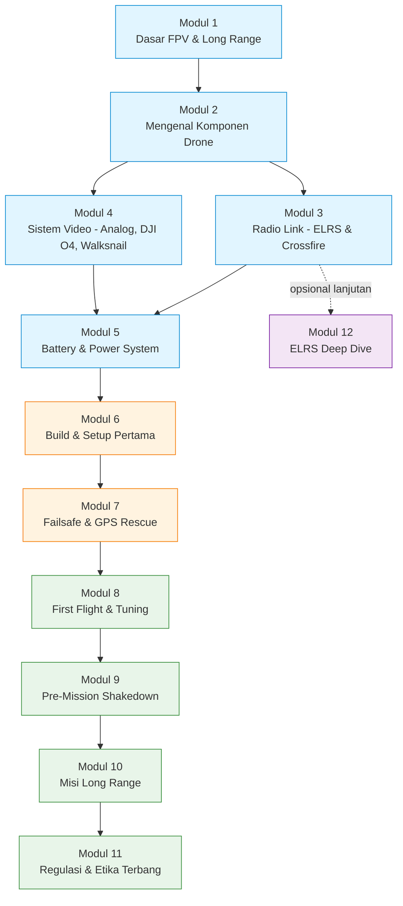
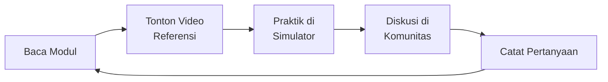

# 🎓 FPV Long Range Learning Series

> Seri belajar **FPV Long Range (LR)** dari nol sampai bisa terbang misi jauh dengan aman. Disusun untuk pemula, ditulis dalam Bahasa Indonesia yang mudah dipahami, dengan diagram Mermaid untuk memperjelas konsep.

**Dibuat oleh [@skyfluxfpv](https://www.instagram.com/skyfluxfpv/)** — ikuti di [Instagram](https://www.instagram.com/skyfluxfpv/) & [TikTok](https://www.tiktok.com/@skyfluxfpv) untuk konten FPV terbaru.

---

## 🧭 Untuk Siapa Seri Ini?

- Pilot FPV pemula yang ingin **upgrade ke long range** (>2 km).
- Hobiyis RC/drone yang ingin paham **end-to-end** sistem FPV LR.
- Builder yang ingin pegangan terstruktur sebelum belanja komponen.

**Prasyarat:** tidak ada. Tapi familiar dengan istilah dasar elektronika (volt, ampere, watt) sangat membantu.

---

## 🗺️ Peta Belajar

---

## 📚 Daftar Modul

| # | Modul | Estimasi Belajar | Status |
|---|---|---|---|
| 1 | [Dasar FPV & Long Range](01-dasar-fpv.md) | 30 menit | 📖 Wajib |
| 2 | [Mengenal Komponen Drone](02-komponen.md) | 60 menit | 📖 Wajib |
| 3 | [Radio Link: ELRS, Gemini, Dual Band](03-radio-link.md) | 60 menit | 📖 Wajib |
| 4 | [Sistem Video: Analog, DJI O4, Walksnail](04-video-system.md) | 60 menit | 📖 Wajib |
| 5 | [Battery & Power System](05-battery-power.md) | 45 menit | 📖 Wajib |
| 6 | [Build & Setup Pertama](06-build-setup.md) | 2–3 jam | 🔧 Praktik |
| 7 | [Failsafe & GPS Rescue](07-failsafe-gps-rescue.md) | 60 menit | 🔧 Praktik |
| 8 | [First Flight & Tuning](08-first-flight-tuning.md) | 60 menit | 🚁 Praktik |
| 9 | [Pre-Mission Shakedown & Iterative Tuning](09-pre-mission-shakedown.md) | 90 menit | 🔧 Praktik |
| 10 | [Misi Long Range](10-long-range-mission.md) | 90 menit | 🚁 Praktik |
| 11 | [Regulasi & Etika Terbang](11-regulasi-etika.md) | 30 menit | ⚖️ Wajib |
| 12 | [ELRS Deep Dive (Glossary, Signal Health, Telemetry, Init Rate)](12-elrs-deep-dive.md) | 60 menit | 🎯 Lanjutan |
| ⭐ | [**Cheat Sheet — Quick Reference LR**](CHEAT-SHEET.md) | 10 menit | 📌 Field Reference |

---

## 🎯 Cara Belajar yang Disarankan

1. **Baca dulu** modulnya pelan-pelan, jangan loncat.
2. **Cross-check** dengan video YouTube (lihat referensi tiap modul).
3. **Latihan di simulator** (Liftoff, Velocidrone, Uncrashed) sebelum beli barang.
4. **Gabung komunitas** (Discord ExpressLRS, Betaflight, Fb FPV Indonesia).
5. **Mulai kecil**: terbang line-of-sight dulu sebelum BVLOS.

---

## ⚠️ Disclaimer Keselamatan

> FPV Long Range melibatkan **risiko nyata**: drone bisa jatuh menimpa orang/properti, baterai Li-Ion bisa terbakar, dan terbang BVLOS tanpa izin **melanggar hukum** di banyak yurisdiksi. Selalu:
> - Patuhi regulasi lokal (Modul 11).
> - Jangan terbang di atas keramaian.
> - Punya **observer** dan **failsafe** yang teruji.
> - Tahu kapan harus **tidak terbang** (cuaca buruk, peralatan baru, area tidak dikenal).

---

## 🔗 Referensi Utama yang Dipakai Seri Ini

- **ExpressLRS Docs** — <https://www.expresslrs.org/>
- **Betaflight Wiki** — <https://betaflight.com/docs>
- **iNav Wiki** — <https://github.com/iNavFlight/inav/wiki>
- **DJI O3/O4 Air Unit Manual** — <https://www.dji.com/o4-air-unit-pro/downloads>
- **Walksnail Avatar HD** — <https://caddxfpv.com/pages/walksnail-avatar-hd-kit>
- **Oscar Liang Blog** — <https://oscarliang.com/category/fpv/>
- **Joshua Bardwell (YouTube)** — pelajaran video paling lengkap.
- **Painless360 (YouTube)** — tutorial setup detail.
- **Mr Steele / Le Drib** — inspirasi terbang freestyle.
- **Chris Rosser / IBN FPV** — tutorial long range & BVLOS.

---

➡️ **Mulai dari [Modul 1: Dasar FPV & Long Range](01-dasar-fpv.md)**
