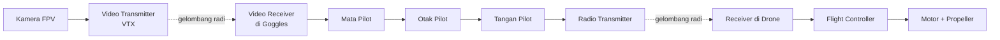
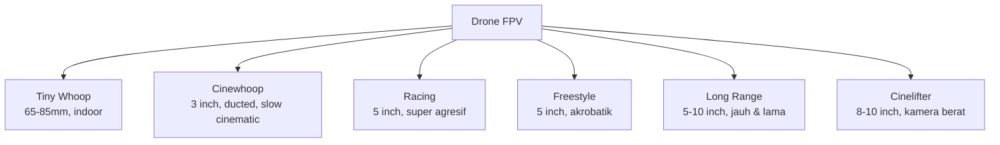
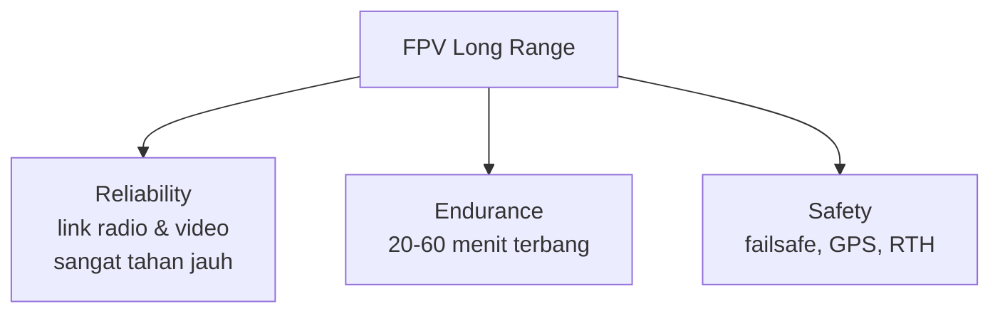
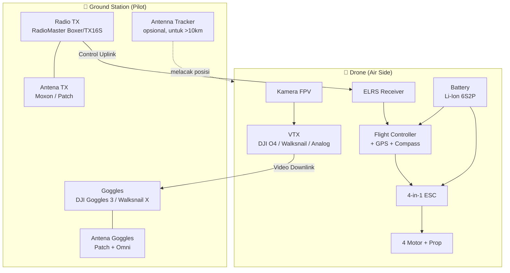
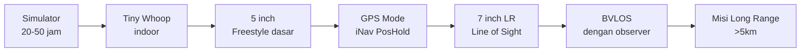

# Modul 1 — Dasar FPV & Long Range

> **Tujuan modul:** memahami apa itu FPV, apa bedanya dengan drone biasa, dan apa yang membuat sebuah build disebut "Long Range".

---

## 1.1 Apa itu FPV?

**FPV = First Person View** = "sudut pandang orang pertama".

Pilot melihat **video real-time dari kamera di drone** lewat:
- **Kacamata FPV (goggles)**, atau
- **Layar/monitor**.

Berbeda dengan drone consumer (DJI Mavic, dll.) yang biasanya dikendalikan via aplikasi smartphone dengan kamera gimbal stabil. FPV menyatukan pilot dengan drone — sensasi seperti **duduk di kokpit**.

**Dua link radio terpisah** harus bekerja bersamaan:
1. **Video downlink** (drone → goggles).
2. **Control uplink** (radio → drone).

Kalau salah satu putus, masalah!

---

## 1.2 Kategori Drone FPV

**Kita fokus di Long Range** — kategori yang paling "engineering-heavy" karena banyak trade-off: jangkauan vs berat vs efisiensi vs ketahanan link.

---

## 1.3 Apa yang Membuat Drone Disebut "Long Range"?

Tiga pilar:

| Pilar | Kenapa penting? |
|---|---|
| **Reliability** | Pada jarak jauh, sinyal melemah, antenna butuh diversity, polarisasi penting. |
| **Endurance** | Mau terbang 10 km PP butuh battery besar (umumnya **Li-Ion**, bukan LiPo racing). |
| **Safety** | Kalau link putus 5 km dari pilot, drone harus bisa **pulang sendiri**. |

---

## 1.4 LR vs Freestyle vs Racing

| Aspek | Long Range | Freestyle | Racing |
|---|---|---|---|
| Tujuan | Jauh & lama | Akrobatik | Cepat |
| Ukuran propeller | 7" (umum), 5"–10" | 5" | 5" |
| Battery | Li-Ion 6S2P | LiPo 6S 1300 mAh | LiPo 6S 1100 mAh |
| Waktu terbang | 30–60 menit | 4–6 menit | 2–3 menit |
| Berat (AUW) | 700–1500 g | 600–800 g | 400–600 g |
| Skill terbang | Smooth, planning | Akrobatik | Refleks |
| Risiko utama | Hilang/jatuh jauh | Crash freestyle | Crash gate |

---

## 1.5 Anatomi Sistem FPV Long Range (Big Picture)

Ada **3 sistem radio** yang harus dipikirin:
1. **Control link** (Radio TX ↔ RX di drone).
2. **Video link** (VTX di drone ↔ Goggles).
3. **Telemetry** (drone → radio TX, mengirim balik info GPS, voltase, RSSI).

---

## 1.6 Roadmap Skill Pilot

> **Kesalahan pemula yang fatal:** langsung beli 7" LR tanpa pernah simulator atau terbang 5". Hampir pasti **crash mahal di maiden flight**. Investasikan waktu di simulator dulu (Liftoff, Velocidrone, atau Uncrashed FPV) — minimal **20 jam terbang virtual**.

---

## 1.7 Budget Realistis (2026)

| Item | Estimasi (USD) |
|---|---|
| Radio TX (RadioMaster Boxer ELRS) | $130 |
| Goggles HD (DJI Goggles 3) | $500 |
| Frame + Motor + ESC + FC (7" kit) | $250–350 |
| VTX HD (DJI O4 Air Unit Pro) | $230 |
| RX ELRS Dual Band | $40 |
| GPS module | $25 |
| Battery Li-Ion 6S2P P42A | $80 |
| Charger + power supply | $150 |
| **Total starter HD LR** | **±$1,400** |

> Bisa ditekan jadi ~$700 kalau ganti ke goggles analog (mis. Skyzone Cobra X V4 ~$300) + radio entry-level. Tapi untuk LR, **investasi di goggles & radio adalah yang paling worth-it** — keduanya bertahan bertahun-tahun.

> ⚠️ **Disclaimer rekomendasi:** harga dan produk yang disebut adalah perkiraan per **2026** berdasarkan pengalaman penulis & komunitas, **bukan endorsement berbayar**. Harga, stok, dan revisi hardware berubah cepat — selalu cross-check ke toko terpercaya, review independen (Joshua Bardwell, Oscar Liang), dan diskusi komunitas sebelum beli. Sesuaikan dengan **regulasi frekuensi & impor** di negaramu.

---

## 🔗 Referensi & Bacaan Lanjut

- Oscar Liang — *What is FPV?* — <https://oscarliang.com/fpv-drone-guide/>
- Joshua Bardwell — *FPV Drone Beginner Course* (YouTube playlist).
- ExpressLRS — *Getting Started* — <https://www.expresslrs.org/quick-start/getting-started/>

---

**Selanjutnya** ➡️ [Modul 2: Mengenal Komponen Drone](02-komponen.md)
