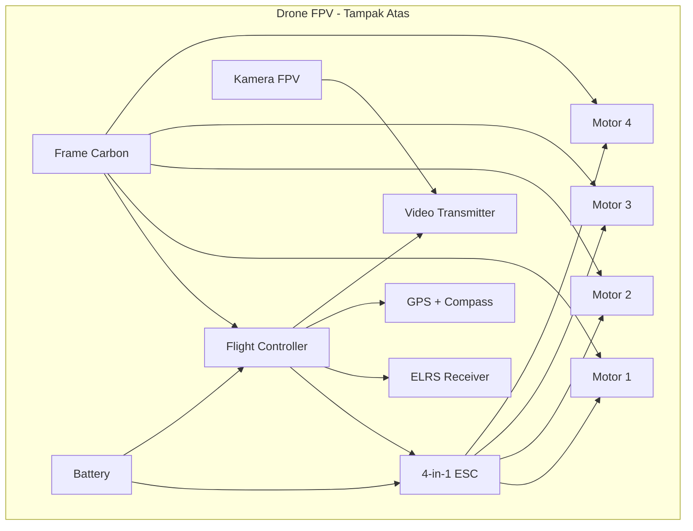
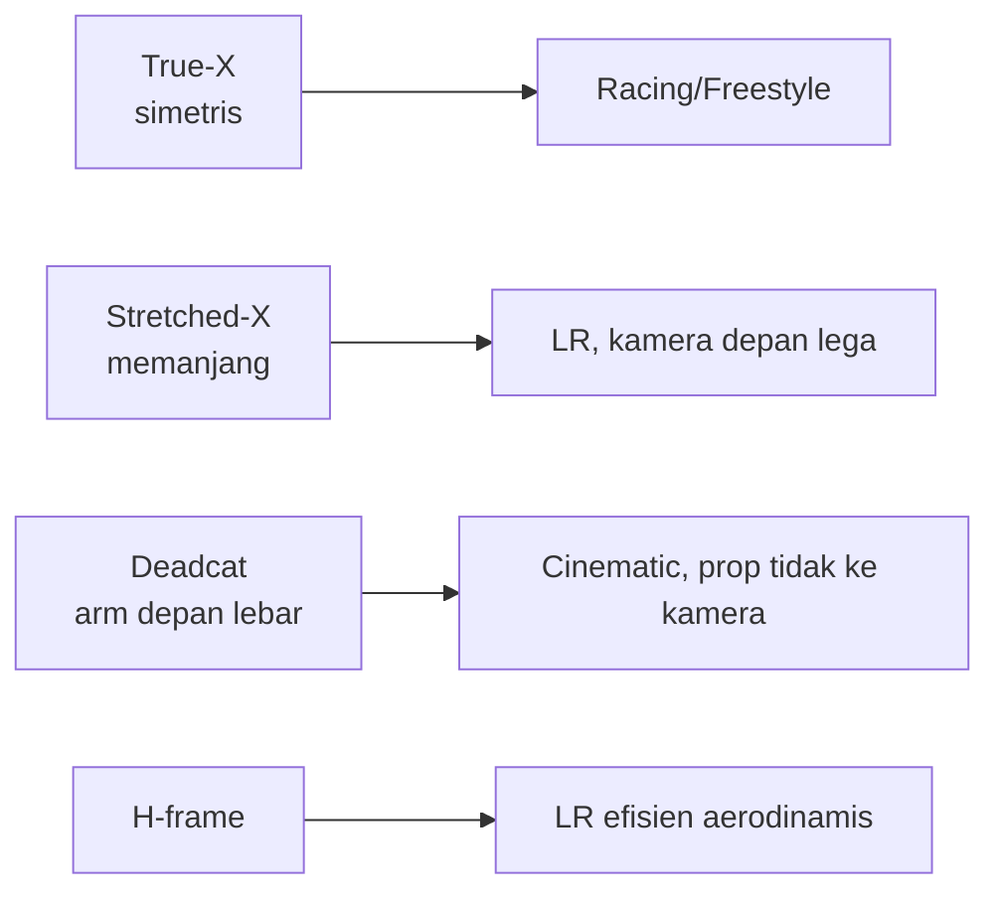
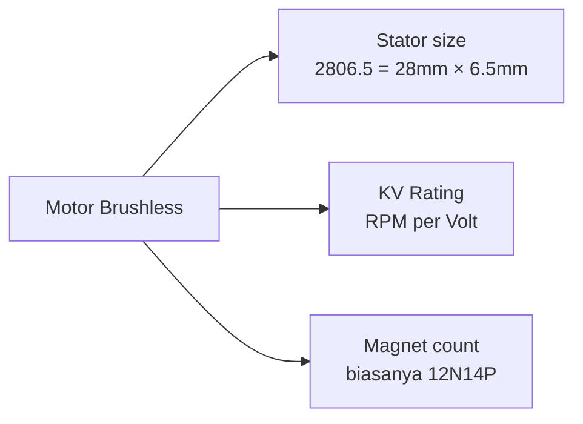
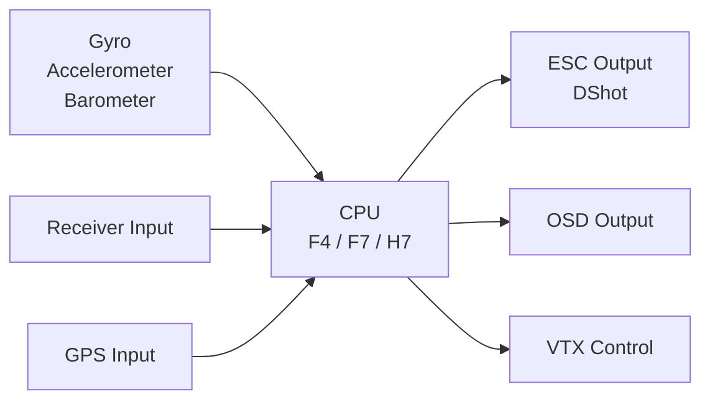
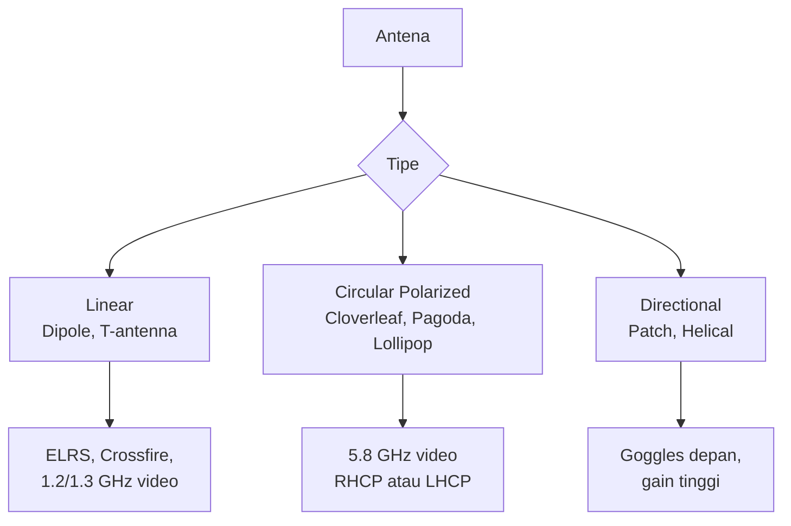
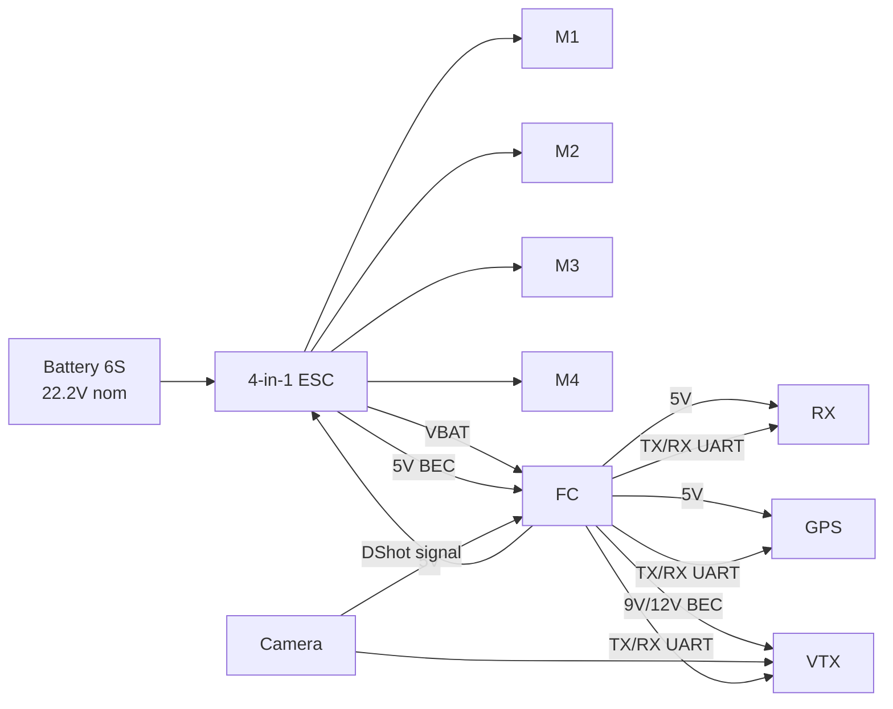

# Modul 2 — Mengenal Komponen Drone

> **Tujuan modul:** memahami fungsi dan cara memilih tiap komponen utama drone FPV LR. Setelah modul ini kamu bisa baca spec sheet dengan percaya diri.

---

## 2.1 Anatomi Drone FPV



---

## 2.2 Frame

**Frame** = "rangka" drone, biasanya carbon fiber.

### Ukuran (size)
Diukur dari **diagonal motor-ke-motor** dalam inci, sama dengan ukuran **propeller maksimum** yang muat.

| Size | Karakter | Cocok untuk |
|---|---|---|
| 5" | Lincah, agresif | Freestyle, Racing, Mini-LR |
| 6" | Kompromi | Mid-range, freestyle efisien |
| **7"** | **Sweet spot LR** | **Long range standar** |
| 8"–9" | Heavy, sangat efisien | Cinematic LR, kamera berat |
| 10" | Cinelifter, lambat | Bawa GoPro/RED, very long range |

### Geometri


Untuk LR 7" pemula: pilih **deadcat** atau **stretched-X**, supaya:
- Battery besar Li-Ion muat di atas frame.
- Propeller tidak masuk frame kamera (no "prop in view").

### Tips memilih frame
- Top mount battery (lebih mudah ganti, Li-Ion sering tinggi).
- Tebal arm minimal **5 mm** untuk 7".
- Standoff mounting **20×20 mm + 30.5×30.5 mm** (universal).

---

## 2.3 Motor



### Membaca kode motor
**Contoh: T-Motor F90 2806.5 1300KV**
- `2806.5` = stator diameter 28 mm × tinggi 6.5 mm.
- `1300KV` = 1300 RPM per volt (no-load).

### Aturan praktis
$$
\text{RPM}_{\text{no-load}} \approx KV \times V_{\text{batt}}
$$

| Prop size | Battery | KV ideal |
|---|---|---|
| 5" | 6S | 1700–2000 |
| 5" | 4S | 2400–2750 |
| 7" LR | 6S | **1300–1700** |
| 9"–10" | 6S | 900–1200 |

> **Aturan emas:** prop besar = KV rendah. Salah pilih KV → motor panas, ESC jebol, atau drone underpowered.

---

## 2.4 Propeller

| Kode | Arti |
|---|---|
| `7×4×3` atau `7040` | 7" diameter, 4" pitch, 3 blade |

- **Diameter** = ukuran (matched dengan frame).
- **Pitch** = jarak teoritis maju per rotasi → **pitch tinggi = top speed tinggi tapi boros**.
- **Blade count** = 2 (efisien), 3 (umum), 4–5 (grippy).

**Untuk LR pilih:** 3-blade pitch rendah (mis. **HQ 7×4×3 V1S**, **Gemfan 7035-3**, **Azure SFP 7042**).

---

## 2.5 Flight Controller (FC)

**FC = "otak" drone**. Mikroprosesor + sensor (gyro, accelerometer, barometer) yang menjalankan firmware.



### Generasi MCU
| MCU | Clock | Cocok untuk |
|---|---|---|
| F4 | 168 MHz | Build hemat, masih relevan |
| **F7** | **216 MHz** | **Mainstream LR, BF/iNav** |
| H7 | 480 MHz | Top-end, banyak UART, blackbox cepat |
| AT32 F435 | 288 MHz | Alternatif ekonomis F7 |

### Yang perlu dilihat saat beli FC
- **Jumlah UART** (minimal **4** untuk LR: RX, GPS, VTX, ESC telemetry).
- **Onboard OSD** (chip MAX7456 untuk analog; BF OSD untuk HD).
- **BEC** (regulator 5V & 9V/12V untuk VTX).
- **Voltage rating** (mendukung **6S = 25.2V max**).
- **Mount pattern** 30.5×30.5 mm umum, 20×20 mm untuk mini.

---

## 2.6 ESC (Electronic Speed Controller)

ESC mengubah perintah dari FC jadi listrik 3-fase untuk motor brushless.

### Spesifikasi penting
| Spec | Penjelasan |
|---|---|
| **Current rating** | Arus kontinu per channel, mis. 60A |
| **Voltage** | Mendukung 6S = up to 25.2V |
| **Protocol** | DShot300 / DShot600 (digital, akurat) |
| **Firmware** | BLHeli_32, AM32, Bluejay |
| **Bidirectional DShot** | Untuk RPM filtering (wajib BF modern) |

### Pilihan untuk 7" LR (6S)
- **45A 6S 4-in-1 BLHeli_32 / AM32** — cukup untuk 1300–1700 KV motor.
- **60A 6S** — kalau pakai motor lebih besar atau prop berat.

### AIO (All-in-One)
FC + ESC dalam satu PCB. Lebih ringan & murah, tapi kalau salah satu rusak → ganti semua. Cocok untuk pemula.

---

## 2.7 Receiver (RX)

Modul kecil yang menerima sinyal dari radio TX dan kirim ke FC.

```mermaid
flowchart LR
    TX[Radio TX] -.2.4 GHz.-> RXmod[ELRS RX<br/>di drone]
    RXmod -- CRSF / SBUS --> FC[Flight Controller]
    FC -- Telemetry kembali --> RXmod
    RXmod -.balik ke TX.-> TX
```

**Bahas detail di Modul 3.** Untuk sekarang ingat: pakai **ExpressLRS (ELRS)** atau **TBS Crossfire/Tracer**.

---

## 2.8 GPS Module

**Wajib untuk LR.** Memberikan posisi drone untuk:
- OSD (jarak, arah pulang).
- **GPS Rescue / RTH** (Return-to-Home).
- Logging misi.

### Pilihan
- **BN-220 / BN-880** — murah, oke untuk pemula (8 satelit cukup cepat lock).
- **Matek M10Q-5883** — generasi terbaru, dual-frequency, akurasi tinggi.
- **HGLRC M100-5883 / M80** — populer 2024–2026.

> Cari modul yang **sudah include compass (magnetometer)** seperti QMC5883 atau HMC5883. iNav butuh compass untuk navigasi yang stabil.

---

## 2.9 Kamera FPV

Beda dengan kamera HD recording. **Kamera FPV** dioptimalkan untuk:
- **Latency rendah** (langsung ke VTX).
- **Dynamic range tinggi** (kontras matahari ↔ bayangan).

| Sistem | Kamera |
|---|---|
| **Analog** | RunCam Phoenix 2, Foxeer Razer Mini, Caddx Ratel 2 |
| **DJI O3/O4** | kamera built-in dari modul Air Unit |
| **Walksnail** | kamera Walksnail dedicated (Avatar HD Pro / Moonlight) |
| **HDZero** | Runcam Nano 90 / Race v3 |

**Untuk LR pilih kamera dengan FOV 150°–160°** dan dynamic range tinggi (WDR/Starlight).

---

## 2.10 VTX (Video Transmitter)

**Bahas detail di Modul 4.** Singkatnya: alat yang kirim video dari kamera ke goggles. Pilihan utama 2026:
- **DJI O4 Air Unit Pro** (HD, terbaru).
- **Walksnail Avatar HD Pro / Moonlight** (HD).
- **HDZero LR VTX** (digital, low-latency).
- **Analog 5.8 GHz** (TBS Unify, RushTank Mini, dll.).
- **Analog 1.2/1.3 GHz** (untuk extreme LR, butuh izin).

---

## 2.11 Antena



**Aturan polarisasi:**
- Antena drone & antena goggles **harus sama polarisasinya**.
- Mismatch (RHCP ↔ LHCP) = signal loss 20+ dB!

---

## 2.12 Battery

**Bahas detail di Modul 5.** Ringkasan:

| Tipe | Cocok untuk |
|---|---|
| **LiPo** | Racing, freestyle (high discharge) |
| **Li-Ion** (Molicel P42A, P45B, Samsung 50S) | **Long Range** (high energy density) |
| **LiHV** | Variant LiPo dengan 4.35V/cell |

Untuk 7" LR pemula: **Li-Ion 6S2P P42A** = ±180 Wh, terbang 30–45 menit.

---

## 2.13 Diagram Pengkabelan Sederhana



---

## 📝 Quiz Modul 2

1. Apa arti `2806.5 1300KV` pada motor?
2. Frame geometri apa yang paling cocok untuk LR pemula?
3. Berapa minimum jumlah UART di FC untuk LR (dengan RX, GPS, VTX, ESC telemetry)?
4. Kenapa Li-Ion lebih cocok untuk LR daripada LiPo?
5. Apa yang terjadi kalau polarisasi antena VTX dan VRX tidak sama?

---

## 🔗 Referensi

- Oscar Liang — *FPV Drone Components* — <https://oscarliang.com/fpv-drone-parts/>
- Joshua Bardwell — *How to Choose FPV Components* (YouTube).
- Betaflight Hardware Compatibility — <https://betaflight.com/docs/wiki/hardware>

---

**Selanjutnya** ➡️ [Modul 3: Radio Link — ELRS, Gemini, Dual Band](03-radio-link.md)
