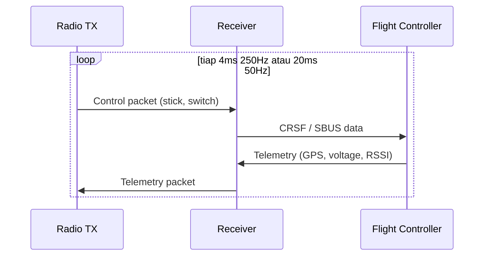
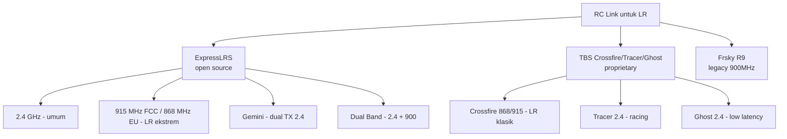
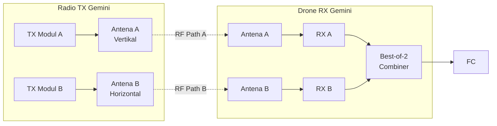
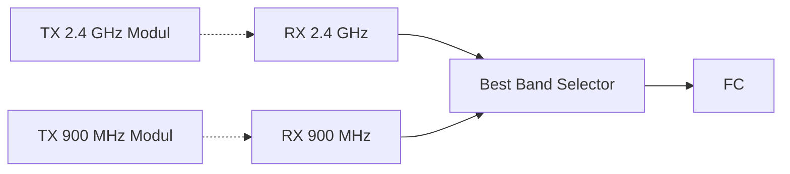
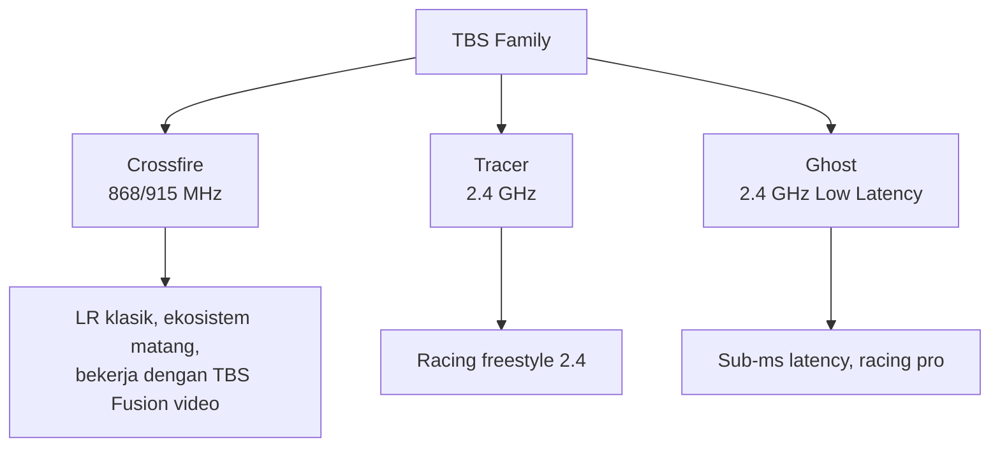
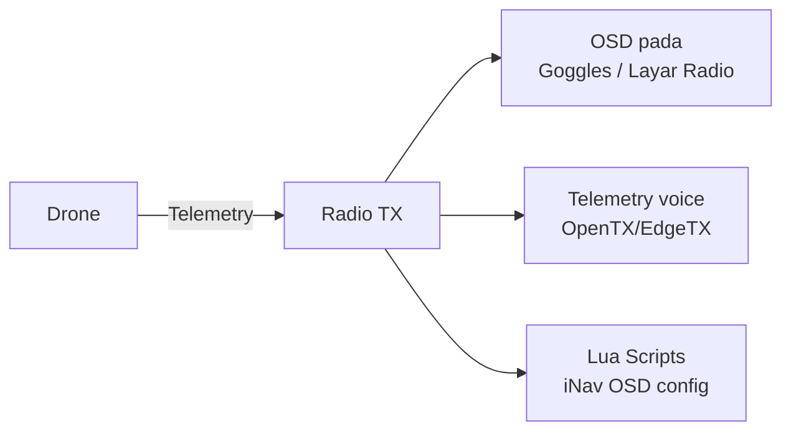
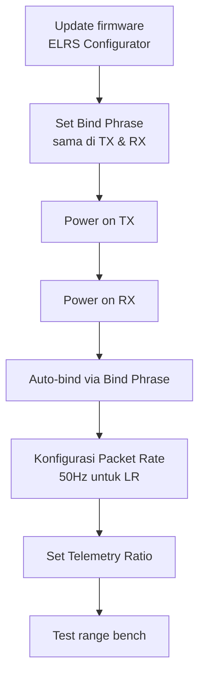
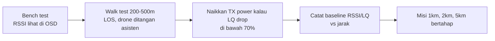

# Modul 3 — Radio Link: ELRS, Gemini, Dual Band

> **Tujuan modul:** memahami sistem RC link untuk LR, perbedaan ExpressLRS vs Crossfire, serta teknologi terbaru seperti **ELRS Gemini** dan **Dual Band**.

---

## 3.1 Apa itu RC Link?

**RC Link = Control Uplink** — jalur radio dari **radio transmitter** (di tangan pilot) ke **receiver** di drone.

Yang membedakan RC link untuk LR vs casual:
- **Sensitivitas tinggi** (bisa nerima sinyal sangat lemah).
- **Telemetry** (data balik dari drone: RSSI, GPS, voltase).
- **Latency rendah & predictable**.

---

## 3.2 Pilihan RC Link Modern (2026)

### Rekomendasi pemula 2026
| Use case | Pilihan |
|---|---|
| Pemula, budget | **ELRS 2.4 GHz** (RadioMaster Pocket / Boxer + EP1/EP2 RX) |
| LR serius | **ELRS Dual Band** (RadioMaster Bandit Dual Band + BetaFPV SuperD RX) |
| Profesional, ekosistem matang | **TBS Crossfire 868/915 MHz** |

> ⚠️ **Disclaimer rekomendasi:** brand & model di atas dipilih berdasarkan adopsi komunitas per **2026**, **bukan endorsement berbayar**. Pastikan band yang kamu pilih (2.4 GHz / 868 / 915 MHz) **legal di negaramu** — pakai band yang salah bisa kena pidana. Cek revisi firmware & hardware terbaru di [expresslrs.org](https://www.expresslrs.org/) sebelum beli.

---

## 3.3 ExpressLRS Deep Dive

### Kelebihan
- **Open source** → murah, perangkat banyak (RadioMaster, BetaFPV, Happymodel, NamimnoRC).
- Latency sangat rendah (< 4 ms @ 500 Hz).
- Sensitivitas tinggi, jangkauan jauh.

### Packet Rate (Refresh Rate)
Mempengaruhi trade-off **latency vs jangkauan**. Sensitivitas berbeda per band — **900 MHz selalu lebih sensitif** dari 2.4 GHz pada packet rate yang sama.

#### Band 2.4 GHz
| Packet Rate | Latency | Sensitivitas | Cocok untuk |
|---|---|---|---|
| 500 Hz / F1000 | < 4 ms | –105 dBm | Racing |
| 250 Hz | 4 ms | –108 dBm | Freestyle |
| 150 Hz | 7 ms | –112 dBm | Mid-range |
| **50 Hz** | **20 ms** | **–115 dBm** | **Long Range standar** |

#### Band 900 MHz (915 / 868)
| Packet Rate | Latency | Sensitivitas | Cocok untuk |
|---|---|---|---|
| 250 Hz | 4 ms | –111 dBm | Freestyle LR |
| 200 Hz | 5 ms | –112 dBm | Mid-range |
| 100 Hz | 10 ms | –117 dBm | Long Range |
| **50 Hz** | **20 ms** | **–120 dBm** | **LR standar** |
| **25 Hz** | **40 ms** | **–123 dBm** | **Extreme LR** |

> **Aturan praktis:** turun setengah packet rate = +3 dB sensitivitas = ±1.4× jangkauan. Tabel lengkap: lihat [Modul 12](12-elrs-deep-dive.md) atau <https://www.expresslrs.org/info/signal-health/>.

### Frekuensi
| Band | Wavelength | Karakter | Catatan |
|---|---|---|---|
| **2.4 GHz** | 12 cm | Antena kecil, saturasi tinggi di urban | Wajib FCC/SDPPI compliance |
| **915 MHz (FCC) / 868 MHz (EU)** | 33 cm | Penetrasi pohon/bangunan lebih baik | **Cek regulasi lokal!** |
| **433 MHz** | 70 cm | LR ekstrem | Sering tidak legal untuk RC |

---

## 3.4 ELRS Gemini (Teknologi Terbaru)

**Gemini** = **dua transmitter 2.4 GHz** memancar **simultan** dengan **dua antena berbeda polarisasi**, ke **satu RX dengan dua antena** juga.

### Manfaat
- **Mengurangi multipath fading** (sinyal yang pantul-pantul jadi cancel).
- **True diversity** di kedua sisi.
- Reliability jauh lebih baik di area urban / berhutan.

### Kekurangan
- Hardware lebih mahal (perlu radio & RX yang support).
- Tetap di band 2.4 GHz, tidak tambah penetrasi.

### Hardware Gemini populer
- **Radio TX:** RadioMaster Boxer / Pocket / TX16S (internal ELRS 2.4 GHz mendukung Gemini sejak firmware 3.x).
- **RX:** **RadioMaster RP4TD** (true-diversity 2.4 GHz, dirancang khusus untuk Gemini), BetaFPV ExpressLRS Diversity Nano RX.

---

## 3.5 ELRS Dual Band (2024+)

**Dual Band** = **RX yang dengar 2.4 GHz DAN 900 MHz secara simultan**, FC otomatis pakai band terkuat.

### Hardware populer
- **Radio TX:** RadioMaster Pocket / Boxer / TX16S **dengan dua modul** (mis. internal 2.4 GHz + external 900 MHz Bandit Micro / Happymodel ES900TX), atau radio yang **siap 900 MHz** seperti RadioMaster Bandit Micro (TX module standalone).
- **RX dual-band 2.4 + 900 (true dual band):** **BetaFPV SuperD** (paling populer per 2026) — satu RX yang dengar 2.4 + 900 simultan.

> 💡 **Catatan klarifikasi:** sampai 2026, RX yang benar-benar **dual band 2.4 + 900 simultan dalam satu modul** masih sangat sedikit — BetaFPV SuperD adalah yang paling matang. RX seperti **RadioMaster RP4TD** itu **2.4 GHz Gemini true-diversity** (dua radio 2.4 GHz dalam satu modul, untuk fitur Gemini), **bukan dual band 2.4+900**. Modul TX seperti **Happymodel ES24TX** adalah **transmitter** (TX), bukan RX. Pastikan kamu beli sesuai fungsi.

### Kapan pakai?
- Terbang LR di area campur urban + alam (gedung lalu hutan).
- Butuh redundansi maksimum tanpa Gemini.
- BVLOS dengan obstruksi tidak terduga.

> **Note penting:** 900 MHz butuh **izin frekuensi** di Indonesia (Kominfo SDPPI). Jangan asal pancarkan!

---

## 3.6 TBS Crossfire / Tracer

### Kelebihan Crossfire
- Sangat matang (2015+), banyak veteran pakai.
- TBS Agent Lite/X firmware, banyak fitur.
- Integrasi mulus dengan **TBS antenna tracker** & **TBS Fusion** video.

### Kekurangan
- Lebih mahal dari ELRS.
- Closed source.
- Latency lebih tinggi dari ELRS modern (~22 ms @ 150Hz).

---

## 3.7 Telemetry: Mata di Punggung Pilot

Telemetry = data balik dari drone ke radio TX.

### Data telemetry penting untuk LR
- **RSSI / LQ** (Link Quality) — kualitas RC link (target LQ ≥ 70%, RSSI > –100 dBm).
- **GPS** — koordinat, jarak, arah.
- **Voltase battery** — dari ESC atau VBAT pad FC.
- **Current draw** — Ampere total (perlu sensor di ESC).
- **Altitude** — dari barometer atau GPS.
- **Heading** — dari magnetometer.

### Voice alert
EdgeTX bisa baca voice "RSSI critical", "Low battery". **Wajib aktifkan untuk LR!**

---

## 3.8 Antena untuk RC Link

| Antena | Karakter | Pakai di mana |
|---|---|---|
| **Dipole** (linier vertikal) | Standar bawaan, omni horizontal | RX drone & TX casual |
| **T-antenna** | Dipole 90° folded | RX drone (lebih kompak) |
| **Moxon** | Directional 9 dBi | TX side untuk LR |
| **Patch / Yagi** | Directional 11–14 dBi | TX side, perlu aim ke drone |

### Tips pemasangan antena RX di drone
1. **Pasang 90° satu sama lain** (kalau RX dual antenna) untuk diversity.
2. **Jauhkan dari carbon, motor, ESC** (bisa block / interfere).
3. **Ujung antena bebas** (bagian aktif), jangan ditekuk dekat tip.
4. Untuk **Gemini/Dual** — pasang **polarisasi berbeda** (vertikal + horizontal).

---

## 3.9 Bind & Setup ELRS (Cepat)

### Bind Phrase
ELRS pakai **bind phrase** (string text) yang di-hash jadi UID. Set **sama** di TX & RX → otomatis bind tanpa tombol.

### Setting LR yang disarankan
- **Packet Rate:** 50 Hz Full (atau D250 untuk smoothness)
- **Switch Mode:** Hybrid / Wide
- **Telemetry Ratio:** 1:64 atau Std (cukup untuk OSD)
- **TX Power:** mulai 100 mW, naikkan bertahap (max 250–1000 mW tergantung regulasi)

> **Wajib:** firmware ELRS major version **TX dan RX harus sama** (mis. 3.x dengan 3.x). Kalau beda, tidak bind!

---

## 3.10 Range Test (Wajib sebelum LR Mission)

> **Jangan langsung 10 km!** Naikkan jangkauan **bertahap** dan catat data tiap penerbangan.

---

## 🔗 Referensi

- ExpressLRS Official Docs — <https://www.expresslrs.org/>
- ExpressLRS Discord — <https://discord.gg/expresslrs>
- TBS Crossfire Manual — <https://www.team-blacksheep.com/tbs-crossfire-manual.pdf>
- Oscar Liang — *ELRS Setup Guide* — <https://oscarliang.com/expresslrs/>

---

**Selanjutnya** ➡️ [Modul 4: Sistem Video — Analog, DJI O4, Walksnail](04-video-system.md)
