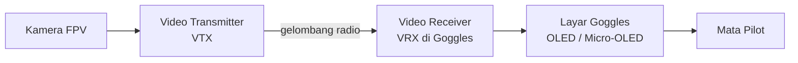
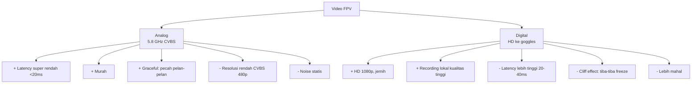
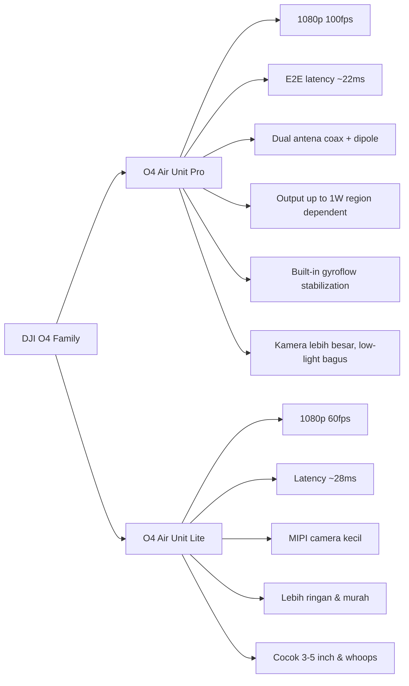
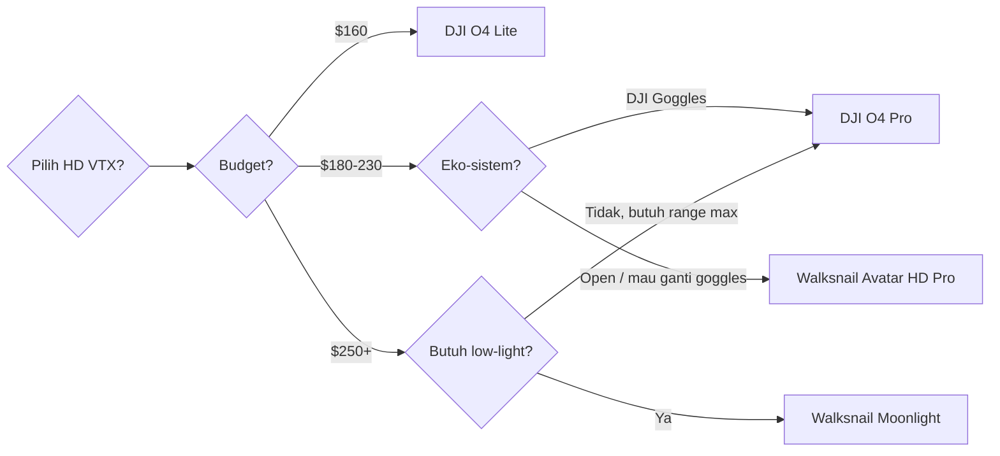
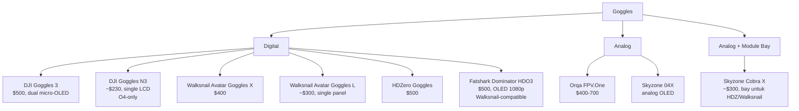
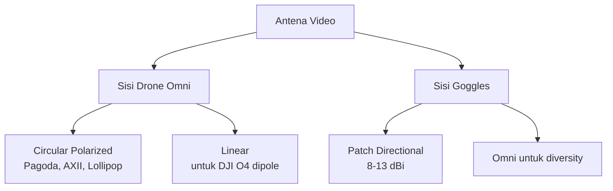
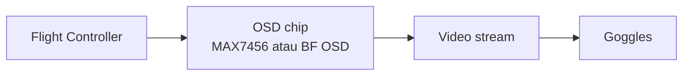

# Modul 4 — Sistem Video: Analog, DJI O4, Walksnail, HDZero

> **Tujuan modul:** memahami pilihan sistem video FPV terbaru (2026), kelebihan/kekurangan, dan cara memilih untuk LR.

---

## 4.1 Big Picture: Bagaimana Video FPV Bekerja?

3 hal yang **paling penting** dalam sistem video LR:
1. **Latency** — delay dari objek di depan kamera sampai muncul di mata pilot.
2. **Range** — jarak maksimum sebelum video pecah/freeze.
3. **Graceful degradation** — apa yang terjadi saat sinyal jelek?

---

## 4.2 Dua Filosofi: Analog vs Digital

### Kapan pilih Analog?
- Budget terbatas.
- Suka **feel klasik** (banyak pilot LR veteran tetap analog).
- Mau frekuensi 1.2 GHz untuk extreme LR (legal di beberapa negara).

### Kapan pilih Digital HD?
- Mau pengalaman immersive HD.
- Suka filming/cinematic.
- Punya budget lebih.

---

## 4.3 Tabel Lengkap Sistem Video 2026

| Sistem | Resolusi | FPS | Latency | Range Tipikal* | Harga (USD) |
|---|---|---|---|---|---|
| **Analog 5.8 GHz** | 480p CVBS | – | <20 ms | 5–20 km dgn patch | $30–80 (VTX) |
| **Analog 1.2/1.3 GHz** | 480p CVBS | – | <20 ms | 30–60+ km | $80–150 (butuh izin) |
| **DJI O3 Air Unit** | 1080p | 100 | 30–40 ms | 8–20+ km | $230 |
| **DJI O4 Air Unit Pro** | 1080p | 100 | ~22 ms | 15–30+ km | $230 |
| **DJI O4 Air Unit Lite** | 1080p | 60 | ~28 ms | 8–15 km | $160 |
| **Walksnail Avatar HD Pro** | 1080p | 100 | ~18 ms | 10–20+ km | $180–220 |
| **Walksnail Moonlight\*\*** | 1080p / 4K record | 100 | ~22 ms | 10–20+ km | $250 |

\*\*Walksnail Moonlight: spec & harga berdasarkan announcement 2025. Verifikasi availability & spec final saat membeli.
| **HDZero LR Whoop V2** | 720p | 60–90 | <20 ms | 5–15 km | $130–180 |
| **HDZero Race V3** | 720p | 90 | <20 ms | 3–8 km | $130 |
| **Caddx Vista (legacy)** | 720p | 60 | ~28 ms | 4–8 km | $150 (used) |

\*Range bergantung pada antena, lingkungan, ketinggian, dan power output.

---

## 4.4 DJI O4 Air Unit Family (Terbaru 2024–2026)

DJI rilis **O4 generation** sebagai pengganti O3, dengan dua varian.

### Kompatibilitas Goggles
| Goggles | O3 | O4 |
|---|---|---|
| Goggles 2 / Integra | ✅ | ✅ (firmware update) |
| Goggles 3 | ✅ | ✅ (native) |
| **Goggles N3** (2024, terjangkau) | ✅ | ✅ (native) |
| Goggles V2 (lama) | ❌ | ❌ |

### Kenapa O4 Pro untuk LR?
- **Range terbaik di kelasnya** (15–30 km dengan antena bagus).
- **Dual diversity antena** (coax + dipole) bawaan.
- **Recording 1080p 100fps** ke microSD lokal.
- **Compatible Goggles 3** — display micro-OLED terbaik di pasaran.

> **Catatan:** DJI O3/O4 punya **DRM lock** ke akun & region. Pastikan beli unit dengan firmware region kamu.

---

## 4.5 Walksnail Avatar HD Pro & Moonlight

Saingan utama DJI di segmen HD digital.

### Walksnail Avatar HD Pro Kit (2024)
- 1080p 100 fps, latency ~18 ms (bersaing dengan DJI O4).
- **True diversity 2 antena RX** di goggles.
- Open ecosystem — banyak vendor 3rd party (Caddx, Foxeer, Speedybee).

### Walksnail Moonlight (2025)
- Kamera **Starlight low-light sensor** — terbang dini hari/sore tetap jelas.
- **Recording 4K 60 fps** di SD card lokal — kualitas mendekati GoPro mini.
- Latency ~22 ms.

---

## 4.6 HDZero — Open Digital

**HDZero** = digital tapi dengan filosofi seperti analog: **low latency, graceful degradation**.

| Varian | Cocok untuk |
|---|---|
| HDZero Race V3 | Racing, freestyle |
| HDZero Freestyle V2 | Freestyle |
| **HDZero LR Whoop V2 / Mini LR** | **Long Range** |

### Kelebihan
- **Latency < 20 ms** (cocok untuk pilot suka feel responsif).
- **Gradual degradation** (tidak cliff freeze seperti DJI/Walksnail).
- Open ecosystem, banyak antena & VTX.

### Kekurangan
- Resolusi 720p (bukan 1080p).
- Range lebih rendah dari DJI O4.

---

## 4.7 Goggles Populer 2026

### Rekomendasi pemula
- **Budget tipis + HD:** DJI Goggles N3 (~$230, single panel LCD; hanya kompatibel dengan DJI O4 Air Unit / Avata 2 / Neo).
- **All-in untuk LR HD:** DJI Goggles 3 (dual micro-OLED 100Hz, kompat O3 & O4).
- **Hybrid (mau analog + HD module):** Skyzone Cobra X.
- **Analog purist:** Orqa FPV.One atau Skyzone 04X.

> ⚠️ **Disclaimer rekomendasi:** pilihan goggles di atas adalah opini berdasarkan kebiasaan komunitas & review publik per **2026**, **bukan endorsement berbayar**. Harga adalah perkiraan retail global (USD) yang bisa bervariasi per region & toko. Kenyamanan goggles **sangat personal** (IPD, jarak mata, bentuk wajah) — kalau memungkinkan, **coba langsung** atau pinjam dulu sebelum beli. Pastikan juga goggles cocok dengan ekosistem VTX yang kamu pakai (DJI O3/O4, Walksnail, HDZero, analog). DJI Goggles N3 **tidak kompatibel dengan O3 Air Unit lama** — hanya O4 / Avata 2 / Neo.

---

## 4.8 Antena Video LR

### Setup goggles diversity yang umum
- **Patch directional** di kiri/depan (gain tinggi, fokus ke arah drone).
- **Omni circular** di kanan/belakang (cover semua arah).
- Goggles otomatis switch ke yang sinyal lebih kuat.

### Tips antena DJI O4 / Walksnail
- Pakai **dua antena bawaan beda orientasi** (coax + dipole vertikal).
- **Jangan satukan** dua antena di lokasi yang sama (multipath kanselasi).
- Pastikan **konektor MMCX/U.FL** terpasang kencang — sering lepas saat crash.

---

## 4.9 Power Output VTX & Regulasi

| Region | Max VTX power 5.8 GHz |
|---|---|
| Indonesia (umum) | 25 mW (legal); 200 mW–1 W common di praktik LR |
| EU | 25 mW (CE); pita amatir bisa lebih |
| USA (HAM license) | up to 1.5 kW di 5.8 GHz amatur |
| Free-fly area | tergantung lokal |

> **Patuhi regulasi & jangan ganggu pilot lain di airfield.** Naikkan power **bertahap** sesuai kebutuhan.

---

## 4.10 OSD (On-Screen Display)

OSD menampilkan info di atas video:
- **RSSI / LQ** (RC link quality).
- **Voltase battery & mAh consumed**.
- **GPS jarak ke home & arah**.
- **Altitude, speed, heading**.
- **Flight timer**.

### Yang **wajib** ada di OSD untuk LR
1. RSSI / LQ
2. Voltase per cell
3. Jarak ke home
4. Arah panah ke home (home arrow)
5. Flight time
6. GPS satelit count
7. **Warning flag** (low voltage, low LQ)

---

## 🔗 Referensi

- DJI O4 Air Unit Pro/Lite — <https://www.dji.com/o4-air-unit-pro>
- Walksnail — <https://www.walksnail.com/>
- HDZero — <https://www.hd-zero.com/>
- Oscar Liang — *FPV Video Systems Comparison* — <https://oscarliang.com/fpv-video-system/>
- Joshua Bardwell — *DJI O4 Review* (YouTube).

---

**Selanjutnya** ➡️ [Modul 5: Battery & Power System](05-battery-power.md)
