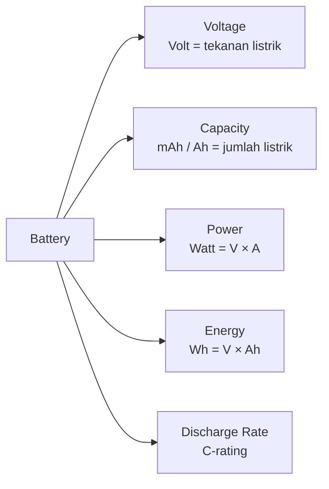
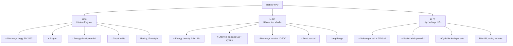
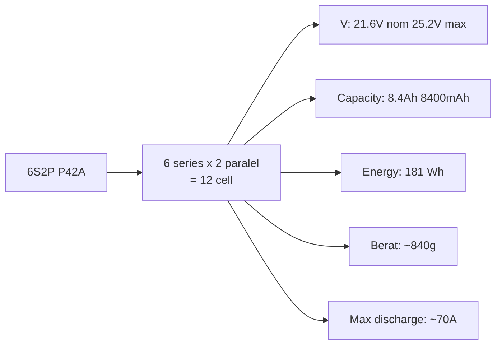
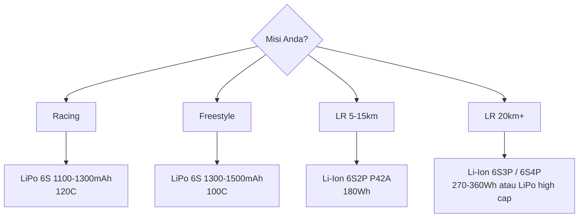
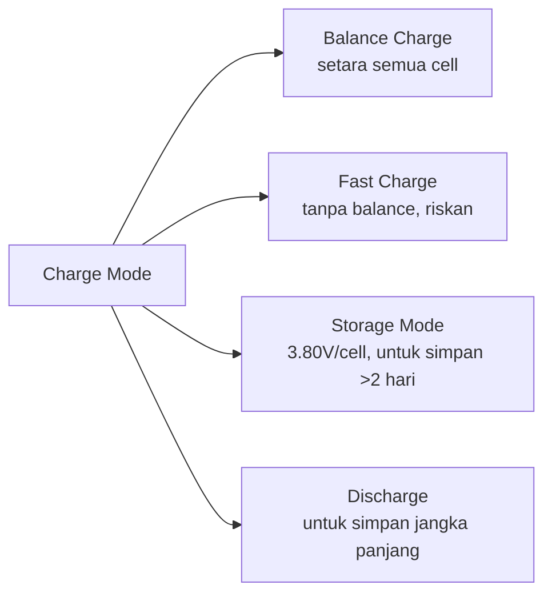
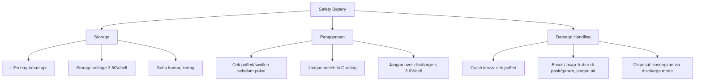
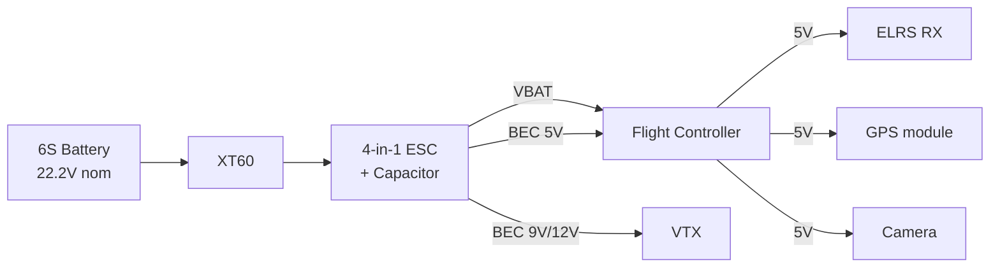

# Modul 5 — Battery & Power System

> **Tujuan modul:** memahami kimia battery, cara baca spec, perhitungan waktu terbang, dan kenapa **Li-Ion** jadi standar LR.

---

## 5.1 Konsep Dasar

### Istilah penting
| Istilah | Arti | Contoh |
|---|---|---|
| **S** | Cell in series | 6S = 6 sel berderet |
| **P** | Parallel | 2P = 2 sel paralel (capacity ×2) |
| **mAh** | Capacity | 4200 mAh = 4.2 Ah |
| **C-rating** | Max discharge | 30C × 4.2Ah = 126A max |
| **Wh** | Energy | 21.6V × 8.4Ah = 181 Wh |

---

## 5.2 LiPo vs Li-Ion vs LiHV

### Tegangan nominal vs full vs empty
| Kimia | Empty (datasheet) | **Practical Cut-off** | Nominal | Full |
|---|---|---|---|---|
| LiPo | 3.30 V/cell | **3.50 V/cell** | 3.70 V/cell | 4.20 V/cell |
| Li-Ion (NMC) | 2.50 V/cell | **3.30 V/cell** | 3.60 V/cell | 4.20 V/cell |
| LiHV | 3.40 V/cell | **3.60 V/cell** | 3.80 V/cell | 4.35 V/cell |

> **Penting:** kolom *Empty* adalah batas teoretis dari datasheet. Untuk **kesehatan baterai jangka panjang**, pakai **Practical Cut-off** sebagai trigger RTH/landing. Li-Ion yang sering didischarge ke 2.5V akan cepat rusak (capacity drop, internal resistance naik). Set `vbat_min_cell_voltage = 3.30V` di Betaflight (lihat [Modul 7](07-failsafe-gps-rescue.md)).

---

## 5.3 Kimia Li-Ion Populer untuk LR (2026)

| Cell | Capacity | Max Discharge | Berat | Catatan |
|---|---|---|---|---|
| **Molicel P42A** | 4200 mAh | 35–45A | 70 g | **Standar industri LR** |
| **Molicel P45B** | 4500 mAh | 45A | 70 g | Upgrade P42A |
| **Samsung 50S** | 5000 mAh | 25A | 70 g | Capacity tinggi |
| **Samsung 40T** | 4000 mAh | 35A | 67 g | Klasik LR |
| **LG M50LT** | 5000 mAh | 7.3A | 70 g | Capacity max, discharge rendah |

### Konfigurasi pack populer

---

## 5.4 Perhitungan Waktu Terbang

### Rumus dasar
$$
T_{\text{terbang (menit)}} \approx \frac{C_{\text{Wh}}}{P_{\text{avg (W)}}} \times 60 \times \eta
$$

- $C_{\text{Wh}} = V_{\text{nom}} \times C_{\text{Ah}}$
- $P_{\text{avg}}$ = daya rata-rata cruise
- $\eta$ ≈ 0.85 (jangan kosongkan 100%)

### Contoh: 7" LR dengan 6S2P P42A
- Energy: 21.6V × 8.4Ah = **181 Wh**
- Cruise power: ~130 W (efisien, throttle 30–40%)

$$
T \approx \frac{181}{130} \times 60 \times 0.85 \approx 71 \text{ menit teoretis}
$$

> Realistis **45–55 menit** dengan margin RTH.

### Cara mengukur cruise power kamu
1. Pasang **current sensor** di FC (BF: `set ibat_scale=...`).
2. Terbang cruise stabil 5 menit.
3. Lihat **W rata-rata** di OSD atau blackbox.

---

## 5.5 Memilih Battery untuk Build Kamu

### Aturan emas untuk LR
1. **Power-to-weight** sweet spot: drone bisa hover di **50% throttle** dengan battery terpasang.
2. Kalau hover < 30% throttle: terlalu ringan → boros / unstable.
3. Kalau hover > 60%: terlalu berat → tidak akan efisien.

---

## 5.6 Charger & Storage

### Charger yang direkomendasikan
- **ISDT Q8 Max** (1000W, support semua kimia).
- **HOTA D6 Pro / D6+** (650W dual port).
- **ToolkitRC M6D / M8** (mid-range, dual port).

### Mode charging

### Aturan charging Li-Ion (BERBEDA dari LiPo!)
- **Max charge rate: 1C** (P42A 4.2Ah → **4.2A max aman**).
- **Stop di 4.20V/cell** (tidak boleh overcharge).
- **Storage: 3.70–3.80 V/cell**.

> 🚨 **WARNING SAFETY**: 1C adalah **batas aman maksimum** untuk Li-Ion silinder. **JANGAN charge melebihi 1C** kecuali kamu paham thermal management & punya monitoring suhu sel. Charging > 1C bisa menyebabkan **thermal runaway, ledakan, atau kebakaran** terutama pada pack rakitan rumahan dengan spot welding sub-optimal. Untuk pemula: stick di **0.5–1C saja**.

> **JANGAN** charge Li-Ion seperti LiPo cepat 5C. Bisa **terbakar / meledak**.

---

## 5.7 Konektor

| Konektor | Current | Cocok untuk |
|---|---|---|
| **XT30** | 15–30A | Tiny whoop, 3" mini |
| **XT60** | 60A continuous | **Standar 5"–7" LR** |
| **XT90 / AS150** | 90–150A | Cinelifter, 10" heavy |
| **MR30** | 30A | Mini freestyle |

### Wiring
- **AWG 12 atau 14** untuk power 6S (jangan terlalu kecil).
- **Solder bersih**, tidak ada cold joint.
- **Heat shrink** semua sambungan.

---

## 5.8 Battery Safety

### Tanda battery rusak
- **Puffed (gembung)** → buang.
- **Voltase tidak balance > 0.1V antar cell** → cek atau buang.
- **Internal resistance naik drastis** (cek di charger) → mendekati end-of-life.
- **Suhu naik abnormal saat charge** → bahaya, hentikan.

### Crash protocol
1. Setelah crash keras, **diamkan battery 15 menit** sebelum disentuh.
2. Cek visual (puffed? bocor cairan?).
3. Kalau aman, charge perlahan & monitor suhu.
4. Kalau ragu — **buang dengan benar**.

---

## 5.9 Voltage Sag & ESR

**Voltage sag** = drop voltase saat draw ampere tinggi (contoh punch throttle).

$$
V_{\text{sag}} = V_{\text{rest}} - (I \times \text{ESR}_{\text{total}})
$$

- **ESR (Internal Resistance)** kecil = sag kecil.
- Li-Ion ESR lebih tinggi dari LiPo → **lebih banyak sag** saat punch.

### Implikasi untuk LR
- Jangan **full throttle berturut-turut** dengan Li-Ion (akan sag drastis).
- **Cruise smooth** — power demand stabil 100–150W.
- Set **min cell voltage** di Betaflight 3.3 V/cell (Li-Ion) untuk RTH.

---

## 5.10 Power System Wiring (Big Picture)

### Capacitor wajib!
**Pasang capacitor low-ESR** (35V, 1000–2200µF) di pad battery:
- Mengurangi voltage spike (lindungi VTX & FC).
- **Wajib** untuk DJI O3/O4 (DJI rekomendasikan!).
- **Wajib** untuk semua build 6S.

---

## 🔗 Referensi

- Molicel datasheet — <https://www.molicel.com/product/>
- Oscar Liang — *Li-Ion vs LiPo for FPV* — <https://oscarliang.com/li-ion-vs-lipo/>
- ChrisRosser — *Long Range FPV Battery Guide* (YouTube).
- Jeff Bourke — *Li-Ion Pack Building Guide* (YouTube).

---

**Selanjutnya** ➡️ [Modul 6: Build & Setup Pertama](06-build-setup.md)
