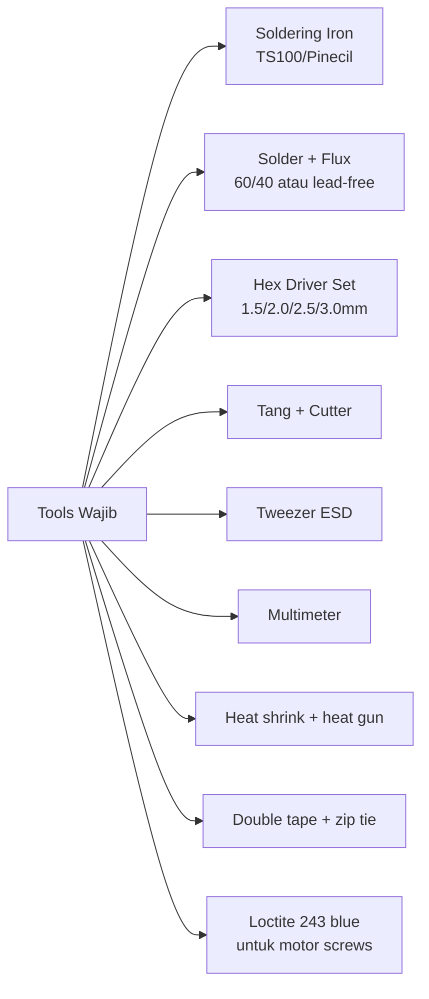
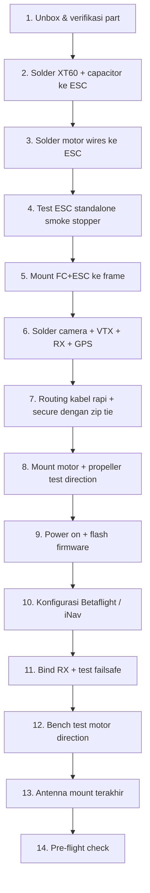
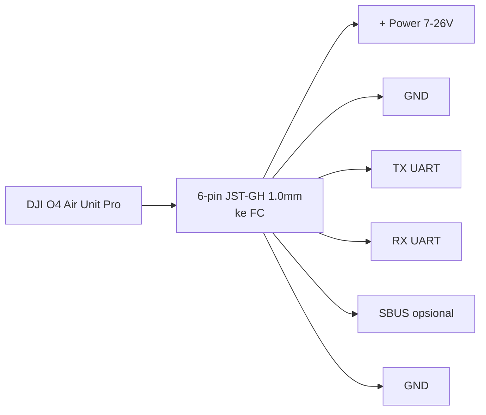
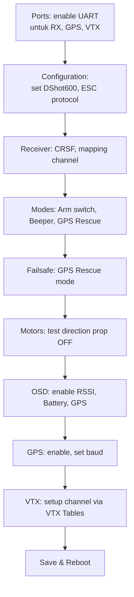
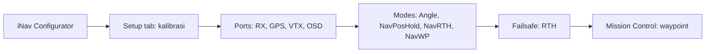
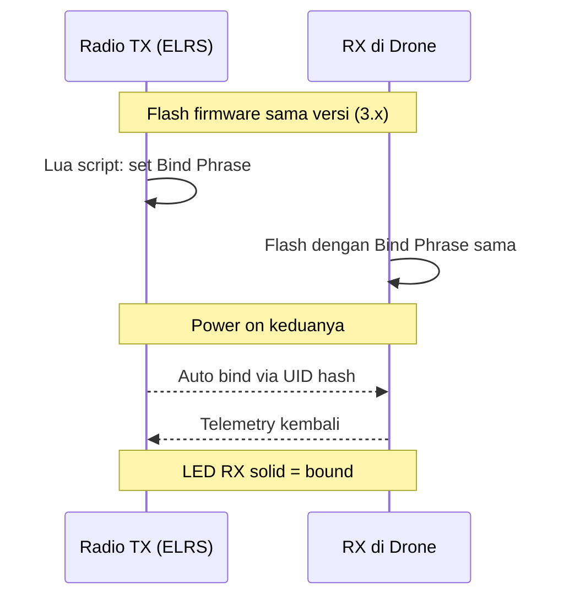
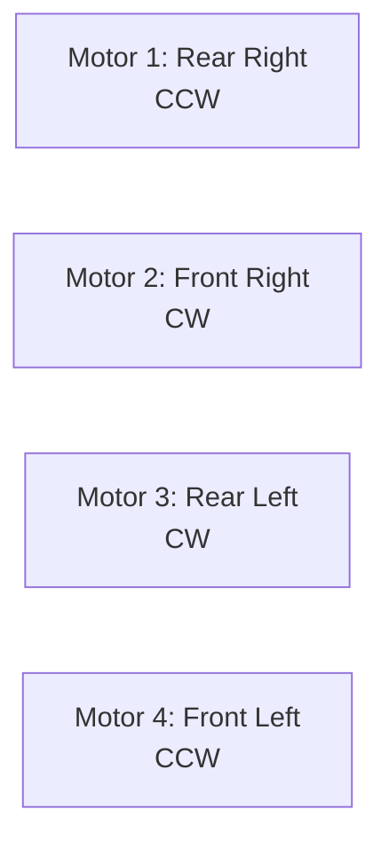
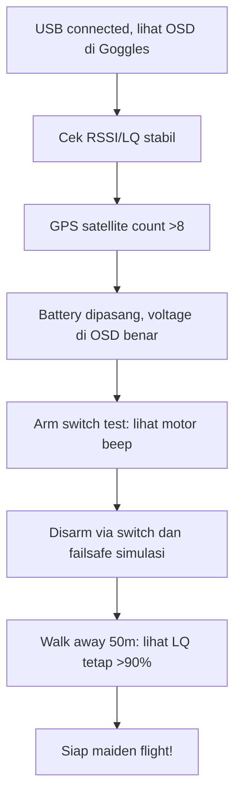

# Modul 6 — Build & Setup Pertama

> **Tujuan modul:** panduan praktis merakit drone FPV LR 7" dari nol, lengkap dengan tools, urutan kerja, dan setup software.

---

## 6.1 Shopping List Lengkap (Build 7" LR HD)

| Komponen | Rekomendasi 2026 | Estimasi (USD) |
|---|---|---|
| Frame 7" | iFlight Chimera7 Pro V2 / GepRC Mark5 LR | $80 |
| FC + ESC AIO | SpeedyBee F405 V4 50A AIO | $90 |
| Motor 2806.5 1300KV (×4) | T-Motor F90 / iFlight Xing2 | $80 |
| Propeller HQ 7×4×3 V1S (×8) | HQProp / Gemfan 7035 | $15 |
| RX | RadioMaster RP4TD Dual Band | $40 |
| GPS | Matek M10Q-5883 | $30 |
| VTX HD | DJI O4 Air Unit Pro | $230 |
| Battery | Molicel P42A 6S2P pack | $80 |
| Antena VTX | dipole bawaan + tambahan stub | $0 |
| Antena RX | T-antenna kit | $5 |
| XT60 + AWG14 wire | – | $5 |
| **Total drone-side** | | **±$655** |

### Ground side (sekali beli, pakai bertahun)
| Item | Rekomendasi | USD |
|---|---|---|
| Radio TX | RadioMaster Boxer ELRS Dual Band | $200 |
| Goggles | DJI Goggles 3 / N3 | $300–500 |
| Charger | ISDT Q8 Max + 12V PSU | $150 |

---

## 6.2 Tools yang Dibutuhkan

### Optional tapi sangat membantu
- **Smoke stopper** (sekring 1A untuk first power on, hindari drone meledak).
- **Solder fume extractor**.
- **PCB holder / vise**.

---

## 6.3 Urutan Build (Workflow)

---

## 6.4 Soldering Tips

### Suhu solder
- **Ujung kawat tipis (signal wire):** 280–320°C
- **Pad besar (battery, motor):** 350–400°C
- **Diam terlalu lama** = pad terbakar atau lift!

### Cold joint vs good joint
| Cold (jelek) | Good |
|---|---|
| Dull, abu-abu | Mengkilap silver |
| Bentuk bola | Cone / vulkan |
| Mudah lepas | Solid |

---

## 6.5 Wiring Checklist Khusus DJI O4

### Pasang capacitor!
**Wajib:** pasang **35V 1000–2200 µF low-ESR cap** di pad battery sebelum pasang DJI Air Unit. DJI menulisnya di manual resmi — **tanpa cap, VTX bisa rusak**.

---

## 6.6 Software Setup — Betaflight

### Instalasi awal
1. Download **Betaflight Configurator 10.10+** dari <https://betaflight.com>.
2. Connect FC via USB-C.
3. Tab **Firmware Flasher** → pilih target board (mis. `SPEEDYBEEF405V4`) → versi **4.5+** → flash.
4. Reconnect.

### Konfigurasi awal (urutan penting)

### Setting penting untuk LR
- **Looptime:** 8 kHz / 4 kHz (default OK).
- **Gyro filter:** default RPM filter on (butuh bidirectional DShot).
- **Min cell voltage:** 3.3V (Li-Ion) atau 3.5V (LiPo).
- **Failsafe stage 2:** GPS Rescue.
- **Beeper:** ON saat failsafe & lost model.

---

## 6.7 Software Setup — iNav (Alternatif untuk LR)

iNav lebih kaya untuk LR: **waypoint mission, fixed wing support, return-to-home matang**.

### Kelebihan iNav untuk LR
- **PosHold mode** tanpa drift bahkan tanpa pilot input.
- **Mission planner** (waypoint).
- **Safehome** (multiple home points).
- **Soaring detection** (untuk efisiensi power).

### Pemula: pilih Betaflight atau iNav?
| Kalau kamu mau... | Pilih |
|---|---|
| Freestyle + sesekali GPS Rescue | Betaflight |
| LR misi waypoint, autonomous | iNav |
| Fixed wing | iNav |
| Acro feel terbaik | Betaflight |

---

## 6.8 Bind ELRS RX

### Tips bind
- **Bind phrase** di TX & RX harus **identik** (case-sensitive).
- Update firmware via **ELRS Configurator** (<https://www.expresslrs.org/quick-start/installing-configurator/>).
- Setelah bind, set **Packet Rate 50 Hz** dan **TX Power 100 mW** untuk start.

---

## 6.9 Test Motor Direction

> **Wajib lepas propeller!** Test direction tanpa prop.

### Aturan motor direction (Betaflight default: "Props Out")

Di tab **Motors** Betaflight:
1. Centang "I understand the risks" (prop OFF!).
2. Slide motor 1 → harus putar CCW.
3. Kalau salah → ubah di tab **Configuration → Motor Direction** atau via BLHeli Configurator.

---

## 6.10 Pre-flight Bench Test

### Test failsafe (PENTING)
1. Arm drone (di bench, prop OFF, dipegang).
2. **Matikan radio TX**.
3. Pastikan motor **stop dalam 1–2 detik** (failsafe stage 1).
4. Untuk LR: aktifkan **GPS Rescue** dan test simulasi (drone dipegang outdoor, GPS lock, switch ke GPS Rescue mode → motor harus mengarahkan ke home).

---

## 📝 Quiz Modul 6

1. Apa fungsi **smoke stopper** dan kapan dipakai?
2. Kenapa **wajib** pasang kapasitor untuk DJI O4?
3. Apa beda Betaflight dan iNav untuk LR?
4. Apa setting failsafe stage 2 yang direkomendasikan untuk LR?
5. Kenapa motor direction harus dites **tanpa propeller**?

---

## 🔗 Referensi

- Betaflight Wiki — <https://betaflight.com/docs>
- iNav Wiki — <https://github.com/iNavFlight/inav/wiki>
- Joshua Bardwell — *FPV Drone Build Tutorial* (YouTube playlist).
- Oscar Liang — *Build a 7 inch Long Range Drone* — <https://oscarliang.com/7-inch-long-range/>

---

**Selanjutnya** ➡️ [Modul 7: Failsafe & GPS Rescue](07-failsafe-gps-rescue.md)
