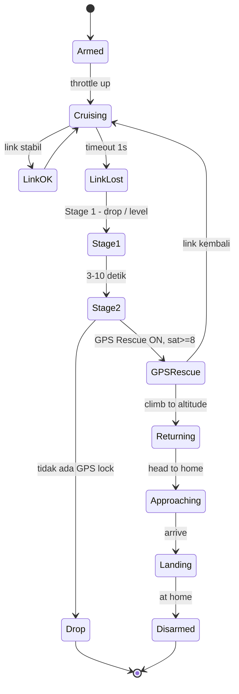
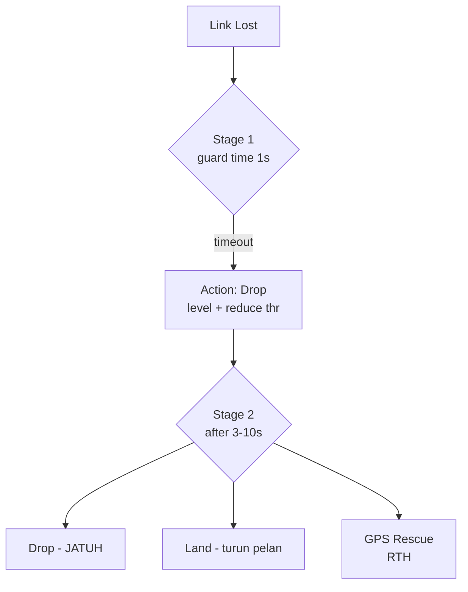
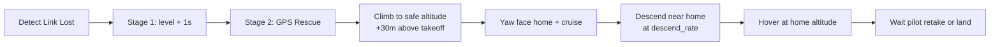
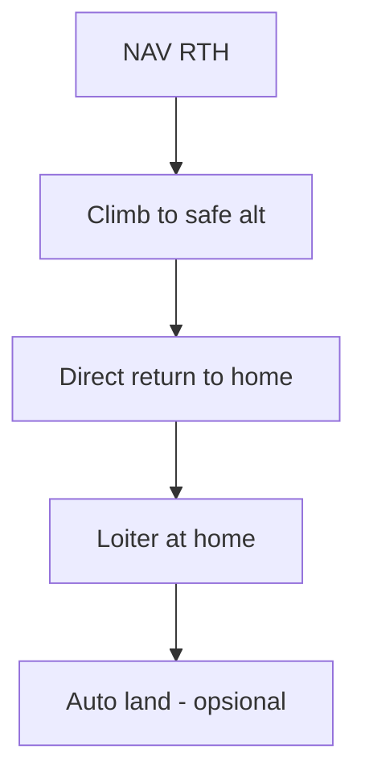
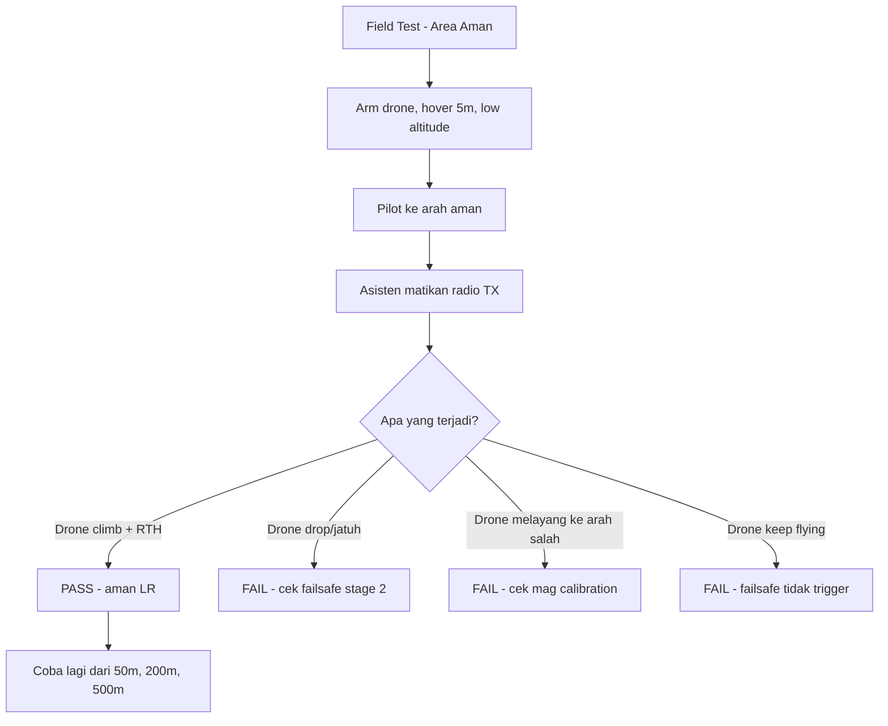
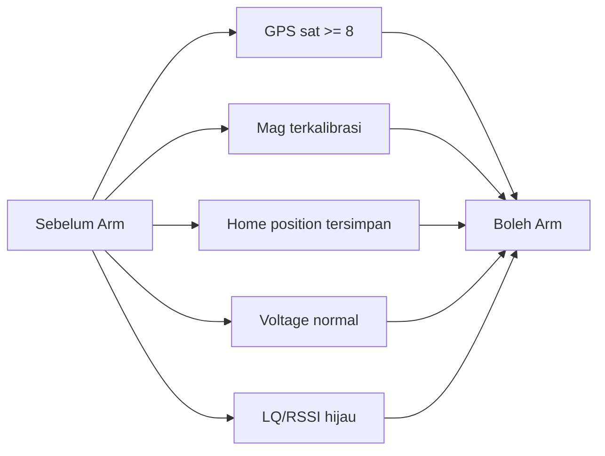
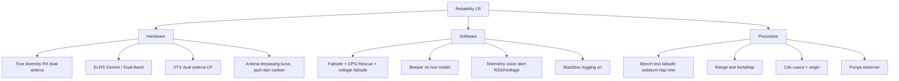

# Modul 7 — Failsafe & GPS Rescue

> **Tujuan modul:** memahami dan mengkonfigurasi sistem keamanan terpenting untuk LR — apa yang terjadi saat link putus.

---

## 7.1 Kenapa Failsafe Wajib untuk LR?

Skenario sederhana:
- Kamu terbang 5 km dari rumah.
- Tiba-tiba RC link putus (interferensi, antenna lepas, dll.).
- **Tanpa failsafe**: drone terbang lurus sampai battery habis → jatuh entah dimana.
- **Dengan GPS Rescue**: drone otomatis pulang ke titik take-off.

---

## 7.2 Tahapan Failsafe Betaflight

### Stage 1 — Reaction (segera saat link timeout)
- **Drop** (motor mati instan), atau
- **Land** (level + slow descend), atau
- **Hold** (lanjut dengan stick netral).

Default Betaflight: **Drop** setelah 1 detik link timeout.

### Stage 2 — Procedure (after stage 1 timeout, 3–10s)
- **Drop** (motor mati permanent — JANGAN untuk LR!).
- **Land** (descend pelan).
- **GPS Rescue** ← **WAJIB untuk LR**.

---

## 7.3 GPS Rescue Setup (Betaflight)

### Prasyarat
- Modul GPS terpasang & lock (**≥ 8 satelit minimum, ≥ 10 sangat disarankan untuk LR**).
- Magnetometer **TIDAK WAJIB** (BF Rescue bisa pakai velocity-based heading), tapi **direkomendasikan**.
- Set di tab **Failsafe** → mode **GPS Rescue**.

> **Standar GPS satellite di seri ini:** ≥ **8 = minimum boleh arm** (BF Rescue bisa jalan), ≥ **10 = disarankan untuk maiden flight & misi LR** (akurasi lebih bagus, fix lebih cepat re-acquire kalau drift).

### Parameter penting

| Parameter | Rekomendasi 7" LR | Penjelasan |
|---|---|---|
| `gps_rescue_min_start_dist` | 10 m | Rescue aktif kalau jarak > 10m dari home |
| `gps_rescue_initial_climb` | 30 m | Climb 30m dulu sebelum RTH (hindari rintangan) |
| `gps_rescue_alt_mode` | `MAX_ALT` | Pakai altitude tertinggi yang tercatat |
| `gps_rescue_ascend_rate` | 500 cm/s | Kecepatan naik |
| `gps_rescue_descend_rate` | 100 cm/s | Kecepatan turun (pelan!) |
| `gps_rescue_ground_speed` | 1500 cm/s (15 m/s) | Speed pulang |
| `gps_rescue_throttle_min/max` | 1100 / 1700 | Range throttle saat rescue |
| `gps_rescue_sanity_checks` | RESCUE_SANITY_ON | Auto-disable kalau drone melenceng |

---

## 7.4 GPS Rescue Setup (iNav RTH)

iNav punya RTH yang lebih matang, dengan banyak opsi.

### Mode RTH iNav

### Setting penting iNav
| Parameter | Rekomendasi |
|---|---|
| `nav_rth_altitude_mode` | `AT_LEAST` |
| `nav_rth_altitude` | 5000 (50m) |
| `nav_rth_climb_first` | ON |
| `nav_rth_climb_ignore_emerg` | OFF |
| `nav_rth_tail_first` | OFF (kepala dulu = lebih cepat) |
| `nav_rth_allow_landing` | NEVER atau ON_FS |
| `nav_emerg_landing_speed` | 200 cm/s |

---

## 7.5 Test Failsafe — WAJIB Sebelum Setiap Misi LR

> **Jangan asumsi failsafe bekerja!** **Test fisik di lapangan terbuka, low altitude, area aman**, sebelum misi sungguhan.

---

## 7.6 Voltage Failsafe

Selain link failsafe, **voltage failsafe** juga penting:
- Kalau battery turun di bawah threshold → trigger RTH otomatis.

### Setting Betaflight
- Tab **Power & Battery**:
  - Cell count detection: auto.
  - Min cell voltage: **3.3V** (Li-Ion) / **3.5V** (LiPo).
  - Warning cell voltage: **3.5V** (Li-Ion) / **3.7V** (LiPo).
- OSD: aktifkan **flash warning** untuk low battery.

### Setting iNav
- `vbat_min_cell_voltage = 330` (Li-Ion).
- `vbat_warning_cell_voltage = 350`.
- Mode: aktifkan **Failsafe pada Low Battery** untuk auto-RTH.

---

## 7.7 Sanity Check Sebelum Arm

### Arming switch + safety
- Pakai **2-step arm**: switch SAFE + switch ARM.
- Atau **arm via stick command** + safe switch.
- **Beeper aktif** — supaya kalau lost, bisa dicari.

### Disable arming saat:
- Tilt > 25° (gyro check).
- Throttle tidak idle.
- Calibration belum done.
- GPS belum lock (untuk LR sebaiknya wajib).

---

## 7.8 Tips Tambahan Reliability LR

### Backup tracker (untuk LR jauh)
- **Bluetooth GPS tracker** kecil (mis. AirTag, GoMcu Tracker, custom LoRa beacon).
- Pasang dengan velcro di drone.
- Kalau drone hilang, masih bisa dicari via Find My / aplikasi.

### Beeper Pattern (Lost Model)
Ketika drone failsafe / disarmed di posisi unknown, beeper akan bunyi:
- **Continuous loud beep** (default Betaflight) — paling mudah dilacak telinga, tapi cepat habiskan voltage residual.
- **Intermittent (1–2 detik on/off)** — lebih hemat power, bisa bertahan 10–20 menit pasca crash.
- Atur via mode **BEEPER → RX_LOST** + **RX_SET** di tab Modes Betaflight.

> Tips field recovery: **diam, dengarkan**, lalu walk perlahan ke arah suara. Beeper drone modern bisa terdengar hingga 30–50 m di area sepi.

---

## 📝 Quiz Modul 7

1. Apa beda **Failsafe Stage 1** dan **Stage 2**?
2. Apa itu `gps_rescue_initial_climb` dan kenapa penting?
3. Berapa **minimum GPS satellite** sebelum GPS Rescue bisa aktif?
4. Apa yang terjadi kalau drone arm tanpa magnetometer terkalibrasi (di iNav)?
5. Sebutkan 3 tips reliability hardware untuk LR.

---

## 🔗 Referensi

- Betaflight GPS Rescue Docs — <https://betaflight.com/docs/wiki/configurator/failsafe-tab>
- iNav Navigation — <https://github.com/iNavFlight/inav/wiki/Navigation-modes>
- Joshua Bardwell — *GPS Rescue Setup* (YouTube).
- Painless360 — *Failsafe Done Right* (YouTube).

---

**Selanjutnya** ➡️ [Modul 8: First Flight & Tuning](08-first-flight-tuning.md)
