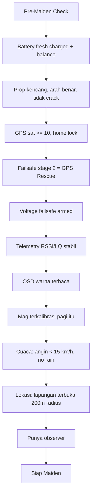
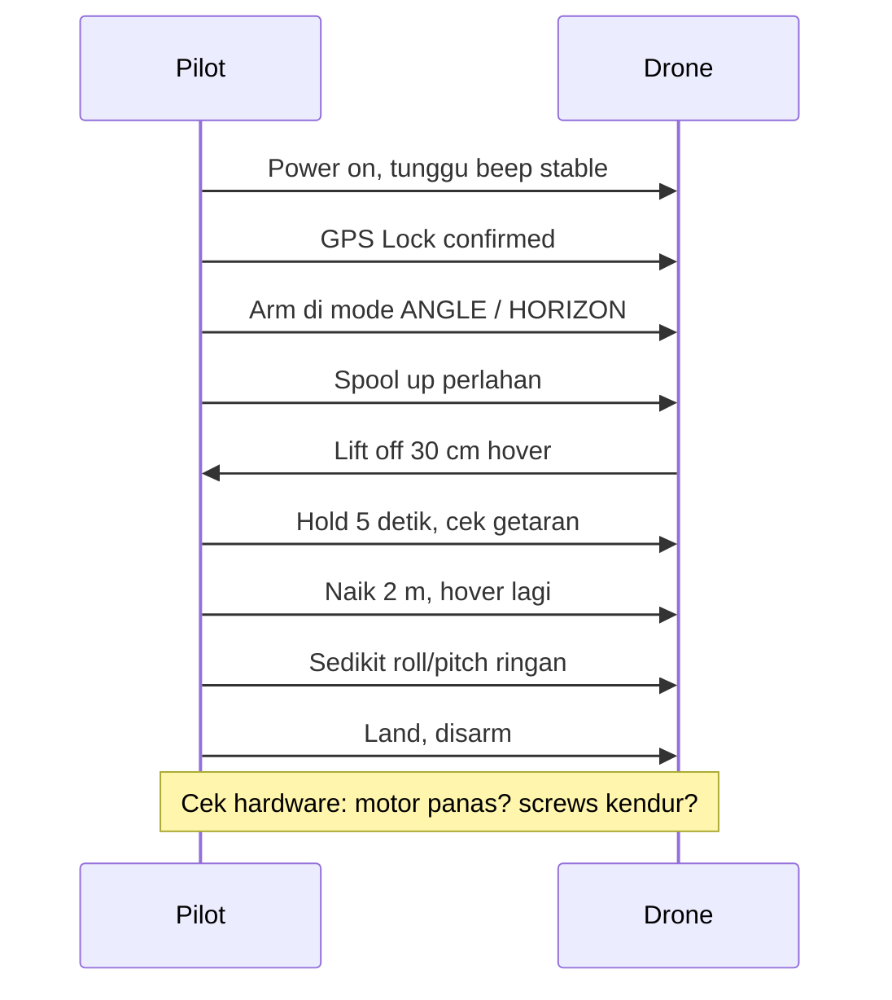
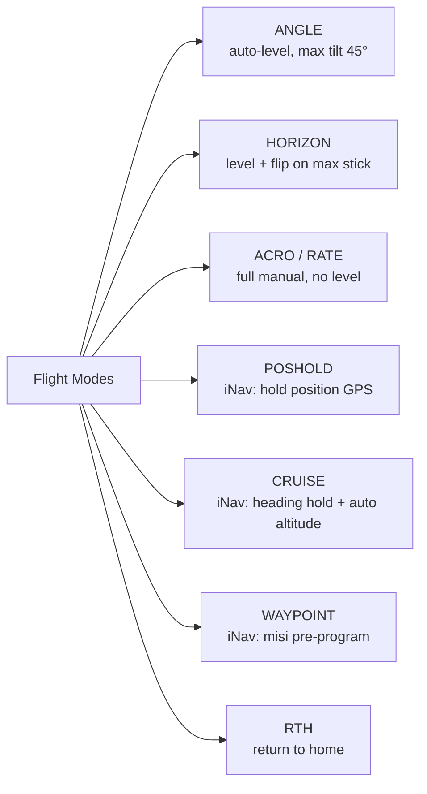
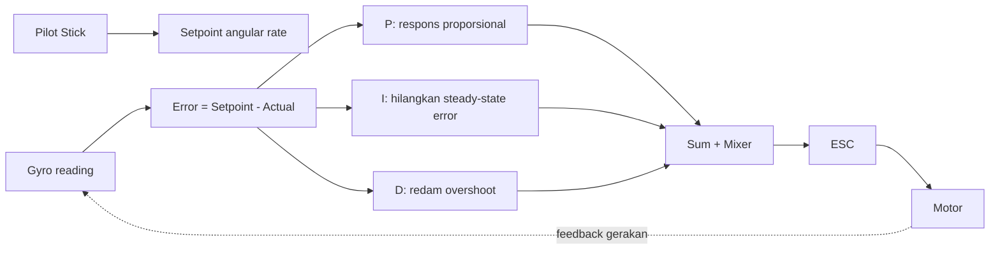
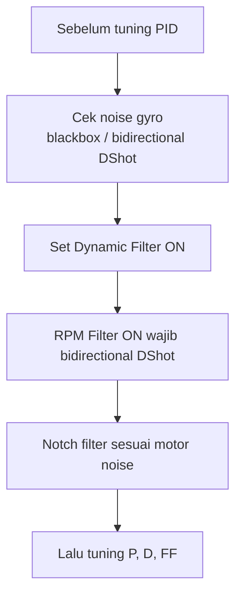
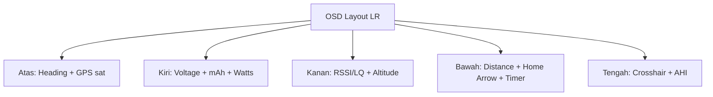
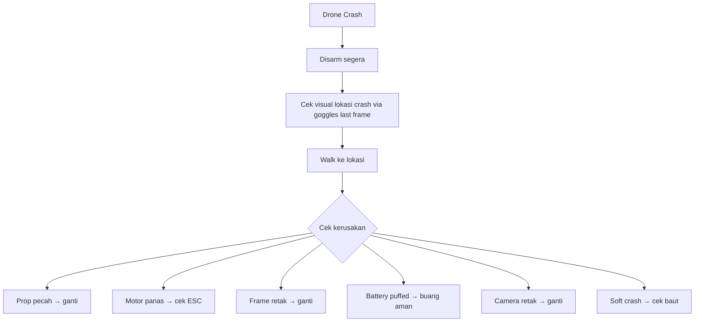
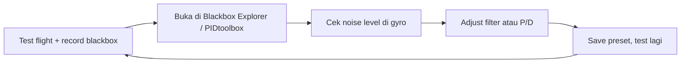

# Modul 8 — First Flight & Tuning

> **Tujuan modul:** sukses melewati maiden flight tanpa crash dan paham dasar tuning PID + filter.

---

## 8.1 Sebelum Maiden — Final Checklist

> **Hindari maiden flight di area kecil, hari pertama beli, sore mau gelap.** Beri diri kamu **kondisi optimal** untuk sukses pertama kali.

---

## 8.2 Maiden Flight Protocol

### Mode terbang pertama
- **Pemula: ANGLE mode** (drone auto-level, tidak bisa flip).
- **Setelah nyaman: HORIZON** (level + bisa flip dengan stick max).
- **ACRO** (full manual) → **setelah 20+ jam simulator**.

---

## 8.3 Memahami Mode Terbang

### Untuk LR, yang sering dipakai:
- **ANGLE** atau **HORIZON** untuk smooth cinematic.
- **ACRO** untuk freestyle moment.
- **CRUISE / POSHOLD** (iNav) untuk istirahat tangan.
- **RTH** kalau ragu.

---

## 8.4 Tuning Dasar — Apa itu PID?

**PID = Proportional, Integral, Derivative** — algoritma feedback yang bikin drone stabil.

| Term | Fungsi | Kalau terlalu tinggi |
|---|---|---|
| **P** | Respons utama | Oscillation cepat |
| **I** | Hilangkan drift | Bouncy / wobble lambat |
| **D** | Redam overshoot | Motor panas, jittery |

---

## 8.5 Tuning Filter (PALING PENTING dulu!)

### Default Betaflight 4.5+ untuk 7" LR
Default sudah cukup baik untuk pemula. Yang penting:
- **Bidirectional DShot ON**.
- **RPM Filter ON**.
- **Dynamic Notch ON**.
- **Looptime 4 kHz** (cukup, hemat CPU).

> **Untuk pemula:** **JANGAN otak-atik PID di awal**. Default + filter sudah 90% bagus. Tuning baru perlu kalau ada problem nyata.

> 🚨 **WARNING SERIUS**: Tuning PID tanpa pemahaman dasar bisa menyebabkan **oscillation tak terkendali → crash mahal** dalam hitungan detik di udara. Aturan aman:
> - **0–20 jam terbang**: pakai default firmware, **JANGAN ubah PID**.
> - **20–100 jam**: baru boleh tweak rates & expo (bukan PID).
> - **100+ jam + paham blackbox**: baru pelajari PID/filter tuning.
>
> Builder berpengalaman pun masih sering pakai default Betaflight 4.5+ untuk LR — karena memang sudah bagus.

---

## 8.6 Trim & Calibrate

### Yang harus dikalibrasi sebelum maiden:
1. **Accelerometer** — drone di permukaan datar → tab Setup → Calibrate Accel.
2. **Magnetometer (mag)** — putar drone semua arah → Calibrate Mag.
3. **ESC throttle range** — Bluejay/BLHeli throttle calibration.
4. **Subtrim** — kalau drone drift sedikit, trim di radio (bukan PID!).

### Stick rates
Pemula: pakai **rates default RC link**, pelan-pelan naikkan kalau sudah nyaman.

---

## 8.7 Membaca OSD

### Reading OSD saat terbang
- **Glance method**: lihat OSD setiap 5–10 detik.
- Prioritas: **Voltage** (kalau warning, RTH segera) > **LQ** > **Distance** > **GPS arrow** > **Battery used (mAh)**.
- **Aturan 50%**: kalau battery atau jarak sudah 50% target, **mulai pulang**.

---

## 8.8 Crash Protocol

### Kalau drone hilang
1. Cek **last GPS coordinate** di OSD recording (DJI/Walksnail rekam!).
2. Pakai **Find My / tracker** kalau ada.
3. Drone **beeper** akan terus bunyi (kalau lost model active).
4. Cari di sektor downwind (angin sering dorong drone).

---

## 8.9 Logbook & Improvement

> **Catat tiap penerbangan**:
> - Tanggal, lokasi, durasi.
> - Battery yang dipakai (capacity awal/akhir).
> - Cuaca & angin.
> - Catatan tuning / problem.
> - Distance terjauh.

Pakai aplikasi: **Speedybee app**, **Betaflight Blackbox Explorer**, atau spreadsheet manual.

---

## 8.10 Tuning Lanjutan (kalau sudah nyaman)

### Tools
- **Betaflight Blackbox Explorer** — analisis log.
- **PIDtoolbox** — visualisasi noise & PID.
- **Setpoint Response** plot — analisa respons.

### Workflow tuning iteratif

> Ini **advanced**. Pemula bisa skip dan stick dengan default Betaflight 4.5+ — sudah sangat bagus untuk 7" LR.

---

## 📝 Quiz Modul 8

1. Mode terbang apa yang **paling cocok** untuk maiden flight pemula?
2. Apa yang **lebih penting** dituning duluan: PID atau Filter?
3. Apa fungsi **RPM Filter** dan apa prasyaratnya?
4. Apa "**aturan 50%**" untuk terbang LR?
5. Kalau drone crash, apa langkah pertama setelah disarm?

---

## 🔗 Referensi

- Betaflight Tuning Guide — <https://betaflight.com/docs/wiki/tuning>
- Joshua Bardwell — *PID Tuning Master Class* (YouTube playlist).
- UAVTech — *Tuning with PIDtoolbox* (YouTube).
- Chris Rosser — *Long Range Flight Tips* (YouTube).

---

**Selanjutnya** ➡️ [Modul 9: Misi Long Range](09-long-range-mission.md)
