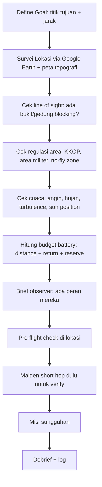
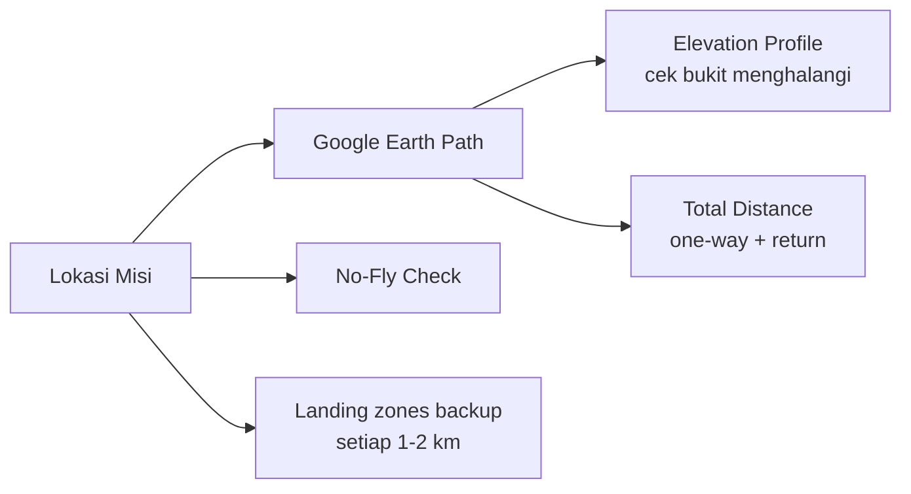
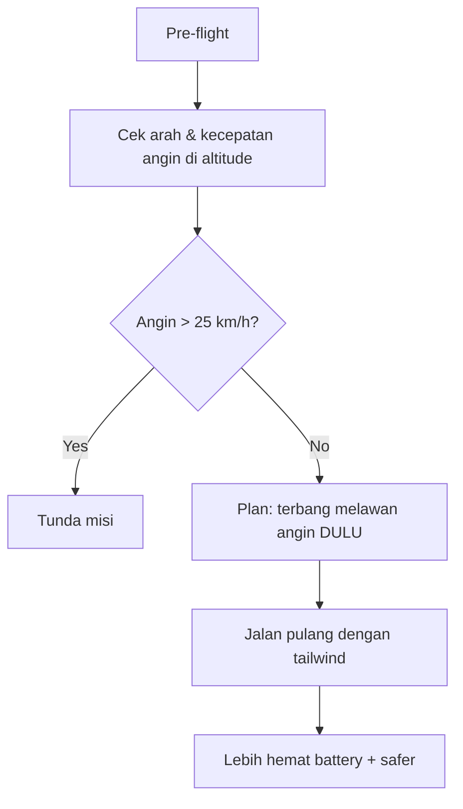
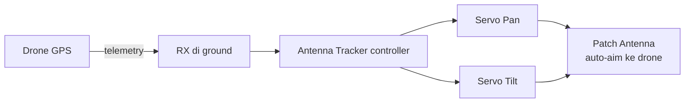
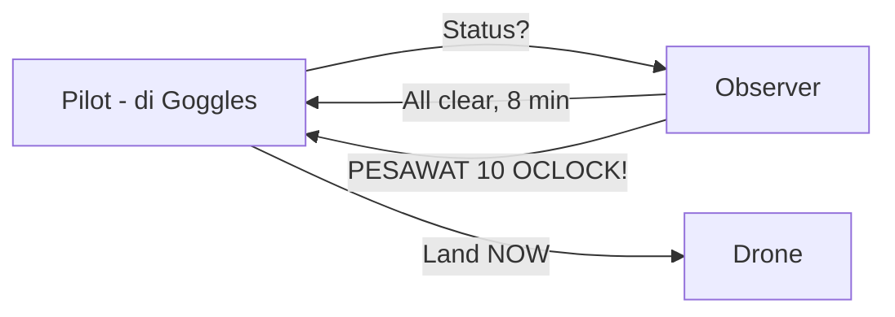
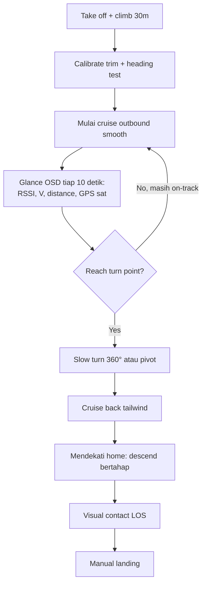
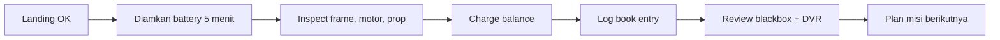
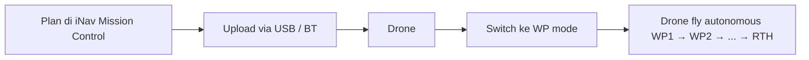

# Modul 9 — Misi Long Range

> **Tujuan modul:** menjalankan misi LR sungguhan secara aman, dari planning sampai pulang.

---

## 9.1 Definisi "Long Range"

| Kategori | Jarak (one-way) | Skill Level |
|---|---|---|
| Mid-range | 1–3 km | Intermediate |
| **LR Standar** | **3–10 km** | **Advanced** |
| Extreme LR | 10–40 km | Expert |
| Ultra LR | 40+ km | Pro / Record holder |

Modul ini fokus pada **LR Standar (3–10 km)** — sweet spot yang **bisa dicapai pemula serius** dengan setup yang tepat.

---

## 9.2 Mission Planning Workflow

---

## 9.3 Survei Lokasi

### Tools
- **Google Earth Pro** — measure distance + path elevation profile.
- **Peta topografi** (BIG, Bhumi.atrbpn.go.id, OpenTopoMap).
- **Drone Coverage Map** — sumber community untuk no-fly zones.
- **PeoplePower / Map of Lightning** — cuaca real-time.

### Kriteria lokasi LR yang baik
- **Lapangan terbuka** untuk takeoff/landing (radius 100m).
- **Sight elevasi** (bukit, kawasan tinggi) untuk antena ground.
- **Tidak ada area sensitif** (bandara, militer, instalasi vital).
- **Akses untuk recovery** kalau drone jatuh di tengah.

---

## 9.4 Battery Budget

### Rumus simple
$$
\text{Range max one-way} = \frac{\text{Battery usable mAh} \times 0.45}{\text{Average mAh/km}}
$$

- Faktor `0.45` = 45% untuk pergi (45% pulang, 10% reserve).

### Contoh
- Pack: P42A 6S2P = **8400 mAh**.
- Drone konsumsi: 100 mAh/km cruise smooth.
- Range one-way: $8400 \times 0.45 / 100 = 37.8$ km.
- **Tetap pakai margin keamanan**: target maksimum **20–25 km** one-way.

> ⚠️ **Caveat penting:** rumus di atas **estimasi linear awal**. Faktor real-world yang TIDAK include: (a) angin (head/tail/cross), (b) voltage sag saat climb, (c) konsumsi non-linear di throttle agresif, (d) altitude (udara tipis = motor kerja lebih keras). **Selalu lakukan 1–2 km test flight dengan current-meter logging** untuk mendapatkan **mAh/km aktual** sebelum misi jauh. Jangan mengandalkan teori saja.

### Cara ukur konsumsi mAh/km
1. Terbang lurus 2 km (lihat OSD distance).
2. Catat **mAh consumed** (OSD).
3. Hitung mAh / km = mAh consumed / 2.
4. **Ulangi 2–3 kali** di kondisi berbeda (calm vs windy, low vs high altitude) untuk ketahui range konsumsi.

---

## 9.5 Pelajari Angin

> **Aturan emas LR:** **terbang melawan angin saat full battery, pulang dengan tailwind**. Kalau salah arah, drone bisa kehabisan battery di tengah jalan.
>
> **Catatan:** angin di altitude bisa **shift 45–90°** selama penerbangan (terutama di area pegunungan / pantai). Pantau OSD ground speed vs air speed (kalau ada) dan **siap RTH lebih awal** kalau angin berubah tidak menguntungkan.

### Sumber data angin
- **Windy.com** (cek 100m, 500m altitude).
- **Meteoblue.com** (forecast detail).
- **Aplikasi mobile**: Windy, Ventusky.

---

## 9.6 Setup Antena Tracker (Untuk >5km)

### Pilihan tracker
- **TBS Antenna Tracker** — plug & play dengan Crossfire/Tracer.
- **DIY arduino-based** (mFD Crossbow, U360GTS, EAGLET).
- **ImmersionRC Long Range System (LRS)**.

> Untuk 3–5 km, **patch antenna manual aim** masih cukup. Tracker baru worth-it untuk **>5 km** atau misi cinematic panjang.

---

## 9.7 Briefing Observer

**Observer** = teman yang membantu mata kedua selama BVLOS.

### Tugas observer
1. **Visual scanning** — lihat ada pesawat lain, helicopter, paraglider.
2. **Radio monitoring** — dengar emergency call.
3. **Time tracking** — alert flight time setiap 5 menit.
4. **Battery alert** — alert kalau cell voltage warning.
5. **Comms** — handheld radio kalau pilot jauh.

---

## 9.8 In-Flight Procedure

### Smooth flying tips
- **Throttle smooth**, hindari punch (Li-Ion sag!).
- **Pitch forward 15–25°** untuk efficient cruise.
- **Hindari banking ekstrem** (boros).
- **Altitude konstan** = lebih efisien.

---

## 9.9 Common Issues & Solutions

| Problem | Cause | Solution |
|---|---|---|
| RSSI drop tiba-tiba | Antena terhalang, multipath | Tilt drone, reposisi |
| Video freeze sebentar | Cliff effect digital | Lambat balik, naik altitude |
| Battery sag drastis | Punch throttle | Cruise smooth |
| GPS drift saat hold | Magnetometer interference | Re-calibrate mag jauh dari drone metal |
| Throttle response lag | Voltage drop | Pulang segera |
| Compass error in flight | Strong wire EMF dekat mag | Reposisi GPS module di mast |

---

## 9.10 Misi Sukses — Recovery & Debrief

### Yang dicatat post-flight
- Distance max, altitude max.
- Battery usage (Wh & mAh).
- RSSI/LQ minimum.
- Anomali (drop, freeze, dll.).
- Lesson learned.

---

## 9.11 Naik Level: Waypoint Mission (iNav)

iNav mendukung **misi otomatis multi-waypoint**.

### Use case
- Survei area (mapping).
- Inspeksi rutin (pipa, garis listrik).
- Fotogrametri.

> Hanya boleh dipakai dengan **otorisasi BVLOS** dan operator berlisensi di banyak yurisdiksi.

---

## 🔗 Referensi

- Chris Rosser — *Long Range Mission Planning* (YouTube).
- Rotor Riot — *Long Range FPV* (YouTube).
- iNav Mission Control — <https://github.com/iNavFlight/inav-configurator/wiki/iNav-Mission-Control>
- Windy.com — <https://www.windy.com/>

---

**Selanjutnya** ➡️ [Modul 10: Regulasi & Etika Terbang](10-regulasi-etika.md)
