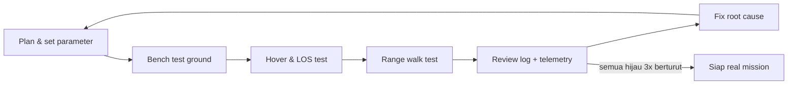
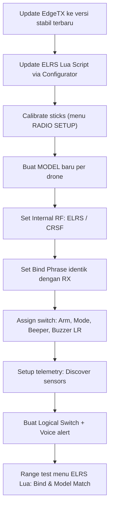
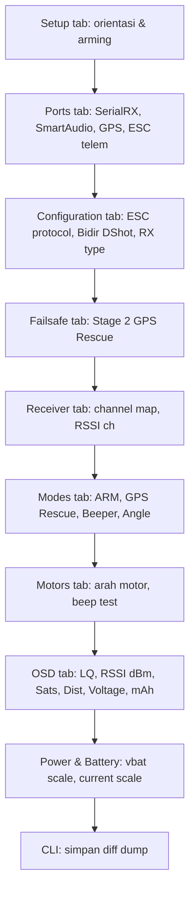
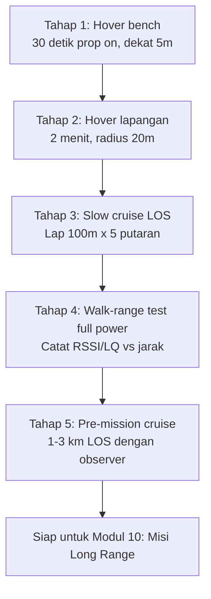
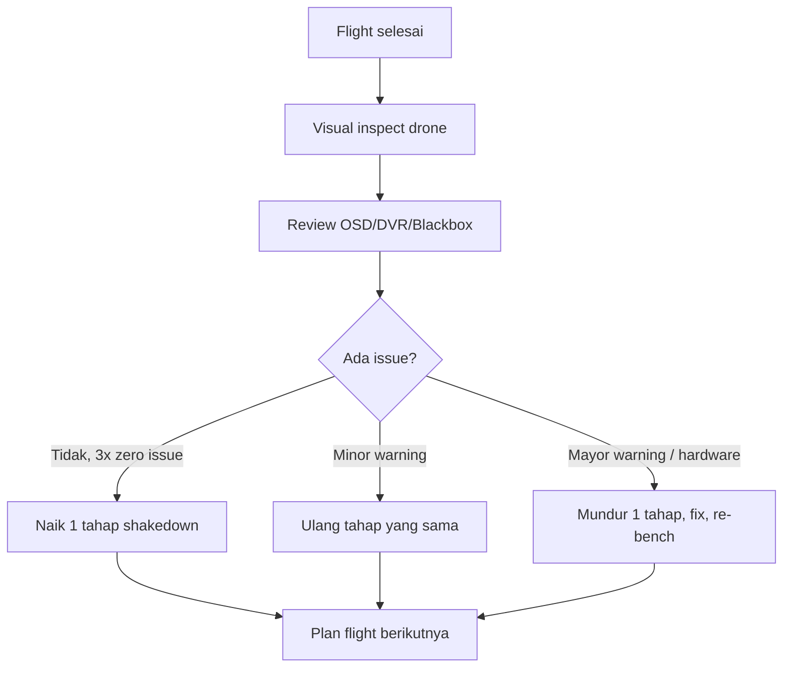
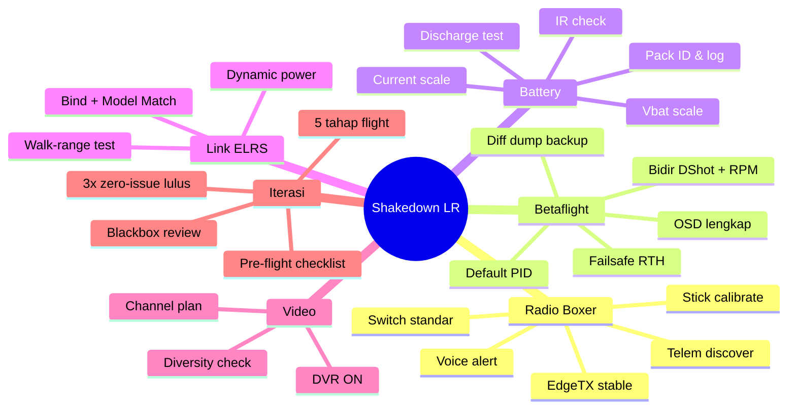

# Modul 9 — Pre-Mission Shakedown & Iterative Tuning

> **Tujuan modul:** menyiapkan, menguji, dan menyetel ulang seluruh sistem (drone, radio, baterai, link, failsafe) **secara iteratif di lingkungan aman dan terkontrol** sebelum berani jalan ke misi long range sungguhan.

> **Prinsip utama:** *"Anything new = test it close first."* Setiap kali ada perubahan firmware, parameter, antena, atau baterai — ulang shakedown dari awal di area dekat. Sumber: [Joshua Bardwell](https://www.youtube.com/@JoshuaBardwell), [Painless360](https://www.youtube.com/@Painless360), [Oscar Liang](https://oscarliang.com/).

---

## 9.1 Filosofi Shakedown — Kenapa Wajib Iteratif?

Long range mission bukan "naik drone, terbang jauh". Ini hasil **dari banyak siklus uji-perbaiki di area aman** sampai semua subsistem terbukti stabil. Statistik komunitas FPV LR menunjukkan mayoritas flyaway/lost model berasal dari **issue yang sebenarnya muncul di flight #1–3 tapi diabaikan**.



> **Aturan emas:** maju ke level berikutnya **hanya jika** level sekarang sudah **3 kali berturut-turut** zero-issue. Mundur satu level kalau ada 1 issue.

---

## 9.2 Lingkungan Shakedown yang Aman

| Lokasi | Cocok untuk | Catatan |
|---|---|---|
| **Bench / meja kerja** | Konfigurasi, prop-off test, telemetry verify | Wajib **lepas prop** atau pakai prop-guard saat pertama nyala |
| **Lapangan kosong, radius 50 m** | Hover, low altitude cruise | Tidak ada orang/properti sensitif |
| **Lapangan terbuka 300–500 m** | Walk-range test, antenna pattern check | Line of sight 100% |
| **Open field 1–3 km** | Pre-LR validation | Setelah semua tahap di atas lulus |

> **Hindari:** dekat keramaian, lapangan basah, area dengan WiFi padat (interferensi 2.4 GHz), dekat menara seluler (RF noise). Sumber: [ExpressLRS — Range Testing](https://www.expresslrs.org/quick-start/transmitters/tx-prep/#range-test).

---

## 9.3 Persiapan Radio (Contoh: Radiomaster Boxer / EdgeTX)

Radiomaster Boxer menjalankan **EdgeTX**. Persiapannya berlapis: hardware → firmware → model → bind → test.



### 9.3.1 Hardware & Firmware Boxer

1. **Update EdgeTX** lewat [EdgeTX Buddy](https://buddy.edgetx.org/). Pilih branch *Stable*, jangan *Nightly*. Sumber: [EdgeTX User Manual](https://edgetx.gitbook.io/edgetx-user-manual/).
2. **Update modul ELRS internal** dengan [ExpressLRS Configurator](https://www.expresslrs.org/quick-start/installing-configurator/). MAJOR version TX & RX **wajib sama** (mis. 4.x dengan 4.x).
3. **Backup SD card** sebelum upgrade.

### 9.3.2 Stick Calibration & Hardware Check

- **`SYS` → `HARDWARE` → `Calibration`**: gerakkan semua stick & slider full range.
- **`HARDWARE` page**: cek tegangan baterai radio (≥7.4 V untuk Boxer 2S).
- Ganti **stick mode** sesuai preferensi (Mode 2 paling umum).

### 9.3.3 Setup Model Baru

Per drone satu model. Wajib di-set:

| Item | Nilai disarankan |
|---|---|
| **Internal RF** | `CRSF` (untuk ELRS) |
| **Channel range** | `CH1–16` |
| **Failsafe mode** | **No Pulses** (drone-side failsafe yang kerja, lihat [Modul 7](07-failsafe-gps-rescue.md)) |
| **Throttle source** | Stick throttle (bukan switch) |
| **Throttle trim** | Off untuk LR |

### 9.3.4 Switch Assignment Standar LR

| Switch | Fungsi | Catatan |
|---|---|---|
| `SA` | ARM/DISARM | 2-pos atau 3-pos dengan momentary safety |
| `SB` | Flight Mode (Angle / Acro / Horizon) | LR pemula sering pakai Angle/Horizon dulu |
| `SC` | GPS Rescue / Return To Home | **Wajib** untuk LR |
| `SD` | Beeper (cari drone hilang) | |
| `SE` | Turtle Mode | Optional |
| `SF` | Buzzer / Voice trigger | |

> **Simpan template** lewat *Model → Save as template*. Untuk drone berikutnya tinggal load.

### 9.3.5 Telemetry Discovery

Setelah bind & drone nyala:

1. Masuk **`MDL` → `Telemetry`** → **Delete All Sensors**, lalu **Discover New**.
2. Pastikan minimal sensor ini muncul: `RSSI`, `LQ`, `RxBt`, `Curr`, `GPS`, `Sats`, `Alt`, `Dist`, `Hdg`.
3. Set **low/high alarm** untuk `RxBt`, `RSSI`, `LQ`.

### 9.3.6 Voice Alert (Wajib LR)

Buat *Logical Switch* + *Special Function*:

| Trigger | Suara |
|---|---|
| `LQ < 70` selama 1 s | "Link Quality low" |
| `RxBt < 14.0V` (4S) | "Battery low" |
| `Sats < 8` | "No GPS lock" |
| Setiap 30 s | Speak `RxBt` & `Dist` |

Sumber suara: [EdgeTX Voice Pack](https://github.com/EdgeTX/edgetx-sdcard-sounds).

---

## 9.4 Shakedown Betaflight (Configurator)

Sumber utama: [Betaflight Wiki](https://betaflight.com/docs) dan dokumentasi resmi tab-per-tab.



### 9.4.1 Tab Setup

- **Orientasi**: putar drone, pastikan horizon di Configurator ikut bergerak benar.
- **Accelerometer Calibration**: drone diam di permukaan **rata sempurna**, klik *Calibrate Accelerometer*.
- **Magnetometer (mag)**: kalau pakai mag eksternal/GPS combo, *Calibrate Magnetometer* lalu putar drone seperti angka delapan 3D.

### 9.4.2 Bidirectional DShot + RPM Filter (WAJIB LR)

- Tab **Configuration**: ESC protocol = `DShot300` atau `DShot600`, **enable Bidirectional DShot**.
- Tab **Motors**: pastikan RPM telemetry semua motor terbaca (angka muncul).
- Tab **Filters**: enable **RPM Filter** + **Dynamic Notch**.
- Sumber: [Betaflight — Bidirectional DShot & RPM Filtering](https://betaflight.com/docs/wiki/guides/current/bidirectional-dshot-and-rpm-filter).

### 9.4.3 Filter & PID — Strategi Aman LR

- Untuk pemula 100%: **gunakan default Betaflight 4.5+** untuk frame 7"/HD LR. Jangan utak-atik PID sampai punya jam terbang & paham [Blackbox](https://github.com/betaflight/blackbox-tools).
- Yang boleh disesuaikan: **TPA**, **Anti-gravity**, **Throttle Limit** (untuk efisiensi), **Yaw Rate** (turunkan untuk LR).
- Sumber resmi: [Betaflight — PID Tuning](https://betaflight.com/docs/wiki/guides/current/pid-tuning) dan [Betaflight — Filter Tuning](https://betaflight.com/docs/wiki/guides/current/Filter-Tuning).

### 9.4.4 Verifikasi Failsafe & GPS Rescue (Re-test setiap shakedown!)

Kembali ke [Modul 7](07-failsafe-gps-rescue.md). Tambahan saat shakedown:

1. **Bench test**: prop OFF, disable motor output, matikan radio → cek log Configurator: stage 1 → stage 2 → GPS Rescue terpicu.
2. **Field test rendah**: arm di lapangan, hover 2 m, pelan-pelan jalan menjauh sampai radio mati otomatis (bisa pakai *Range Test* di Lua) → drone harus auto-RTH ke titik take-off **sebelum** menyentuh tanah keras.
3. **Catat**: GPS sat ≥ 8, home altitude tersimpan, descent rate aman.

### 9.4.5 Simpan Diff Dump (Backup)

```text
diff all
```

Salin output ke file `nama-drone-tanggal.txt`. Ini snapshot konfigurasi yang bisa di-restore kapan saja. Sumber: [Betaflight CLI](https://betaflight.com/docs/wiki/configurator/cli-tab).

---

## 9.5 Kalibrasi & Verifikasi Baterai

Baterai LR (Li-Ion 4S/6S P42A/P45B atau LiPo 6S) adalah **single point of failure** paling umum. Perlakukan tiap pack secara individual.

### 9.5.1 Pack ID & Logging

- Tempel **stiker nomor** di tiap pack (LI-01, LI-02, ...).
- Buat **logsheet** per pack: tanggal beli, IR awal, jumlah cycle, mAh terakhir digunakan.

### 9.5.2 Storage Charge & IR Check

- Sebelum shakedown, charge pack ke **storage voltage** (3.85 V/cell LiPo, 3.7 V/cell Li-Ion).
- Ukur **internal resistance (IR)** per cell pakai charger (ISDT, iCharger). IR naik tajam → pack mulai sekarat. Sumber: [Oscar Liang — LiPo Battery Guide](https://oscarliang.com/lipo-battery-guide/).

### 9.5.3 Vbat Scale Calibration di Betaflight

1. Charge pack penuh, hubungkan ke drone.
2. Ukur **voltage aktual** dengan multimeter di balance plug.
3. Buka tab **Power & Battery** Betaflight → bandingkan dengan reading FC.
4. Sesuaikan **Voltage Meter Scale** sampai cocok ±0.05 V.
5. **Save**.

### 9.5.4 Current Scale Calibration

1. Drone terbang hover stabil 1–2 menit, catat **mAh used** di OSD setelah landing.
2. Bandingkan dengan **mAh yang masuk saat charge ulang**.
3. Hitung scale baru: `scale_baru = scale_lama × (mAh_charger ÷ mAh_OSD)`.
4. Update di tab Power & Battery → Save.
5. Ulang sampai selisih < 5%.

> Sumber: [Betaflight — Power & Battery Tab](https://betaflight.com/docs/wiki/configurator/power-and-battery-tab).

### 9.5.5 Discharge Test (Capacity Verification)

Sebelum dipakai LR, lakukan **discharge test** di charger sampai cutoff aman. Capacity nyata sering 80–95% rated. Pack < 80% **pensiunkan** dari LR.

### 9.5.6 Aturan Pemakaian LR

| Tipe pack | Cutoff terbang | Cutoff RTH |
|---|---|---|
| Li-Ion P42A 6S2P | 3.3 V/cell | 3.5 V/cell |
| LiPo 6S | 3.5 V/cell | 3.7 V/cell |

> Selalu **mulai RTH lebih cepat** dari yang dihitung. Headwind & altitude beda bisa makan 20–30% mAh ekstra.

---

## 9.6 Verifikasi Link ELRS

Sumber utama: [ExpressLRS — Signal Health](https://www.expresslrs.org/info/signal-health/) dan [Modul 12: ELRS Deep Dive](12-elrs-deep-dive.md).

| Cek | Cara | Threshold OK |
|---|---|---|
| **Bind** | Lua "Bind" → LED RX solid | Solid hijau/biru |
| **Model Match** | Set Model ID di Lua + Receiver tab Betaflight | Tidak ada warning di Lua status |
| **LQ statis di bench (≤ 5 m)** | OSD `LQ` | **100%** stabil 60 detik |
| **RSSI dBm baseline** | OSD `RSSI dBm` | Catat baseline (mis. -45 dBm) |
| **Telemetry rate** | EdgeTX telemetry screen | Update lancar tiap detik |
| **Dynamic Power** | Lua → `TX Power: Dynamic` | Power naik saat LQ drop |
| **Rate untuk LR** | Lua → `Packet Rate` | 50 Hz Full atau 100 Hz Full |
| **Switch Mode** | Lua → `Switch Mode` | Hybrid atau Wide |

### Walk-Range Test (LOS)

1. Posisi drone di tanah, antena vertikal, motor disarm.
2. Pegang radio, jalan menjauh sambil pantau **LQ** & **RSSI dBm**.
3. Catat jarak saat LQ pertama kali drop di bawah 90% — itu **baseline range** untuk power & antena setup itu.
4. Naikkan TX Power bertahap (25 → 100 → 250 → 500 mW) dan ulang. Plot grafik power vs range.

> **Aturan praktis:** real flight max range ≈ **0.7 × walk test range** (karena drone bergerak, multipath, orientasi antena berubah). Sumber: ExpressLRS Discord pinned posts.

---

## 9.7 Verifikasi Video Link (Analog / DJI O4 / Walksnail / HDZero)

| Cek | Cara |
|---|---|
| **Channel & band** | Pakai band yang dialokasikan, hindari overlap dengan pilot lain |
| **VTX power** | Mulai 25 mW di bench, naikkan saat field test |
| **Signal di goggles** | Cek video clean tanpa breakup di radius 100 m |
| **MCS / Bitrate** (HD) | Set Auto / mode LR (DJI: Long Range Mode; Walksnail: 25 Mbps mode) |
| **Antena diversity** | Pasang antena LHCP+RHCP atau patch+omni di goggles, pastikan auto-switch jalan |
| **DVR ON** | Mandatory untuk debugging crash & lost model |

Sumber: [DJI O4 Air Unit User Manual](https://www.dji.com/o4-air-unit-pro/downloads), [Walksnail Avatar HD Docs](https://caddxfpv.com/pages/walksnail-avatar-hd-kit).

---

## 9.8 Test Flight Iteratif — Roadmap 5 Tahap



### Checklist tiap tahap

- [ ] **Pre-flight** (lihat 9.10) lulus 100%.
- [ ] **Tidak ada warning** OSD selama flight.
- [ ] **Battery landing voltage** sesuai prediksi (±0.1 V/cell).
- [ ] **Blackbox / DVR** tersimpan.
- [ ] **Catat di logbook**: tanggal, lokasi, durasi, baterai, max distance, max alt, issue.

> Naik tahap berikutnya **hanya jika tahap sekarang 3× zero-issue berturut-turut**.

---

## 9.9 Blackbox Logging & Review

Untuk LR, **enable Blackbox** ke SD card on-board (FC/AIO yang support).

- Tab **Blackbox** Betaflight: rate `2 kHz` cukup untuk LR analysis.
- Setelah flight, buka log di [Betaflight Blackbox Explorer](https://github.com/betaflight/blackbox-log-viewer).
- Yang dicek minimum:
  - **Gyro noise** sebelum & sesudah filter (target < 1.0 dalam tab Spectrum).
  - **Motor output** — tidak ada motor saturated (selalu 100%).
  - **PID error** (P-error, D-error) — tidak oscillation.
  - **Vbat sag** saat throttle punch — drop < 0.3 V/cell.

Sumber: [Joshua Bardwell — Blackbox Tutorial Series](https://www.youtube.com/playlist?list=PLwoDb7WF6c8nQ2bmeXY4qB7CmO5zw1RGY).

---

## 9.10 Pre-Flight Checklist (Cetak & Bawa)


### Kartu Pre-Flight (compact)

```
[ ] Cuaca: angin < 8 m/s, tidak hujan
[ ] Goggles channel & DVR ON
[ ] Battery voltage full (4.20 LiPo / 4.10 Li-Ion)
[ ] Battery strap kencang
[ ] Prop kencang, arah benar, balance OK
[ ] Antena VTX vertikal, RX 90 deg cross
[ ] GPS sats >= 8, home altitude logged
[ ] OSD: LQ 100, RSSI -50 dBm at takeoff
[ ] Failsafe / RTH switch tested di Modes
[ ] TX battery > 7.6 V
[ ] Logbook: pack ID, lokasi, tujuan
[ ] Observer briefed
```

---

## 9.11 Iterative Loop — Kapan Mundur, Kapan Maju



### Definisi "Issue"

| Kategori | Contoh | Aksi |
|---|---|---|
| **Mayor** | Lost link >2 s, motor desync, GPS lost in flight, vbat drop tak normal, prop crack, frame retak | **Mundur 1 tahap**, root cause analysis, re-bench |
| **Minor** | LQ drop singkat <90% sekejap, vibrasi sedikit naik, satu sat hilang sekejap | Ulang tahap yang sama, observe |
| **None** | Semua hijau | Naik 1 tahap setelah 3× berturut-turut |

---

## 9.12 Cheat Sheet Shakedown LR



---

## 🔗 Referensi & Bacaan Lanjut

- **Betaflight Wiki — Configurator Tabs** — <https://betaflight.com/docs/wiki/configurator>
- **Betaflight Wiki — PID Tuning** — <https://betaflight.com/docs/wiki/guides/current/pid-tuning>
- **Betaflight Wiki — Filter Tuning** — <https://betaflight.com/docs/wiki/guides/current/Filter-Tuning>
- **Betaflight Wiki — Bidirectional DShot & RPM Filter** — <https://betaflight.com/docs/wiki/guides/current/bidirectional-dshot-and-rpm-filter>
- **Betaflight Wiki — Power & Battery Tab** — <https://betaflight.com/docs/wiki/configurator/power-and-battery-tab>
- **Betaflight Blackbox Log Viewer** — <https://github.com/betaflight/blackbox-log-viewer>
- **EdgeTX User Manual** — <https://edgetx.gitbook.io/edgetx-user-manual/>
- **EdgeTX Buddy (Updater)** — <https://buddy.edgetx.org/>
- **Radiomaster Boxer Manual** — <https://www.radiomasterrc.com/products/boxer-radio-controller>
- **ExpressLRS Docs — Signal Health** — <https://www.expresslrs.org/info/signal-health/>
- **ExpressLRS Docs — TX Prep & Range Test** — <https://www.expresslrs.org/quick-start/transmitters/tx-prep/>
- **DJI O4 Air Unit Manual** — <https://www.dji.com/o4-air-unit-pro/downloads>
- **Walksnail Avatar HD Docs** — <https://caddxfpv.com/pages/walksnail-avatar-hd-kit>
- **Oscar Liang — LiPo Battery Guide** — <https://oscarliang.com/lipo-battery-guide/>
- **Joshua Bardwell — Blackbox Tutorial Playlist** — <https://www.youtube.com/@JoshuaBardwell>
- **Painless360 — EdgeTX & Setup Tutorials** — <https://www.youtube.com/@Painless360>

---

⬅️ Sebelumnya: [Modul 8: First Flight & Tuning](08-first-flight-tuning.md) | **Selanjutnya** ➡️ [Modul 10: Misi Long Range](10-long-range-mission.md)
