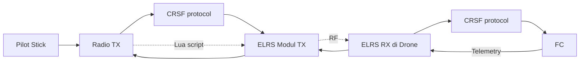
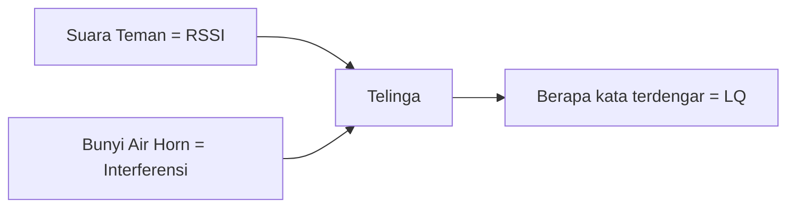
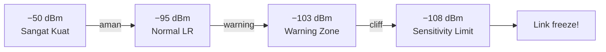
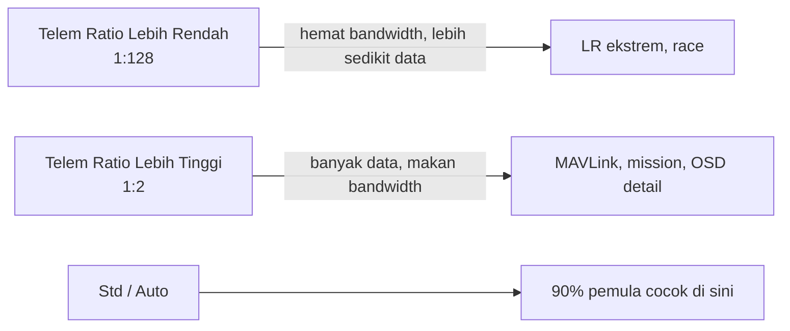
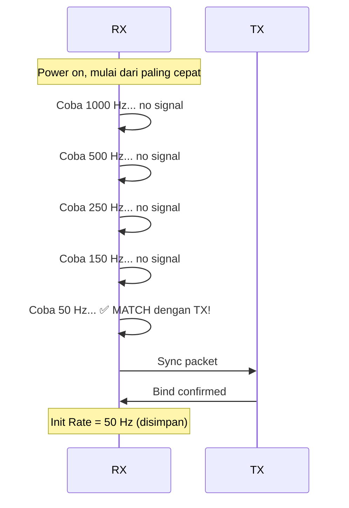
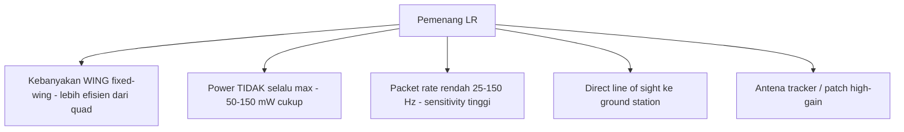
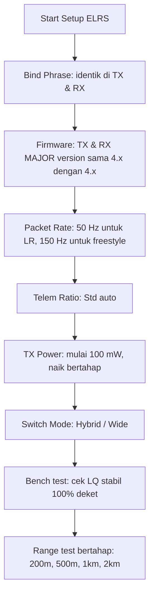

# Modul 11 — ELRS Deep Dive (Glossary, Signal Health, Telemetry, Init Rate, Long Range, Advanced)

> **Tujuan modul:** memahami konsep teknis ELRS yang sering bikin pemula bingung — istilah, RSSI/LQ/SNR, telemetry bandwidth, Init Rate, kompetisi long range, dan info debugging.
>
> **Sumber utama:** dokumentasi resmi ExpressLRS (<https://www.expresslrs.org/info/>) — diterjemahkan & disederhanakan ke bahasa pemula.

---

## 11.1 Glossary — Istilah Wajib Hafal

ELRS punya banyak singkatan. Ini daftar yang paling sering kamu lihat:

| Istilah | Kepanjangan | Arti sederhana |
|---|---|---|
| **BL** | Bootloader | Program kecil yang load firmware utama |
| **CRSF** | TBS Crossfire protocol | Protokol komunikasi antara TX↔modul & RX↔FC. ELRS pakai protokol ini juga. |
| **ESC** | Electronic Speed Controller | Penggerak motor |
| **FC** | Flight Controller | Otak drone |
| **FW** | Firmware | Software yang jalan di hardware |
| **LQ** | Link Quality | **% paket RC yang berhasil diterima**. 100 = sempurna, 0 = putus. |
| **Lua** | (bahasa pemrograman) | Script kecil yang jalan di radio TX (EdgeTX/OpenTX) untuk atur ELRS. **Tulisannya "Lua"**, bukan "LUA". |
| **MCU** | Micro Controller Unit | Chip prosesor kecil di FC/RX/TX |
| **OSD** | On Screen Display | Tulisan/info yang muncul di video goggles |
| **OTA** | Over The Air | Update firmware via WiFi |
| **OTX** | OpenTX | Firmware radio (sebelum EdgeTX) |
| **RSSI** | Received Signal Strength Indicator | **Seberapa keras sinyal terdengar** (dalam dBm) |
| **RSSI dBm** | RSSI dalam satuan dBm | Nilai negatif: −50 = kuat, −110 = lemah |
| **S.Port / sport** | SmartPort | Protokol telemetry FrSky |
| **DVDA** | Deja Vu Diversity Aid (D-mode) | Kirim paket sama 2× (D250) atau 4× (D500). Naikkan LQ tapi turunkan range & latency |
| **FLRC** | Fast Long Range Communication (F-mode) | Modulasi cepat untuk latency rendah |



> **Cara baca**: `LQ` = "berapa persen ngomongnya nyambung", `RSSI` = "berapa keras suaranya". Lebih lengkap di bagian berikutnya.

---

## 11.2 Signal Health — Memahami RSSI vs LQ vs SNR

### Analogi Percakapan di Ruangan

> Bayangin kamu ngobrol di ruangan:
> - **RSSI** = seberapa **keras** suara teman kamu.
> - **LQ** = berapa **persen kata** yang berhasil kamu dengar.
> - Kalau ada bunyi air horn (interferensi), RSSI tetap sama tapi LQ turun karena ada kata yang ketutupan.



### Dua Jenis Indikator

| Indikator | Satuan | Range | Yang **paling penting** |
|---|---|---|---|
| **RSSI** | dBm | 0 (kuat) → −130 (mati) | Seberapa dekat ke "tuli" |
| **LQ** | % | 100 (sempurna) → 0 (putus) | ✅ **Yang paling penting** |
| **SNR** | dB | tinggi = bagus | Selisih sinyal vs noise |

> **Aturan emas:** kalau cuma boleh lihat satu, **lihat LQ**. LQ jelek → tidak bisa terbang. RSSI bagus tapi LQ jelek → ada interferensi.

### RSSI Sensitivity Limit

Setiap **packet rate** punya batas minimum RSSI sebelum sinyal "tidak terdengar lagi". Di bawah limit ini = **link cliff = freeze**.

Contoh batas dari dokumentasi ELRS:
| Packet Rate | Sensitivity Limit |
|---|---|
| 25 Hz @ 900 MHz | **−123 dBm** (paling tahan) |
| 50 Hz @ 2.4 GHz | −115 dBm |
| 250 Hz @ 2.4 GHz | −108 dBm |
| 500 Hz @ 2.4 GHz | −105 dBm (paling sensitif terhadap noise) |
| F1000 (FLRC) @ 2.4 | −104 dBm |

> **Set warning value 5–10 dBm di atas sensitivity limit.** Misal kamu pakai 250 Hz 2.4 GHz (−108 dBm), set warning di **−98 sampai −103 dBm**.



### RF Mode Indexes (RFMD)

OSD & Lua tidak menampilkan "Hz" langsung, tapi **index angka**. Contoh `7:99` = mode 7 (= 250 Hz) dengan LQ 99%.

Cheat-sheet (ELRS 4.x) — dipisahkan per band untuk kemudahan baca:

#### Mode 900 MHz (Team900)
| Index | Mode | Sensitivity |
|---|---|---|
| 0 | 25 Hz | −123 dBm (paling tahan) |
| 1 | 50 Hz | −120 dBm |
| 2 | 100 Hz | −117 dBm |
| 5 | 200 Hz | −112 dBm |
| 7 | 250 Hz | −111 dBm |

#### Mode 2.4 GHz (Team2.4)
| Index | Mode | Sensitivity |
|---|---|---|
| 21 | 50 Hz | **−115 dBm** ← LR favorit |
| 24 | 150 Hz | −112 dBm |
| 27 | 250 Hz | −108 dBm |
| 29 | 500 Hz | −105 dBm |
| 30 | D250 (DVDA) | −104 dBm |
| 33 | F1000 (FLRC) | −104 dBm |

#### Mode X-Band (Dual Band 2.4 + 900)
| Index | Mode | Sensitivity |
|---|---|---|
| 100 | 100 Hz Full | −112 dBm |
| 101 | 150 Hz | −112 dBm |

### SNR (Signal-to-Noise Ratio)

**SNR** = selisih sinyal vs background noise (satuan dB, makin tinggi makin bagus).

ELRS pakai SNR untuk **Dynamic Power**: kalau SNR tinggi → otomatis turunkan power TX (hemat baterai radio + kurangi interferensi). Kalau SNR turun → naikkan power.

> **Catatan**: semua mode FLRC (F1000, F500, D500, D250) selalu lapor SNR = 0. Itu **bukan bug**, memang chip-nya tidak ukur SNR di mode tersebut.

### "Berapa jauh sih ELRS bisa pada X mW?"

Jawaban resmi ELRS: **"sangat jauh"** — tapi pertanyaan yang lebih tepat: *"Apakah saya akan dapat sinyal bagus di lokasi terbang saya?"*

Faktor yang menentukan range:
1. **Direct line of sight** (paling penting!).
2. **Interferensi** (WiFi 2.4 GHz, cell tower 900 MHz).
3. **TX power** (efeknya kecil — 2× power hanya tambah ±10% range).
4. **Antena & polarisasi**.
5. **Posisi pilot** (lebih tinggi = lebih bagus).

Contoh yang sering dikutip ELRS: **40+ km @ 250 Hz @ 100 mW** dengan antena omni LOS sempurna.

---

## 11.3 Telemetry Bandwidth — Berapa Data yang Bisa Pulang?

**Telemetry** = data dari drone balik ke radio TX (GPS, voltase, RSSI, dll).

ELRS punya 2 jenis paket:
- **LINK** = statistik link (RSSI, LQ) — selalu ada.
- **DATA** = telemetry dari FC (GPS, voltase, dll) — share bandwidth dengan MSP.

### Telem Ratio

Setting `Telem Ratio` di Lua menentukan **berapa sering paket telemetry dikirim**. Format: `1:N` artinya 1 paket telemetry tiap N paket RC.

| Telem Ratio | Arti | Pakai untuk |
|---|---|---|
| Off | Tidak ada telemetry | Race tanpa OSD |
| 1:128 | Sangat hemat | LR ekstrem |
| 1:64 | Standar minimal | LR standar |
| **Std** | Otomatis | **Direkomendasikan pemula** |
| 1:32 / 1:16 | Telemetry banyak | Misi waypoint, MAVLink |
| 1:2 / 1:4 | Maksimum | Mavlink full, BT relay |

### Bandwidth Tabel (singkat)

Contoh untuk **150 Hz** (umum freestyle/LR ringan):
| Telem Ratio | Packets/sec | Bandwidth (Burst) |
|---|---|---|
| 1:128 | 1.2 | 23 bps |
| 1:64 | 2.3 | 47 bps |
| 1:32 | 4.7 | 94 bps |
| 1:16 | 9.4 | 281 bps |
| 1:8 | 18.8 | 667 bps |
| 1:4 | 37.5 | 1421 bps |
| 1:2 | 75.0 | **2921 bps** |

Untuk **50 Hz** (LR standar):
| Telem Ratio | Packets/sec | Bandwidth (Burst) |
|---|---|---|
| 1:128 | 0.4 | 8 bps |
| 1:32 | 1.6 | 31 bps |
| 1:8 | 6.2 | 167 bps |
| 1:2 | 25.0 | 917 bps |



### Burst Mode

ELRS pakai **burst** = kirim beberapa telemetry packet berurutan supaya throughput naik tanpa harus naikkan ratio. Default sudah aktif. **Tidak perlu kamu otak-atik.**

> **Aturan praktis pemula:** **biarkan Telem Ratio di "Std"**. Cukup untuk OSD, GPS, voltase. Kalau pakai MAVLink atau Bluetooth telemetry tracker, baru naikkan ke 1:8 atau 1:4.

---

## 11.4 Init Rate — Kenapa RX Lambat Connect?

### Apa Itu?

Saat RX nyala, dia **mendengar dari packet rate paling cepat → paling lambat** sampai ketemu sinyal TX, lalu sync.

Kalau kamu pakai **50 Hz (LR)** tapi RX cek dari 1000 Hz dulu → bind lama (bisa 2–5 detik).



### ELRS 3.5.6+ (terbaru): Otomatis!

Mulai **ELRS 3.5.6 dan 4.x**, Init Rate **otomatis tersimpan** saat connection berhasil. Lain kali RX boot, langsung mulai dari rate terakhir = **bind super cepat (<1 detik)**.

> Untuk pemula yang pakai ELRS terbaru: **tidak perlu setup apapun**. Tinggal pakai.

### Cara Manual (ELRS 3.4.x – 3.5.5 saja, jarang)

Kalau pakai versi lama:
1. **Switch to Rate**: ubah packet rate ke yang diinginkan (misal 50 Hz). RX failsafe sebentar lalu save.
2. **Power Off TX**: matikan TX saat RX masih connect. RX akan failsafe → save rate terakhir.

---

## 11.5 Long Range Competition — Belajar dari Record Holder

ELRS punya **leaderboard resmi** di <https://www.expresslrs.org/info/long-range/>. Ini contoh entry untuk inspirasi:

### Top Records 2.4 GHz (per Mei 2026 — bisa berubah)

| Distance (km) | Power (mW) | Packet Rate (Hz) | Craft | Failsafed? | Pilot |
|---|---|---|---|---|---|
| **101.3** | 50 | 2000¹ | Wing | No | Snipes |
| 43.7 | 150 | 250 | Wing | No | Slickshot |
| 40.6 | 50 | 25 | Wing | No | Shawn U |
| 35.0 | 250 | 100 | Wing | No | Snipes |
| 20.0 | 150 | 100 | Wing | Yes | Pairan |
| 16.1 | 50 | 250 | **Quad** | No | heggy_fpv |
| 13.2 | 150 | 500 | Quad | No | FelipeCris |
| 10.0 | 50 | 250 | Quad | No | Disnator |
| 7.0 | 150 | 50 | Quad | No | Taufik 🇮🇩 |

¹ **Catatan:** Beberapa entry leaderboard mencantumkan rate non-standar (mis. "2000") yang merupakan **kombinasi DVDA + FLRC custom build atau interpretasi pencatat sendiri**. Mode resmi ELRS 2.4 GHz max adalah **F1000 / K1000 (1000 Hz)**. Entry tetap valid sebagai record tapi konfigurasi belum tentu reproducible dengan firmware stock.

### Pelajaran dari Leaderboard



> **Insight pemula**: kamu **tidak butuh 1000 mW** untuk LR. Pilot record 100 km hanya pakai **50 mW**! Yang penting: LOS, antena, packet rate rendah.

### Aturan Submit Record

Kalau kamu mau submit:
- Catat: distance, freq band, packet rate, power, failsafed?, nama pilot.
- Sertakan **DVR YouTube** sebagai bukti.
- Pull request ke ELRS docs repo.

---

## 11.6 Advanced Technical Info — Debugging

### Lua Status Codes (untuk Troubleshooting)

Saat Lua menampilkan **angka di pojok kanan atas** (bukan `-` atau `C`), itu kode warning. Format **bit** — convert angka ke biner untuk decode:

| Bit | Arti | Solusi |
|---|---|---|
| **0** | RX connection status | Pastikan RX terhubung, Telem Ratio ≠ Off |
| 1 | Reserved | – |
| **2** | Model Mismatch Warning | Set ModelMatch = Off, atau pilih Model ID yang benar |
| **3** | Armed Status | **Tutup Lua** saat armed, supaya stick command max |
| 4 | Reserved | – |
| **5** | Not While Connected | Jangan ubah parameter ini saat RX connected |
| 6 | Reserved Critical | – |
| 7 | Reserved Critical | – |

Contoh: angka **`5`** di pojok = biner `0000 0101` = **bit 0 + bit 2** → "RX connection status" + "Model Mismatch Warning".

```mermaid
flowchart LR
    Lua[Lua Pojok Kanan] -->|"-" atau "C"| OK[Normal]
    Lua -->|angka muncul| Decode[Convert ke biner]
    Decode --> Bit[Lihat bit yang ON]
    Bit --> Fix[Perbaiki sesuai tabel]
```

> **Pemula tidak perlu hafal**. Cukup tahu: **kalau muncul angka, sesuatu tidak normal** — cek koneksi RX & Model ID dulu.

### DEBUG Logging (untuk Developer / Power User)

Kalau kamu compile ELRS dari source, ada flag debug:
| Flag | Fungsi |
|---|---|
| `-DDEBUG_LOG` | Master switch debug. Off = semua debug off. |
| `-DDEBUG_LOG_VERBOSE` | Log sangat detail (spammy) |
| `-DDEBUG_RX_SCOREBOARD` | Print huruf untuk tiap paket received/missed |
| `-DDEBUG_CRSF_NO_OUTPUT` | Tidak kirim RC ke UART (untuk test) |
| `-DDEBUG_BF_LINK_STATS` | Kirim info ekstra ke Betaflight LinkStats |

> **99% pemula tidak butuh ini.** Hanya berguna kalau kamu ngoprek source code atau bantu developer ELRS debug bug.

---

## 11.7 Setting Praktis untuk Pemula LR (Cheat Sheet)



### Yang Wajib di OSD untuk Membaca Signal Health
- **Link Quality (LQ)** — paling penting!
- **RSSI dBm** — true value dengan satuan jelas (bukan "RSSI Value" tanpa unit).
- **RFMD** (RF Mode index) — untuk tau rate aktif.
- **Voltage cell** — untuk failsafe voltage.

### Yang **TIDAK** Direkomendasikan di OSD
- "RSSI Value" tanpa unit (skala bingung).
- "RSSI Channel" enabled (ELRS sudah kirim via CRSF natif).

---

## 11.8 Mitos vs Fakta ELRS

| Mitos | Fakta |
|---|---|
| "Lebih besar mW = lebih jauh" | Hanya ±10% range tiap 2× power. Antena & LOS lebih penting. |
| "2.4 GHz tidak bisa LR" | 100+ km terbukti @ 2.4 GHz LoRa (lihat leaderboard) |
| "900 MHz selalu menang penetrasi" | Beda dengan 2.4 tidak sebesar yang dibayangkan, ELRS sensitif sekali |
| "RSSI lebih penting dari LQ" | **LQ lebih penting** — itu yang menentukan apakah kamu kehilangan packet |
| "Naikkan packet rate = lebih bagus" | Untuk LR justru **turun**kan ke 50 Hz untuk sensitivity tinggi |
| "Telem Ratio harus 1:2 maksimum" | Std/Auto sudah cukup; 1:2 boros bandwidth & turunkan range |

---

## 📝 Quiz Modul 11

1. Apa beda **RSSI** dan **LQ**? Mana yang lebih penting?
2. Berapa **sensitivity limit** untuk 50 Hz @ 2.4 GHz?
3. Apa singkatan **DVDA** dan apa fungsinya?
4. Kalau Lua menampilkan angka **`5`** di pojok kanan atas, artinya apa?
5. Kenapa pemula disarankan biarkan **Telem Ratio = Std**?
6. Versi ELRS berapa yang **otomatis menyimpan Init Rate**?
7. Kalau kamu mau cek mode RF aktif di OSD, lihat **field** apa?

---

## 🔗 Referensi (sumber resmi)

- **Glossary** — <https://www.expresslrs.org/info/glossary/>
- **Signal Health (LQ, RSSI, SNR)** — <https://www.expresslrs.org/info/signal-health/>
- **Telemetry Bandwidth** — <https://www.expresslrs.org/info/telem-bandwidth/>
- **Init Rate** — <https://www.expresslrs.org/info/init-rate/>
- **Long Range Competition (Leaderboard)** — <https://www.expresslrs.org/info/long-range/>
- **Advanced Technical Info** — <https://www.expresslrs.org/info/advance-technical-info/>
- ELRS Discord (komunitas) — <https://discord.gg/dS6ReFY>
- ELRS GitHub — <https://github.com/ExpressLRS/ExpressLRS>

---

⬅️ Kembali ke [Index Learning Series](00-index.md) | Sebelumnya: [Modul 10: Regulasi & Etika](10-regulasi-etika.md)
