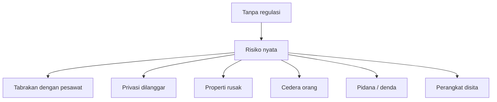
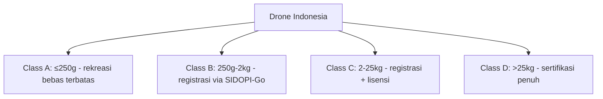
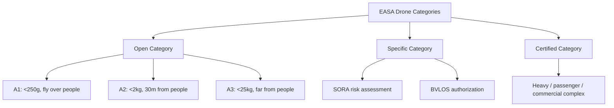
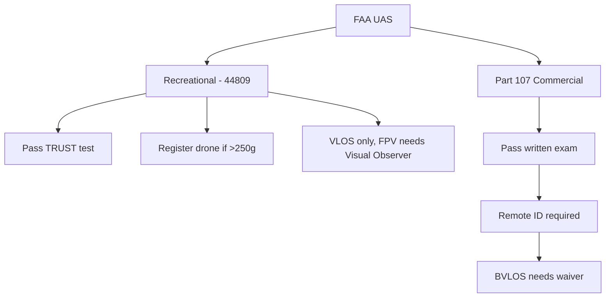
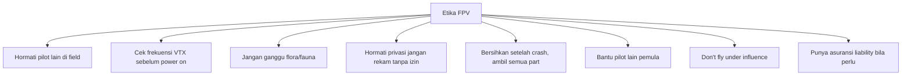
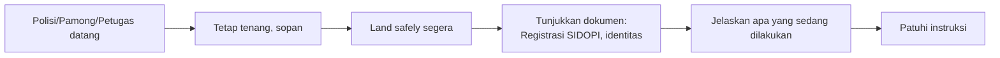
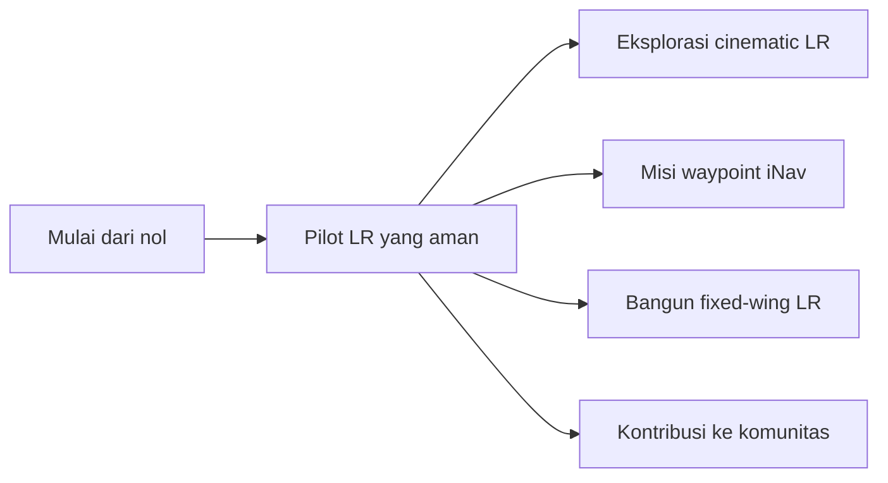

# Modul 11 — Regulasi & Etika Terbang

> **Tujuan modul:** memahami regulasi dasar drone & FPV di Indonesia dan internasional, serta etika di komunitas.

> ⚠️ **Disclaimer:** regulasi sering berubah. Modul ini ringkasan **per Mei 2026**. Selalu **verifikasi langsung** ke otoritas resmi sebelum terbang.

---

## 11.1 Kenapa Regulasi Penting?

> Pelanggaran bisa berujung **denda hingga ratusan juta rupiah, penjara, atau larangan terbang seumur hidup**. Jangan main-main.

---

## 11.2 Regulasi Indonesia

### Peraturan Utama

| Regulasi | Pembuat | Tentang |
|---|---|---|
| **PM 37 Tahun 2020** | Kemenhub | Pengoperasian pesawat udara tanpa awak |
| **PM 27 Tahun 2021** | Kemenhub | Pengamanan ruang udara |
| **PM 63 Tahun 2021** | Kemenhub | Tatanan kebandaraan + KKOP |
| **Permenkominfo 7 Tahun 2018 + amandemen** | Kominfo SDPPI | Sertifikasi alat telekomunikasi (radio, VTX) |

### Klasifikasi drone (PM 37/2020 — disederhanakan)

### Aturan umum terbang
- **Maks ketinggian: 120 m AGL** (di luar KKOP).
- **Tidak di atas keramaian, jalan raya, fasilitas vital**.
- **Visual Line of Sight (VLOS)** — kecuali ada otorisasi khusus.
- **BVLOS untuk rekreasi: tidak ada path legal** — secara praktik tidak diperbolehkan tanpa otorisasi.
- **BVLOS untuk komersial / Specific operation:** ada path legal melalui **Direktorat Navigasi Penerbangan (DNP) Kemenhub** dengan dokumen risk assessment, **PSC (Pilot Sertifikat Cakupan)**, dan pendaftaran misi spesifik. Proses panjang & ketat tapi bukan blanket dilarang.
- **KKOP (Kawasan Keselamatan Operasi Penerbangan)** — area sekitar bandara, terbang DILARANG total.

### Registrasi Drone
- **SIDOPI-Go** (Sistem Informasi Drone Pilot Indonesia) — wajib untuk drone tertentu.
- Pilot wajib registrasi via **Aplikasi SIDOPI-Go**.
- Beberapa drone perlu **PSC** (Pilot Sertifikat Cakupan) untuk komersial.

### Frekuensi Radio (Kominfo SDPPI)

| Band | Status di Indonesia |
|---|---|
| 2.4 GHz (RC + VTX) | Bebas SRD (max 100 mW EIRP) |
| 5.8 GHz (VTX) | Bebas (max 25 mW EIRP — tapi praktek LR sering pakai lebih, tidak compliant) |
| 915 MHz | **Tidak alokasi SRD di Indonesia** — bertabrakan dengan band seluler GSM 900. Pemakaian = ilegal kecuali izin khusus. |
| 868 MHz | Tidak alokasi sipil umum di Indonesia. |
| 1.2 / 1.3 GHz (VTX LR) | **Butuh izin frekuensi khusus** dari SDPPI. |
| 433 MHz | Alokasi amatir radio (perlu lisensi ORARI), bukan untuk RC umum. |

> **Cek SDPPI**: <https://sdppi.kominfo.go.id/> — cari sertifikat "type approval" perangkat sebelum impor/pakai. Indonesia **tidak mengikuti FCC / EU plan** untuk band sub-GHz, jadi banyak modul ELRS 915/868 MHz **tidak compliant** secara hukum lokal.

---

## 11.3 Regulasi Eropa (EASA)

### FPV LR di EU
- Umumnya jatuh ke **Specific Category** (BVLOS).
- Butuh **operator authorization** + **SORA**.
- Drone wajib **CE class marking** (C0–C4).
- **Remote ID** wajib dari Jan 2024.

---

## 11.4 Regulasi USA (FAA)

### Khusus FPV
- **FPV pilot WAJIB punya Visual Observer** (VO) di sampingnya.
- BVLOS tanpa waiver = **ilegal**.
- **Remote ID broadcast** wajib (sejak 2023).

---

## 11.5 Regulasi Negara Lain (Singkat)

| Negara | Highlight |
|---|---|
| **Australia** (CASA) | < 2 kg rec hobby, registrasi >250g, BVLOS perlu RPA license |
| **UK** (CAA) | Mengikuti EASA-like, A2 CofC, Operator ID + Flyer ID |
| **Jepang** | Ketat, day-time only, registrasi wajib semua >100g |
| **Singapore** (CAAS) | UAOLP & UAPL, sangat ketat, area terbatas |
| **Malaysia** (CAAM) | Registrasi wajib, BVLOS izin khusus |

---

## 11.6 Etika & Common Sense

### Code of Conduct AMA / komunitas FPV
1. **Aircraft ALWAYS yields to manned aircraft** (drone harus mengalah ke pesawat berawak).
2. **No FPV without spotter** kalau di area publik.
3. **Inform local police / RT** kalau terbang di area baru lama.
4. **Karma**: bantu pilot baru, share knowledge.

---

## 11.7 Asuransi & Liability

> Drone bisa menyebabkan kerugian besar. Pertimbangkan asuransi:
- **Pribadi**: cek apakah asuransi rumah cover hobby aviation.
- **Komersial**: wajib punya **drone insurance** (mis. SkyWatch.AI, Verifly).
- Beberapa komunitas (mis. AMA US) punya **member insurance** otomatis.

---

## 11.8 Saat Otoritas Menanyakan

> Jangan terbang **ngumpet-ngumpet**. Lebih baik **terbuka** dan punya **dokumen** lengkap. Banyak masalah hilang dengan komunikasi yang baik.

---

## 11.9 Komunitas FPV Indonesia

- **Indonesia FPV Racing Association (IFRA)** — komunitas racing.
- **Throttle Warrior** — komunitas FPV Indonesia (racing, freestyle, long range), aktif di IG & event lokal.
- **Forum FB**: "Drone FPV Indonesia", "Indonesia Long Range FPV".
- **Discord**: ExpressLRS Indonesia, iNav ID.
- **Local clubs** di kota besar: Jakarta, Bandung, Surabaya, Bali, Yogya.

> Bergabung komunitas = **akses field legal**, mentor, beli/jual second, dan teman terbang.

### Catatan Budget untuk Indonesia

Harga di seri ini ditulis dalam **USD** (referensi global). Realitas Indonesia:
- **Cukai impor + PPN + bea masuk** rata-rata menambah **30–60%** harga.
- Pajak elektronik radio kadang +10–20% lagi.
- **Estimasi budget IDR realistis (HD LR setup komplit, 2026):**
  | Item | USD | IDR realistis |
  |---|---|---|
  | Drone 7" LR + DJI O4 + Li-Ion | ~$650 | **Rp 13–16 juta** |
  | Radio TX + Goggles + Charger | ~$750 | **Rp 15–20 juta** |
  | **Total starter HD LR** | ~$1,400 | **Rp 28–36 juta** |
- Banyak builder Indonesia mulai dengan **analog setup** (Rp 8–12 juta total) lalu upgrade ke HD.

---

## 11.10 Resource & Update Regulasi

| Sumber | URL |
|---|---|
| Ditjen Hubud Indonesia | <https://hubud.dephub.go.id/> |
| SDPPI Kominfo | <https://sdppi.kominfo.go.id/> |
| AirNav Indonesia (KKOP) | <https://www.airnavindonesia.co.id/> |
| EASA Drones | <https://www.easa.europa.eu/en/domains/civil-drones> |
| FAA UAS | <https://www.faa.gov/uas> |
| CASA Australia | <https://www.casa.gov.au/drones> |
| CAA UK | <https://www.caa.co.uk/drones/> |

---

## 🎓 Selesai!

Selamat! Kamu sudah menyelesaikan **FPV Long Range Learning Series**.

### Langkah berikutnya
1. **Build drone pertama** kamu.
2. **Mulai dari simulator** + 5" freestyle.
3. **Naik ke 7" LR** secara bertahap.
4. **Ikuti updates ELRS, Betaflight, iNav** — komunitas open source aktif sekali.
5. **Share pengalaman** — tulis blog, bikin video, bantu pemula lain.

---

## 🔗 Referensi Penutup

- Komunitas FPV Indonesia (FB, Discord).
- ExpressLRS, Betaflight, iNav GitHub.
- Joshua Bardwell, Painless360, Oscar Liang — guru-guru FPV dunia.
- Sumber resmi pemerintah (Hubud, Kominfo).

---

**Terbang aman, terbang bahagia! 🚁✨**

⬅️ Kembali ke [Index Learning Series](00-index.md)
