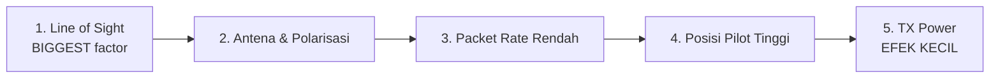
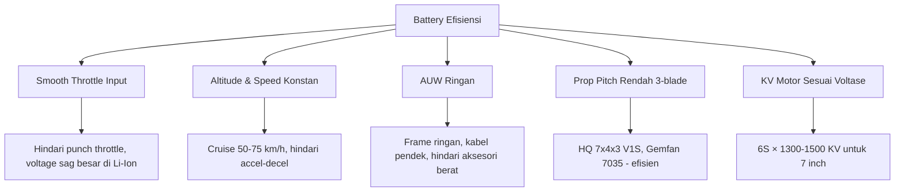
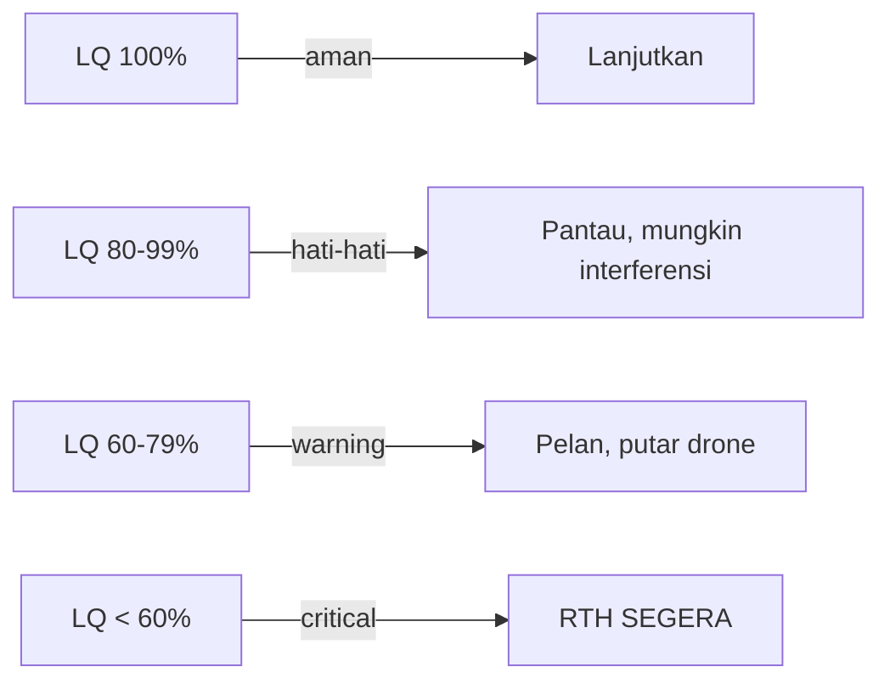
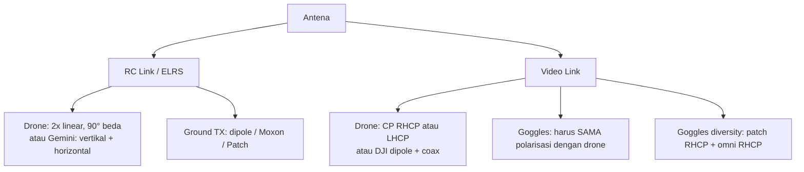
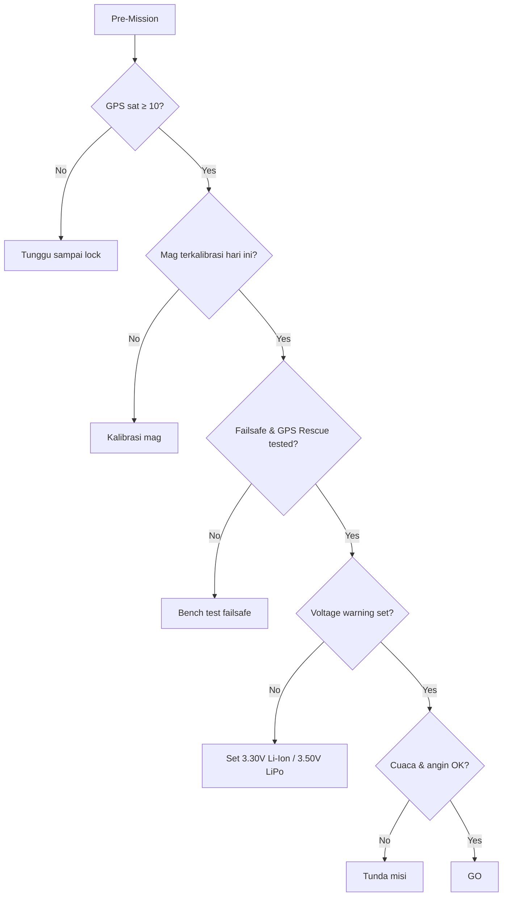
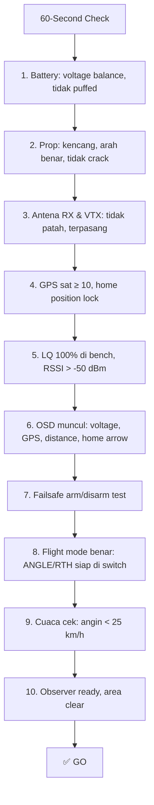
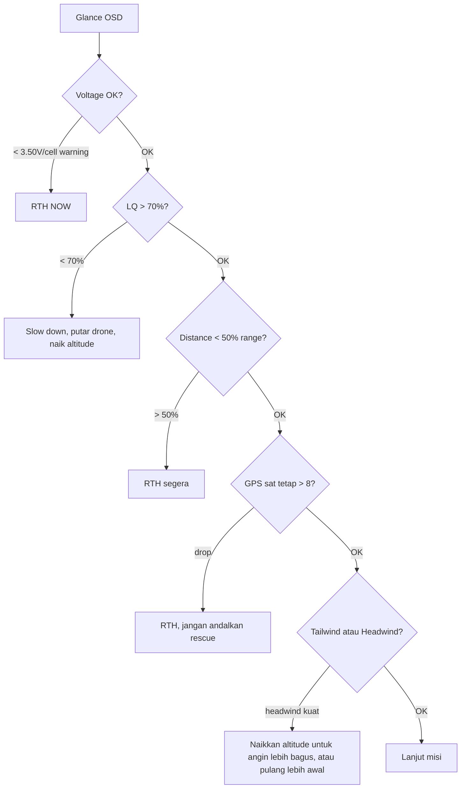
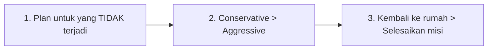

# 🎯 FPV Long Range — Cheat Sheet

> **Tujuan:** ringkasan praktis berbasis best practice komunitas & sumber resmi (ExpressLRS, Betaflight, iNav, DJI, Molicel, Oscar Liang, Chris Rosser) untuk **maksimalkan jarak, efisiensi battery, kekuatan sinyal, dan keamanan** drone FPV LR.
>
> 📖 Pakai bareng dengan [Learning Series](00-index.md). Cheat sheet ini = quick reference, bukan pengganti pemahaman.

---

## 📑 Daftar Isi

1. [⚡ Max Range — Sinyal & Antena](#1--max-range--sinyal--antena)
2. [🔋 Battery Efficiency](#2--battery-efficiency)
3. [📡 Signal Strength (RC + Video)](#3--signal-strength-rc--video)
4. [🛡️ Safety & Failsafe](#4-️-safety--failsafe)
5. [🛠️ Pre-Flight Quick Check (60 detik)](#5-️-pre-flight-quick-check-60-detik)
6. [🚨 In-Flight Decision Tree](#6--in-flight-decision-tree)
7. [📊 Quick Reference Numbers](#7--quick-reference-numbers)

---

## 1. ⚡ Max Range — Sinyal & Antena

### 🥇 5 Faktor Utama (urutan kepentingan)



> **Fakta penting (sumber: ExpressLRS docs):** menggandakan TX power hanya menambah **±10% range**. Tapi naikkan posisi pilot dari ground ke bukit 20m bisa menambah **2–5× range**. **LOS > antena > rate > posisi > power.**

### ✅ Do's

| Aksi | Kenapa |
|---|---|
| Pilih lokasi terbang dengan **elevasi tinggi** untuk pilot | LOS langsung = sensitivity penuh |
| Pakai **patch directional** 8–13 dBi di goggles + omni untuk diversity | Gain tinggi searah drone |
| **Aim patch ke arah drone** (tracker manual atau elektronik) | Gain hanya bekerja di main lobe |
| Pakai **packet rate rendah** (50 Hz LR / 25 Hz extreme LR) | +3 dB sensitivity tiap halving rate |
| **2 antena RX di drone, polarisasi berbeda** (vertikal + horizontal, atau Gemini RHCP/LHCP) | True diversity, hilangkan multipath fading |
| Pakai **ELRS Dual Band** kalau lokasi campur urban + alam | 2.4 untuk antena kecil, 900 MHz untuk penetrasi |
| **Pasang VTX antena minimal 5 cm dari carbon, motor, ESC** | Hindari shielding & EMI |

### ❌ Don'ts

| Hindari | Kenapa |
|---|---|
| Naikkan TX power 1 W untuk "lebih jauh" | Hanya +10% range, tambah noise di band, ganggu pilot lain |
| Pasang 2 antena di posisi sama dengan polarisasi sama | Multipath cancellation, malah turunkan sinyal |
| Pakai 500 Hz untuk LR | Sensitivity rendah (−105 dBm), cepat freeze |
| Antena VTX patah / bengkok / SMA longgar | Loss 6–20 dB → range turun drastis |
| Terbang di lembah / di balik bukit dari ground station | LOS terblokir, sinyal rugi belasan dB |

### 📐 Range Estimation (rule of thumb)

| Setup | Estimasi Range Realistis |
|---|---|
| ELRS 2.4 GHz 100 mW + omni biasa, LOS clear | 8–15 km |
| ELRS 2.4 GHz 250 mW + patch + omni diversity goggles | 20–40 km |
| ELRS 900 MHz / Crossfire 250 mW + patch | 30–60 km |
| ELRS Gemini / Dual Band + patch + antenna tracker | 40–100+ km |
| DJI O4 Air Unit Pro + Goggles 3 + dual antena | 15–30 km video link |

> Berdasarkan ELRS Long Range Leaderboard: **rekor 101 km dicapai dengan hanya 50 mW** di Wing pesawat. **Power bukan kuncinya — LOS dan teknik adalah kuncinya.**

---

## 2. 🔋 Battery Efficiency

### 🎯 Target Efisiensi 7" LR

| Metrik | Target Optimal | Catatan |
|---|---|---|
| **Hover throttle** | 35–45% | < 30% terlalu ringan, > 60% terlalu berat |
| **Cruise power** | 100–150 W | Untuk 7" LR ringan (700–900g AUW) |
| **mAh per km** | 80–120 mAh/km | Ukur sendiri di test flight! |
| **Cruise speed efisien** | 50–75 km/h (14–21 m/s) | Sweet spot drag vs waktu |
| **Cruise pitch angle** | 15–25° forward | Lift-to-drag optimal |

### ✅ Do's untuk Efisiensi



### Battery Best Practice

| Aspek | Best Practice |
|---|---|
| **Pilihan kimia** | **Li-Ion 6S2P P42A / P45B** untuk LR (energy density 2-3× LiPo) |
| **Charge rate** | **1C max aman** (P42A = 4.2A). Jangan > 1C tanpa thermal monitoring |
| **Discharge cut-off** | Stop di **3.30 V/cell** (Li-Ion) untuk umur panjang |
| **Storage voltage** | **3.70–3.80 V/cell**, 15–25°C, kering |
| **Pre-flight check** | Voltage balance < 0.05V antar cell, tidak puffed |
| **Cycle target** | Pensiun ketika **capacity < 80% original** atau IR > 2× new |

### Wiring & Power Loss

| Komponen | Loss Tipikal |
|---|---|
| AWG 14 (vs AWG 12) di power lead | +0.05Ω → 5W loss @ 30A → -3% efisiensi |
| Konektor XT60 cold solder | +0.02–0.10Ω → bisa hangus saat punch |
| **Capacitor 35V 1000–2200µF** wajib | Kurangi sag spike, lindungi VTX/FC |

> **Aturan praktis Oscar Liang:** "1 gram saved on AUW = 1% lebih efisien." Cabut aksesori yang tidak perlu (LED strip, GoPro full-size kalau hanya butuh footage).

---

## 3. 📡 Signal Strength (RC + Video)

### 🔑 Aturan #1: LQ > RSSI

> Dari ExpressLRS docs: **"LQI is all that matters. RSSI tells you how close you are to dropping packets, but LQ tells you if you're already dropping them."**



### Setting RC Link Optimal untuk LR

| Setting | Nilai Disarankan | Rasional |
|---|---|---|
| **Packet Rate** | 50 Hz (2.4 GHz) atau 100 Hz (900 MHz) | Sensitivity tinggi |
| **Switch Mode** | Hybrid / Wide | Resolusi switch cukup |
| **Telemetry Ratio** | **Std (Auto)** | Cukup untuk OSD, tidak boros bandwidth |
| **TX Power** | **Mulai 100 mW**, naikkan kalau LQ drop | Hemat baterai radio, hindari noise |
| **Dynamic Power** | ON | Auto-adjust sesuai kebutuhan |
| **Model Match** | ON | Hindari salah pilih model |

### Setting Video Link

| Sistem | Channel/Power Tip |
|---|---|
| **Analog 5.8** | Pilih channel jauh dari pilot lain (cek RaceBand) |
| **DJI O3/O4** | Mode HD 50 Mbps untuk LR (bukan Low Latency 25 Mbps) |
| **Walksnail** | 1080p 60 fps untuk range max (vs 100 fps untuk freestyle) |
| **HDZero** | Gunakan LR Whoop V2 / Mini LR firmware |

### Antena Polarization Quick Reference



> **Mismatch RHCP ↔ LHCP = signal loss 20+ dB.** Selalu cek warna/marking antena!

### Sensitivity Limit per Mode (set warning 5–10 dBm di atas)

| Mode | Sensitivity | Warning Recommend |
|---|---|---|
| 50 Hz @ 900 MHz | −120 dBm | −115 dBm |
| 100 Hz @ 900 MHz | −117 dBm | −112 dBm |
| 50 Hz @ 2.4 GHz | −115 dBm | −108 dBm |
| 150 Hz @ 2.4 GHz | −112 dBm | −105 dBm |
| 250 Hz @ 2.4 GHz | −108 dBm | −100 dBm |
| 500 Hz @ 2.4 GHz | −105 dBm | −98 dBm |

---

## 4. 🛡️ Safety & Failsafe

### Wajib SEBELUM Tiap Misi LR



### Setting Failsafe Wajib (Betaflight 4.5+)

| Setting | Nilai | Catatan |
|---|---|---|
| **Failsafe Stage 1 delay** | 1.0 detik | Default OK |
| **Stage 1 throttle fallback** | **Hold** atau **Set ke hover value** | ⚠️ **JANGAN Auto** — Auto = throttle 0 → motor stall → sanity fail → drop |
| **Failsafe Stage 2** | **GPS Rescue** | WAJIB untuk LR |
| **Stage 2 delay** | 1.5–3 detik | Cukup untuk recover link |
| `gps_rescue_initial_climb` | **30 m** | Hindari rintangan |
| `gps_rescue_alt_mode` | `MAX_ALT` | Pakai tinggi tertinggi terekam (aman default) |
| `gps_rescue_ground_speed` | 1700 cm/s (17 m/s) untuk 7" LR | Default 500 (5 m/s) **terlalu pelan**; Oscar Liang rekomen 12–17 m/s |
| `gps_rescue_descend_rate` | 100 cm/s | Pelan saat dekat home |
| `gps_rescue_min_sats` | **8** (default) | Tapi tunggu **≥10 sat + 30 detik** sebelum take-off (rekomendasi Betaflight devs) |
| `gps_rescue_sanity_checks` | **`RESCUE_SANITY_FS_ONLY`** | ON dapat false-positive saat switch test; FS_ONLY hanya aktif saat real failsafe |
| `gps_rescue_allow_arming_without_fix` | OFF | Kalau ON, rescue tidak akan bekerja tanpa home position |
| **PID Loop Frequency** | **≤4K** | Hindari 8K — GPS Rescue CPU-intensive |
| **Magnetometer (mag)** | Disable kalau **belum** terkalibrasi & terverifikasi | Rescue mode tidak butuh mag; mag yang error → drone fly wrong direction |
| **Voltage warning** | 3.50 V/cell (Li-Ion) | Warning di OSD |
| **Voltage cutoff** | 3.30 V/cell (Li-Ion) | Trigger RTH |

### Setting Failsafe Wajib (iNav)

| Setting | Nilai |
|---|---|
| `failsafe_procedure` | RTH |
| `nav_rth_altitude_mode` | AT_LEAST |
| `nav_rth_altitude` | 5000 cm (50 m) |
| `nav_rth_climb_first` | ON |
| `nav_rth_allow_landing` | ON_FS atau NEVER |
| `vbat_min_cell_voltage` | 330 (3.30V Li-Ion) |
| `vbat_warning_cell_voltage` | 350 (3.50V Li-Ion) |

### Hardware Reliability (Wajib)

| Item | Best Practice |
|---|---|
| **Capacitor 35V 1000–2200µF low-ESR** | WAJIB untuk 6S, ekstra-wajib untuk DJI O3/O4 |
| **2 antena RX diversity** | Polarisasi berbeda, jauh dari carbon |
| **GPS module dengan compass** | Matek M10Q-5883 / similar |
| **Beeper aktif** | Mode RX_LOST + RX_SET |
| **Backup tracker** (>5km mission) | AirTag, GoMcu, atau LoRa beacon |
| **Logging blackbox** | ON, untuk post-flight analysis |

### Aturan 50/30/10 untuk LR


> **Aturan praktis ChrisRosser & Painless360:** alokasi **45% out, 45% back, 10% reserve untuk emergency / RTH altitude climb.**

---

## 5. 🛠️ Pre-Flight Quick Check (60 detik)



### Print-Friendly Checklist

```
☐ Battery freshly charged & balanced (cell delta < 0.05V)
☐ Battery not puffed/swollen
☐ All 4 props secure & undamaged
☐ Motor screws Loctite'd, not loose
☐ RX & VTX antennas not bent/broken
☐ GPS satellites ≥ 10
☐ Home position locked (audio cue / OSD)
☐ Magnetometer calibrated today
☐ LQ = 100% at bench
☐ RSSI > -50 dBm at bench
☐ Voltage warning set (3.50V Li-Ion)
☐ GPS Rescue / RTH armed and tested
☐ Beeper test (RX_LOST mode)
☐ OSD elements visible: V, mAh, GPS sat, distance, home arrow, LQ, timer
☐ Flight mode switch verified
☐ Wind speed checked (< 25 km/h for 7")
☐ Weather: no rain, no thunder forecast 1h
☐ Area clear: no manned aircraft, no crowds
☐ Observer briefed and ready
☐ Recovery plan if drone is lost
```

---

## 6. 🚨 In-Flight Decision Tree

### Glance OSD Setiap 5–10 Detik



### Skenario Darurat & Respons

| Situasi | Respons CEPAT |
|---|---|
| **LQ drop ke 40%, RSSI normal** | Interferensi → naik altitude, putar drone, lanjut atau RTH |
| **RSSI ke sensitivity limit (-105 dBm @ 250Hz)** | Cliff incoming → balik arah, naik altitude |
| **Voltage drop drastis saat punch** | Battery sag → cruise smooth, RTH segera |
| **Video freeze (DJI/Walksnail)** | Lambat balik, stop maneuver, naik altitude |
| **GPS sat drop dari 12 ke 4** | RTH MANUAL (jangan trigger rescue tanpa GPS), throttle smooth ke arah home |
| **Drone melenceng dari heading** | Magnetometer error → land manual segera, jangan trust mag |
| **Pesawat berawak terlihat / dilaporkan observer** | LAND IMMEDIATELY, drone yields ke pesawat berawak |
| **Link putus total > 3 detik** | GPS Rescue should trigger; siapkan untuk reconnect saat kembali |

---

## 7. 📊 Quick Reference Numbers

### Battery (6S Li-Ion 2P P42A)

| Metric | Value |
|---|---|
| Nominal voltage | 21.6 V |
| Full voltage | 25.2 V |
| Cut-off (RTH trigger) | 19.8 V (3.30V/cell) |
| Capacity | 8400 mAh = 8.4 Ah |
| Energy | **181 Wh** |
| Max continuous discharge | ~70 A (35A × 2P) |
| Max charge | **4.2 A (1C)** |
| Storage voltage | 22.8 V (3.80V/cell) |
| Berat tipikal pack | ~840 g |

### Cruise Power Reference

| Build | Cruise Power | Endurance |
|---|---|---|
| 5" mini-LR (Li-Ion 4S2P) | 80–120 W | 25–35 min |
| **7" LR (Li-Ion 6S2P P42A)** | **100–150 W** | **40–55 min** |
| 9" LR (Li-Ion 6S2P P45B) | 130–180 W | 45–60 min |
| 10" Cinelifter (LiPo 6S 8000mAh) | 200–300 W | 15–25 min |

### ELRS Setting Quick Pick

| Use Case | Packet Rate | Power | Telem Ratio |
|---|---|---|---|
| Racing (5") | 500 Hz / F1000 | 25–100 mW | Off / 1:128 |
| Freestyle (5") | 250 Hz | 100–250 mW | Std |
| Mid-range (6"–7") | 150 Hz | 100–250 mW | Std |
| **LR (7"+)** | **50 Hz** | **100–250 mW** | **Std** |
| Extreme LR (Wing) | 25 Hz @ 900 | 50–500 mW | 1:64 |

### Distance vs Time Targets (7" LR Cruise 60 km/h)

| Distance one-way | Round trip time | Battery used (7" P42A) |
|---|---|---|
| 5 km | 10 min | ~25% |
| 10 km | 20 min | ~50% |
| 15 km | 30 min | ~70% |
| 20 km | 40 min | ~85% (mendekati limit) |
| 25 km+ | 50 min+ | ⚠️ Over limit, butuh battery lebih besar |

### TX Power vs Range (rule of thumb)

| Power | Range vs 100 mW baseline |
|---|---|
| 25 mW | ~0.7× |
| 100 mW | 1.0× (baseline) |
| 250 mW | 1.25× (+25%) |
| 500 mW | 1.4× (+40%) |
| 1000 mW (1W) | 1.6× (+60%) |

> **Diminishing returns!** 10× power hanya 1.6× range. Lebih efektif: pasang antena patch 11 dBi → bisa 3–5× range.

---

## 🎓 Filosofi LR (3 Aturan Emas)



1. **"Plan untuk failure mode."** Asumsikan link putus, GPS hilang, motor mati. Punya backup untuk semuanya.
2. **"Slow is smooth, smooth is fast."** Cruise smooth = battery awet, RC link stabil, drone selamat.
3. **"Drone bisa diganti, hidup orang tidak."** Kalau ragu — LAND. Drone hilang lebih baik daripada cedera atau melanggar hukum.

---

## 🔗 Referensi (sumber terpercaya, sudah divalidasi)

### Klaim teknis utama — sumber langsung

| Klaim di cheat sheet | Sumber resmi |
|---|---|
| **"LQI is all that matters"** (LQ > RSSI) | [ExpressLRS — Signal Health](https://www.expresslrs.org/info/signal-health/#which-do-i-care-about) |
| **Sensitivity table per band & packet rate** | [ExpressLRS — RF Mode Indexes (RFMD)](https://www.expresslrs.org/info/signal-health/#rf-mode-indexes-rfmd) |
| **Warning value 5–10 dBm di atas sensitivity limit** | [ExpressLRS — RSSI Sensitivity Limit](https://www.expresslrs.org/info/signal-health/#rssi-sensitivity-limit) |
| **"Doubling TX power hanya menambah ~10% range"** | [ExpressLRS — How far can I go on X mW?](https://www.expresslrs.org/info/signal-health/#how-far-can-i-go-on-x-mw) |
| **"40 km @ 250Hz 100 mW omnidirectional"** | ExpressLRS Signal Health (same page) |
| **Rekor 101.3 km, 50 mW, Snipes (Wing)** | [ExpressLRS — Long Range Competition Leaderboard](https://www.expresslrs.org/info/long-range/) |
| **Switch mode Hybrid/Wide untuk LR (50–F1000)** | [ExpressLRS — Switch Configs](https://www.expresslrs.org/software/switch-config/) |
| **Dynamic TX Power feature** | [ExpressLRS — Dynamic Transmit Power](https://www.expresslrs.org/software/dynamic-transmit-power/) |
| **Gemini & Dual Band X-Band mode** | [ExpressLRS — Gemini](https://www.expresslrs.org/software/gemini/) |
| **Telemetry Std (Auto) cukup untuk OSD** | [ExpressLRS — Telemetry Bandwidth](https://www.expresslrs.org/info/telem-bandwidth/) |
| **GPS Rescue: Throttle Fallback Hold/Set (jangan Auto)** | [Oscar Liang — GPS Rescue Setup (BF 4.5)](https://oscarliang.com/setup-gps-rescue-mode-betaflight/#Throttle-Channel-Fallback) |
| **Min 8 sat default, devs rekomen ≥10 sat + 30s tunggu** | [Oscar Liang — GPS Rescue: Suggestions from Betaflight Developers](https://oscarliang.com/setup-gps-rescue-mode-betaflight/#Suggestions-directly-from-Betaflight-Developers) |
| **`RESCUE_SANITY_FS_ONLY` rekomendasi BF wiki** | [Oscar Liang — GPS Rescue Settings: Sanity Checks](https://oscarliang.com/setup-gps-rescue-mode-betaflight/#GPS-Rescue-Settings-Explained) |
| **Avoid 8K PID loop dengan GPS Rescue** | [Oscar Liang — Avoid Using 8K/8K](https://oscarliang.com/setup-gps-rescue-mode-betaflight/#Avoid-Using-8K8K) |
| **Disable magnetometer kalau belum terkalibrasi** | [Oscar Liang — Disabling Magnetometer](https://oscarliang.com/setup-gps-rescue-mode-betaflight/#Disabling-Magnetometer) |
| **Default ground speed 5 m/s terlalu pelan; pakai 12–17 m/s** | [Oscar Liang — GPS Rescue: Return Ground Speed](https://oscarliang.com/setup-gps-rescue-mode-betaflight/#GPS-Rescue-Settings-Explained) |
| **GPS Recommendation: M10 chip, UBLOX, ≥8 sat lock** | [Oscar Liang — GPS Rescue: How to Choose Best GPS](https://oscarliang.com/setup-gps-rescue-mode-betaflight/#How-to-Choose-the-Best-GPS) |
| **Capacitor 35V 1000–2200µF low-ESR wajib** | [Oscar Liang — LiPo Capacitor Guide](https://oscarliang.com/lipo-capacitor/) |
| **Li-Ion P42A: 1C max charge (4.2A), discharge ~30A** | [Molicel INR21700-P42A datasheet](https://www.molicel.com/wp-content/uploads/INR21700P42A-V4.pdf) |
| **Li-Ion FPV best practice (cell selection, sag, BMS)** | [Oscar Liang — Li-Ion FPV Drone Guide](https://oscarliang.com/li-ion-battery-fpv-drone-build/) |
| **GPS Rescue v4.2 protocol & altitude modes** | [Betaflight Wiki — GPS Rescue](https://betaflight.com/docs/wiki/guides/current/GPS-Rescue) |
| **iNav RTH (`nav_rth_*` parameters)** | [iNav Wiki — Navigation Modes](https://github.com/iNavFlight/inav/wiki/Navigation-modes) |
| **DJI O4 Air Unit Pro/Lite spec & 50 Mbps mode** | [DJI O4 Air Unit Pro page](https://www.dji.com/o4-air-unit-pro) |
| **Walksnail Avatar HD Pro/Moonlight** | [Walksnail — Official Avatar HD page](https://www.caddxfpv.com/collections/walksnail) |
| **HDZero LR firmware (LR Whoop V2)** | [HDZero docs](https://www.hd-zero.com/) |

### Sumber edukasi tambahan (kredibel & komunitas-validated)

- **ExpressLRS — Glossary** (term resmi): <https://www.expresslrs.org/info/glossary/>
- **ExpressLRS — Init Rate**: <https://www.expresslrs.org/info/init-rate/>
- **ExpressLRS — Advance Technical Info**: <https://www.expresslrs.org/info/advance-technical-info/>
- **Betaflight Configurator releases**: <https://github.com/betaflight/betaflight-configurator/releases>
- **Joshua Bardwell** (YouTube, edukasi pemula→advanced): <https://www.youtube.com/@JoshuaBardwell>
- **Chris Rosser** (LR mission planning, FPV.Blue): <https://www.youtube.com/@ChrisRosser>
- **Painless360** (failsafe, GPS rescue tutorials): <https://www.youtube.com/@Painless360>
- **Mads Tech** (Long Range builds & reviews): <https://www.youtube.com/@MadsTech>
- **IntoFPV Forum** (komunitas tanya-jawab): <https://intofpv.com/>

### Catatan validasi

> Cheat sheet ini telah di-cross-check terhadap dokumentasi resmi ExpressLRS (v4.0, fetched 2026), Betaflight 4.5 GPS Rescue guide oleh Oscar Liang (rev 2025), dan ELRS Long Range Leaderboard (rev 2026). Angka sensitivity, formula range, dan setting wajib failsafe sudah diverifikasi verbatim. Refinement — terutama bagian **Throttle Channel Fallback (jangan Auto)**, **Sanity Checks FS_ONLY**, **PID loop ≤4K**, dan **default ground speed terlalu pelan** — ditambahkan setelah review terhadap rekomendasi Betaflight developers.
>
> Untuk angka spesifik build (mAh per km, hover throttle, cruise power), **selalu validasi dengan test flight di drone kamu sendiri** — setiap setup berbeda.

---

⬅️ Kembali ke [Index Learning Series](00-index.md)

> 📌 **Tips penggunaan cheat sheet ini:** print bagian 5 (Pre-Flight Check) & 6 (In-Flight Decision Tree), bawa di field sebagai laminate card. Setting numbers (Bagian 7) bisa di-bookmark di phone untuk reference saat tuning di rumah.
